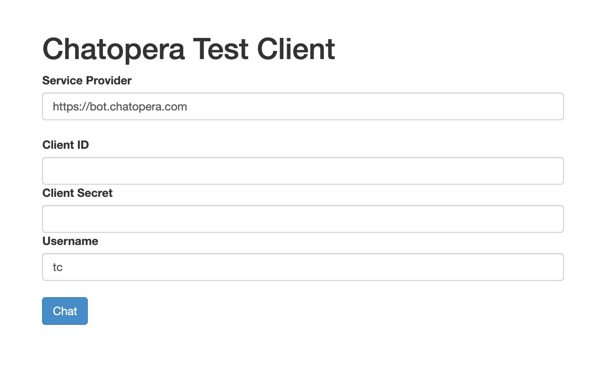

## 示例程序

通过系统集成的示例程序，快速掌握 SDK 使用，尤其是对话检索 API；系统集成示例程序也可以用来调试和检查机器人，在和业务系统集成前测试相关接口。与 Chatopera 机器人平台的测试页面不同，系统集成示例程序更侧重上线前，对 SDK 相关接口的测试。

在系统集成示例程序中，使用 Chatopera 机器人平台地址，clientId 和 secret 立刻连接聊天机器人，开始对话。

功能：

- 提供对话页面，方便系统集成测试
- 使用 Bot Provider 地址，clientId 和 secret 连接机器人
- 实现 Dialogue Management: 融合意图识别检索、多轮对话检索和知识库检索
- [app.js](https://github.com/chatopera/webchat/blob/master/app/app.js) 使用 [Chatopera Node.js SDK](https://www.npmjs.com/package/@chatopera/sdk)，可作为系统集成参考

### 直接使用

[https://tc.chatopera.com/](https://tc.chatopera.com/)

或使用 Docker 启动实例

```
docker run -it --rm -p 8668:8668 chatopera/webchat:develop
```



### 示例程序代码库

[https://github.com/chatopera/webchat](https://github.com/chatopera/webchat)
