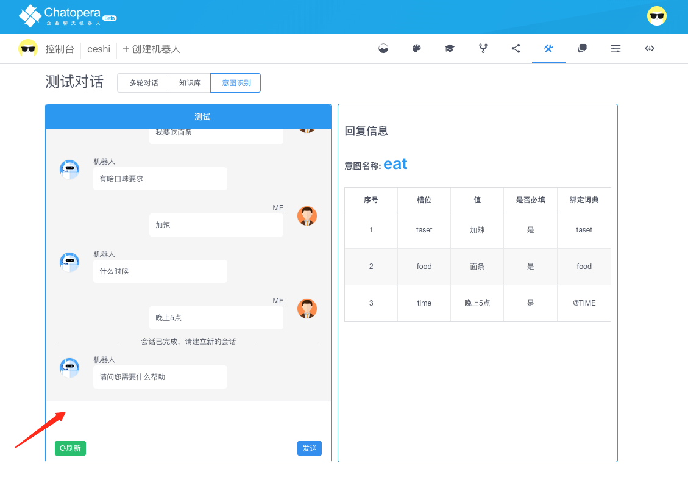
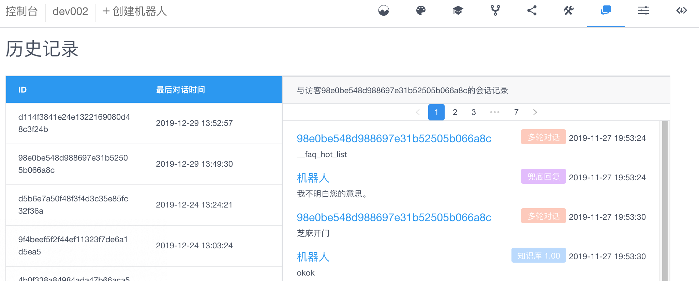

# 意图识别

## 概述

在应用聊天机器人的场景中，有一大类是任务驱动型的问答，比如来访者说“我想购买车票”，那么接下来机器人围绕订票这个需求，询问出行时间、目的地等信息，并将收集到的信息返回给聊天机器人开发者，完成订单确认、支付和下单订票等。这就是一个典型的任务驱动的问答，或者说识别意图并根据意图收集相关信息为目的。该种类型对话，在 Chatopera 云服务中，就是通过**意图识别**模块支持。

## 术语

**意图识别**是语义理解的一个重要话题：与机器人对话时，是需要机器首先理解人的意图的；然后，根据这个意图，机器人继续与人进行问答；得到了这个意图的相关信息，然后机器才去执行这个意图代表的任务。

<table class="image">
<caption align="bottom">图：意图识别模块概念关系</caption>
<tr><td></td></tr>
</table>

### 词典

机器人的词汇表

- 自定义词典：通过词汇表，正则表达式来设定词汇集合，表达实体概念
- 系统词典：Chatopera 机器人平台内置地名、组织机构名、人名和时间等

### 意图

一个对话任务的最小单元

- 说法：表达同样意图的不同说法，可包含槽位标识
- 槽位：在意图中，完成用户任务需要的信息

### 调试

从设计到实现机器人的技能

- 训练机器人：建立词汇表，意图，为意图添加槽位和说法
- 测试对话：在测试对话页面，测试意图识别，优化训练内容

### 版本

每次训练都会得到新的意图识别模型，系统创建新的版本

- 调试版本：调试中的机器人版本
- 生产版本：训练好的机器人模型，满足上线使用需求，从调试版本发布而成

### 会话

也称为 session，和用户的单个意图关联的对话；在系统集成时，会话生命周期，部分阶段由开发者管理。

- 请求对话，需要先创建会话，会话会绑定 0-1 个任务：刚开始不知道用户意图，当确定用户意图后，该 session 就只和这个意图相关。

### 聊天

发送访客的请求，获得机器人的回复

- 通过访客的 ID，session id， 文本消息和机器人进行聊天

**会话**和**聊天**都是与上线集成相关，详细参考 [系统集成](/products/chatbot-platform/integration.html)。

## 快速开始

### 登录服务

访问 <a href="https://bot.chatopera.com" target="_blank">https://bot.chatopera.com</a> 从浏览器打开后，点击“立即使用”，跳转到登陆/注册页面，输入邮箱和密码，使用“回车键”【Enter】提交，即完成。

下文以“餐饮机器人”为例介绍意图识别聊天机器人的创建、配置和发布上线。

### 新建机器人

在 Chatopera 云服务首页单击“创建机器人”，根据提示信息新建后点击“确认”，即完成机器人的创建。

<table class="image">
<caption align="bottom">图：创建机器人</caption>
<tr><td></td></tr>
</table>

<table class="image">
<caption align="bottom">图：创建机器人</caption>
<tr><td></td></tr>
</table>

### 新建意图

切换至【意图】模块新建意图，以订外卖的意图为例，单击操作列的【新建意图】，在弹出的对话框中输入意图标识名，例如：Take_out，确定后即完成意图创建。

<table class="image">
<caption align="bottom">图：新建意图</caption>
<tr><td></td></tr>
</table>

### 编辑意图

单击操作列的 Take_out【编辑】，进入意图的配置页面，包括【用户说法】和【槽位】两个模块。

<table class="image">
<caption align="bottom">图：编辑意图</caption>
<tr><td></td></tr>
</table>
<table class="image">
<caption align="bottom">图：编辑意图</caption>
<tr><td></td></tr>
</table>

逐一添加数据，例如：【用户说法】添加带槽位和不带槽位的用户说法。

<table class="image">
<caption align="bottom">图：用户说法</caption>
<tr><td></td></tr>
</table>

添加【槽位】并进行相关设置。

<table class="image">
<caption align="bottom">图：槽位</caption>
<tr><td></td></tr>
</table>

### 配置词典

在配置意图的槽位时需要为各个槽位设置对应的词典，此时可在【槽位】配置模块选择词典时快速新建词典，或引用系统词典。

<table class="image">
<caption align="bottom">图：选择词典</caption>
<tr><td></td></tr>
</table>

也可先保存意图配置后，切换到【词典管理】模块新建自定义词典。

<table class="image">
<caption align="bottom">图：新建自定义词典</caption>
<tr><td></td></tr>
</table>

无论通过哪种途径新建自定义词典，都需要在【词典管理】模块对自定义词典进行配置，添加词条。导航【词典管理>>自定义词典】，在列表页点击“编辑”进入词典编辑页面。

<table class="image">
<caption align="bottom">图：编辑词典</caption>
<tr><td></td></tr>
</table>

词典详情页面可以添加多个近义词，添加后进行保存。

<table class="image">
<caption align="bottom">图：编辑词条</caption>
<tr><td></td></tr>
</table>

### 训练机器人

在意图详情页面，点击保存，提示：训练成功，可进行测试。

<table class="image">
<caption align="bottom">图：保存</caption>
<tr><td></td></tr>
</table>

点击意图详情页面右上角“测试”按钮，进入测试对话页面。

<table class="image">
<caption align="bottom">图：测试</caption>
<tr><td></td></tr>
</table>

<table class="image">
<caption align="bottom">图：测试</caption>
<tr><td></td></tr>
</table>

测试对话窗口输入意图中的用户说法对机器人进行训练，机器人识别到意图后会对该意图下添加的槽位进行追问。

<table class="image">
<caption align="bottom">图：对话</caption>
<tr><td></td></tr>
</table>

机器人识别到所有槽位后会结束对话，建立新的会话。

<table class="image">
<caption align="bottom">图：建立新的会话</caption>
<tr><td></td></tr>
</table>

### 发布机器人

每次机器人训练通过后，都会自动更新【版本管理】模块中的调试版本：

<table class="image">
<caption align="bottom">图：调试版本</caption>
<tr><td></td></tr>
</table>

机器人存在调试版本时，可进行测试，测试无误后可对当前调试版本进行发布上线。

<table class="image">
<caption align="bottom">图：发布上线</caption>
<tr><td></td></tr>
</table>

## 意图管理

### 意图和词典的关系

进入机器人意图管理页面，新建意图，意图的编辑包括用户说法和槽位。在添加意图的槽位时需要对词典进行配置，包括新建自定义词典或引用系统词典，参考[词典的管理文档](/products/chatbot-platform/dicts.html)。

需要强调的是，在词表表词典创建后，默认是没有词条的，这种情况会导致训练失败；相似的，正则表达式词典也需要有表达式定义，否则会导致机器人训练失败。在遇到训练失败时，通过错误提示消息进行解决，在保存词典，保存意图时，会进行**训练**。

### 意图命名规则

- 意图标识名为字母、数字、下划线的组合，1-32 位，如：RailTypes
- 同一个机器人下的意图标识名不能重复
- 意图标识名一经确认后无法进行修改

创建：

在意图管理页面点击新建自定义词典，在弹出的对话框里输入正确的自定义词典名称，点击确定。与新建自定义词典一样

### 编辑意图和槽位

添加槽位：添加槽位时可以选择应用系统词典或自定义词典，可以设置是否必填和追问，必填的话必须设置追问。

<table class="image">
<caption align="bottom">图：添加槽位</caption>
<tr><td></td></tr>
</table>

删除槽位：对于不需要的槽位可以进行删除，点击删除按钮即可。

修改槽位：对于需要修改的槽位，直接进行编辑和修改即可。

<table class="image">
<caption align="bottom">图：修改槽位</caption>
<tr><td></td></tr>
</table>

添加说法：对于用户的说法，可以添加没有槽位的说法，也可以用{}关联槽位，把槽名称放到{}里面即可，一个说法可以绑定多个槽位。

<table class="image">
<caption align="bottom">图：添加说法</caption>
<tr><td></td></tr>
</table>

删除说法：点击删除按钮即可。

修改说法：直接进行编辑和修改即可。

### 保存意图

在编辑完所有说法和槽位之后，需要进行保存。保存并且训练成功有提示。成功就可以到测试对话页面进行测试。

<table class="image">
<caption align="bottom">图：保存</caption>
<tr><td></td></tr>
</table>

### 测试和发布机器人

保存机器人词典，意图等信息后，Chatopera 云服务会提示开始重新训练机器人，训练会有成功或失败两种结果，训练会持续一段时间，时间长短取决于意图、词表、槽位的数量；完成训练后，代表机器人测试版本已经用最新的数据更新，在测试页面，导航至"意图识别"，和测试版本进行对话。

## 版本管理

### 调试版本

每次保存并且训练成功后，都会自动更新调试版本。但是此时不该急于发布上线，需要多次在测试对话页面进行测试，确保无误之后，再发布上线。

测试：在测试对话页面与机器人进行对话，在右侧会把对应的意图、槽位以及槽位值之类的信息展示出来。

<table class="image">
<caption align="bottom">图：测试</caption>
<tr><td></td></tr>
</table>

### 生产版本

测试无误后便可在【意图>>发布管理】模块对调试版本进行发布上线，发布后的线上版本可用于实际使用，线上的集成通过集成页面获取 SDK 和使用文档。

<table class="image">
<caption align="bottom">图：生产版本</caption>
<tr><td></td></tr>
</table>

## 集成意图识别

经过一系列的工作，发布生产版本后，意图识别问答终于准备妥当，可以为业务系统提供机器人问答服务了，下一步参考[系统集成](/products/chatbot-platform/integration.html)接入上线吧！

## 查看使用情况

### 意图识别对话检索次数

<table class="image">
<caption align="bottom">图：生产版本的意图识别对话检索次数</caption>
<tr><td></td></tr>
</table>

### 查看历史消息

<table class="image">
<caption align="bottom">图：对话历史记录</caption>
<tr><td></td></tr>
</table>

## 评论

