# 意图识别

## 服务概述

**意图识别**是语义理解的一个重要话题，我们可以认为：任何机器对话时，是需要机器首先理解人的意图的。然后，根据这个意图，机器人继续与人进行问答，得到了这个意图的相关信息，然后机器才去执行这个意图代表的任务。

### 创建和配置机器人

初次使用首先需要新建一个机器人，并对其进行配置。机器人的配置主要包括意图和词典的配置，分别对应【意图】和【词典管理】模块。

### 添加意图和词典

进入机器人配置页面，需要新建和编辑意图，意图的编辑包括用户说法和槽位。在添加意图的槽位时需要对词典进行相关配置，包括新建自定义词典或引用系统词典，并在意图配置完成后 为所需的自定义词典添加词条。

### 测试和发布机器人

机器人配置完成后必须先通过训练，才可以对机器人进行测试。测试无误后便可在【意图>>发布管理】模块对调试版本进行发布上线，发布后的线上版本可用于实际使用。

### 接入机器人

若机器人已存在生产版本，可通过 API 文档提供的接口进行接入。

## 快速开始

### 登录服务

访问 <a href="https://bot.chatopera.com" target="_blank">https://bot.chatopera.com</a> 从浏览器打开后，点击“立即使用”，跳转到登陆/注册页面，输入邮箱和密码，使用“回车键”【Enter】提交，即完成。

## 点餐机器人

下文以“餐饮机器人”为例介绍 机器人 的创建、配置和发布上线。

### 新建机器人

在 Chatopera 云服务首页单击“创建机器人”，根据提示信息新建后点击“确认”，即完成机器人的创建。

<table class="image">
<caption align="bottom">创建机器人</caption>
<tr><td></td></tr>
</table>

<table class="image">
<caption align="bottom">创建机器人</caption>
<tr><td>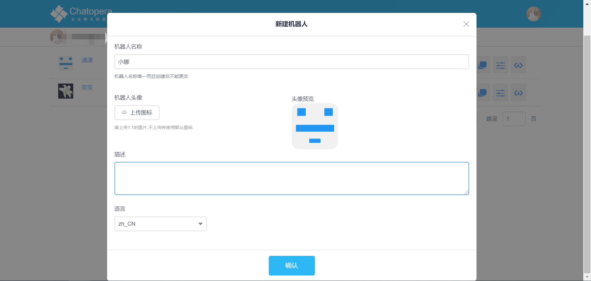</td></tr>
</table>

### 新建意图

切换至【意图】模块新建意图，以订外卖的意图为例，单击操作列的【新建意图】，在弹出的对话框中输入意图标识名，例如：Take_out，确定后即完成意图创建。

<table class="image">
<caption align="bottom">新建意图</caption>
<tr><td>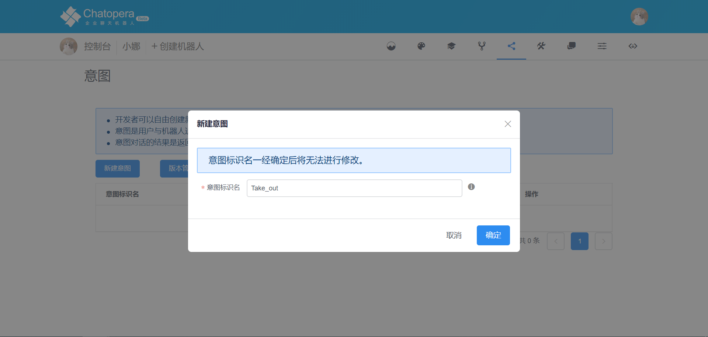</td></tr>
</table>

### 编辑意图

单击操作列的 Take_out【编辑】，进入意图的配置页面，包括【用户说法】和【槽位】两个模块。

<table class="image">
<caption align="bottom">编辑意图</caption>
<tr><td>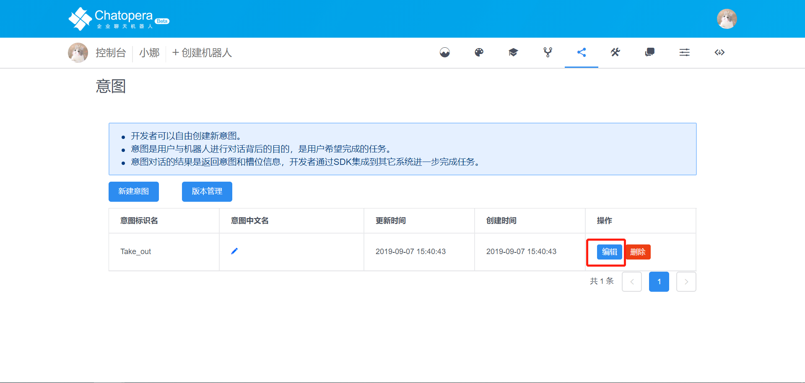</td></tr>
</table>
<table class="image">
<caption align="bottom">编辑意图</caption>
<tr><td></td></tr>
</table>

逐一添加各个模块，例如：【用户说法】添加带槽位和不带槽位的用户说法

<table class="image">
<caption align="bottom">用户说法</caption>
<tr><td></td></tr>
</table>

【槽位】添加槽位并进行相关设置

<table class="image">
<caption align="bottom">槽位</caption>
<tr><td></td></tr>
</table>

### 新建和配置自定义词典

在配置意图的槽位时需要为各个槽位设置对应的词典，此时可在【槽位】配置模块选择词典时快速新建词典，或引用系统词典

<table class="image">
<caption align="bottom">选择词典</caption>
<tr><td></td></tr>
</table>

也可先保存意图配置后，切换到【词典管理】模块新建自定义词典

<table class="image">
<caption align="bottom">新建自定义词典</caption>
<tr><td></td></tr>
</table>

无论通过哪种途径新建自定义词典，都需要在【词典管理】模块对自定义词典进行配置，添加词条

【词典管理】【自定义词典】列表点击“编辑”进入词典编辑页面

<table class="image">
<caption align="bottom">编辑词典</caption>
<tr><td>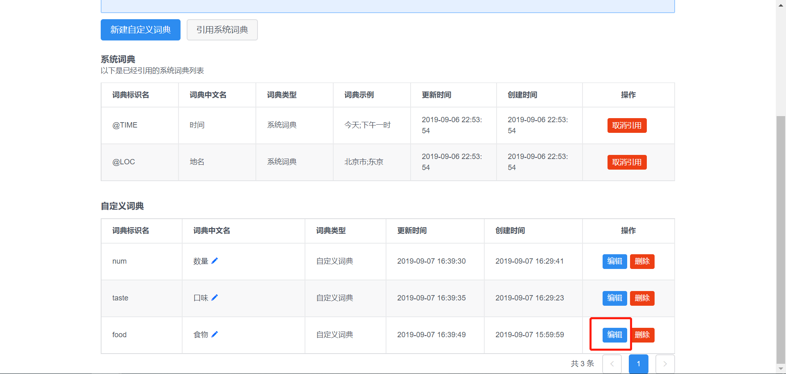</td></tr>
</table>

词典详情页面可以添加多个同义词与近义词，添加后进行保存

<table class="image">
<caption align="bottom">编辑词条</caption>
<tr><td></td></tr>
</table>

### 训练机器人

在意图详情页面，点击保存，提示：训练成功，可进行测试

<table class="image">
<caption align="bottom">保存</caption>
<tr><td></td></tr>
</table>

点击意图详情页面右上角“测试”按钮，进入测试对话页面

<table class="image">
<caption align="bottom">测试</caption>
<tr><td>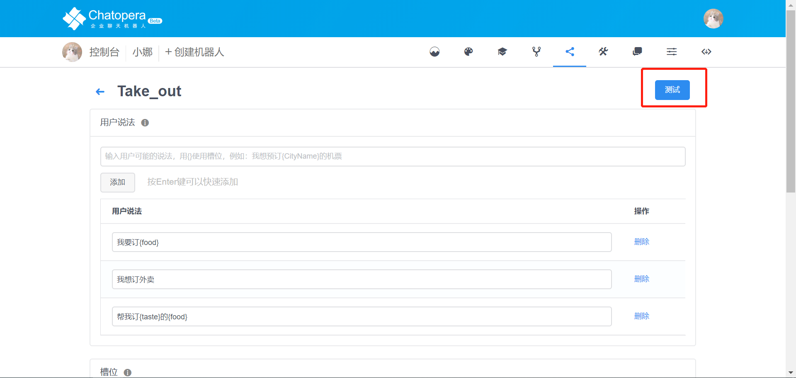</td></tr>
</table>

<table class="image">
<caption align="bottom">测试</caption>
<tr><td></td></tr>
</table>

测试对话窗口输入意图中的用户说法对机器人进行训练，机器人识别到意图后会对该意图下添加的槽位进行追问

<table class="image">
<caption align="bottom">对话</caption>
<tr><td>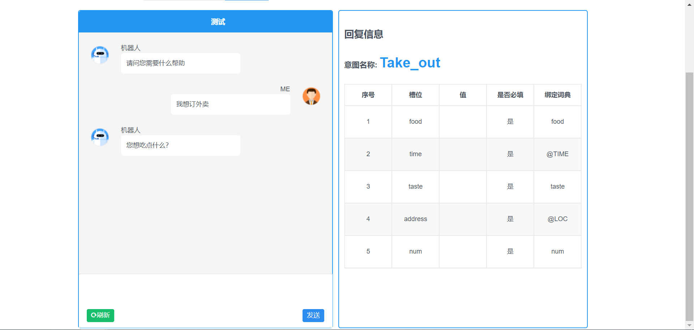</td></tr>
</table>

机器人识别到所有槽位后会结束对话，建立新的会话

<table class="image">
<caption align="bottom">建立新的会话</caption>
<tr><td>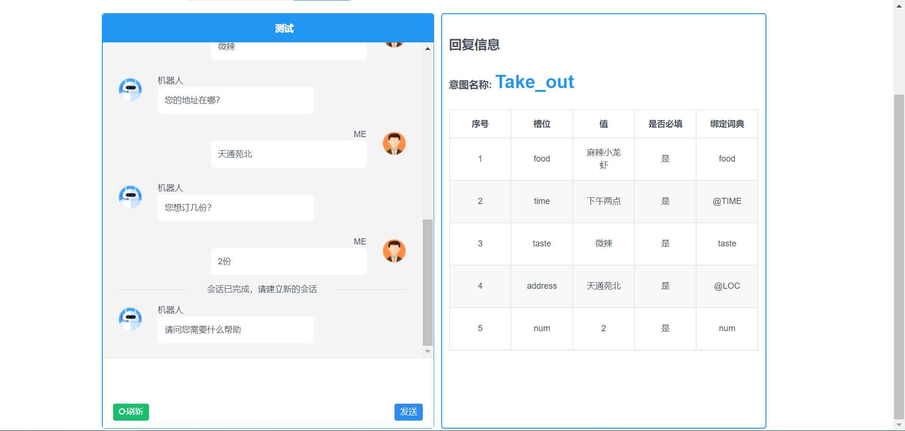</td></tr>
</table>

### 发布机器人

每次机器人训练通过后，都会自动更新【版本管理】模块中的调试版本：

<table class="image">
<caption align="bottom">调试版本</caption>
<tr><td></td></tr>
</table>

机器人存在调试版本时，可进行测试，测试无误后可对当前调试版本进行发布上线

<table class="image">
<caption align="bottom">发布上线</caption>
<tr><td></td></tr>
</table>

## 词典管理

### 事前准备：发现问题，分析问题

明确问题是什么，例如我们需要的是帮助用户来定一份外卖，那么问题就是建立一个定外卖的意图

分析这个意图需要的词典：例如订一份外卖需要知道用户想定什么外卖，什么时候定，定多少，以及口味要求和地址。那么此时需要的词典就包括：food（食物）、time（时间）、num（数量）、taste（口味）、address（地址）

接下来就可以通过这些分析结果来创建一个意图了

### 自定义词典

**命名规则与创建、修改中文名、删除**

 命名规则：

- 词典标识名为字母、数字、下划线的组合，1-32位，如：RailTypes
- 同一个机器人下的词典标识名不能重复
- 词典标识名一经确认后无法进行修改

创建：

在词典管理页面点击新建自定义词典，在弹出的对话框里输入正确的自定义词典名称，点击确定

<table class="image">
<caption align="bottom">新建自定义词典</caption>
<tr><td></td></tr>
</table>

<table class="image">
<caption align="bottom">新建自定义词典</caption>
<tr><td>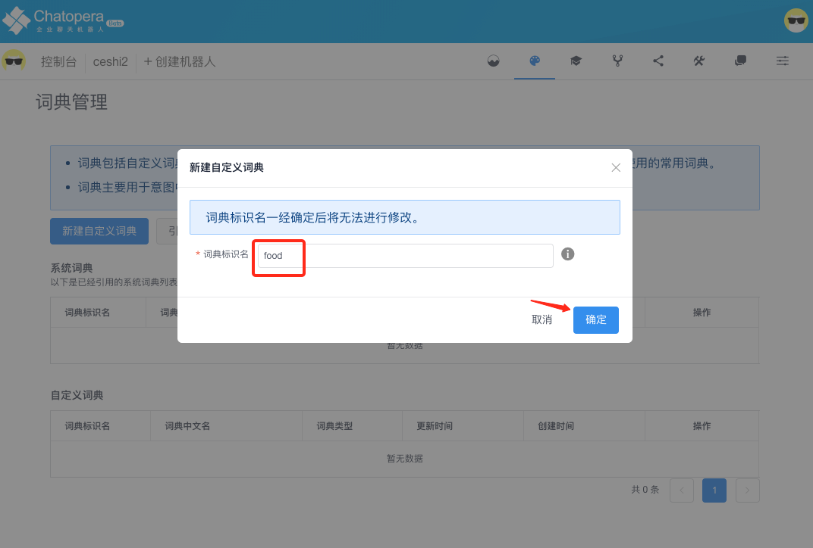</td></tr>
</table>

如果创建的自定义词典名称不符合要求，会有相应的提示

<table class="image">
<caption align="bottom">不符合要求</caption>
<tr><td></td></tr>
</table>

修改中文名：对于已经创建的自定义词典可以修改中文名

<table class="image">
<caption align="bottom">修改中文名</caption>
<tr><td>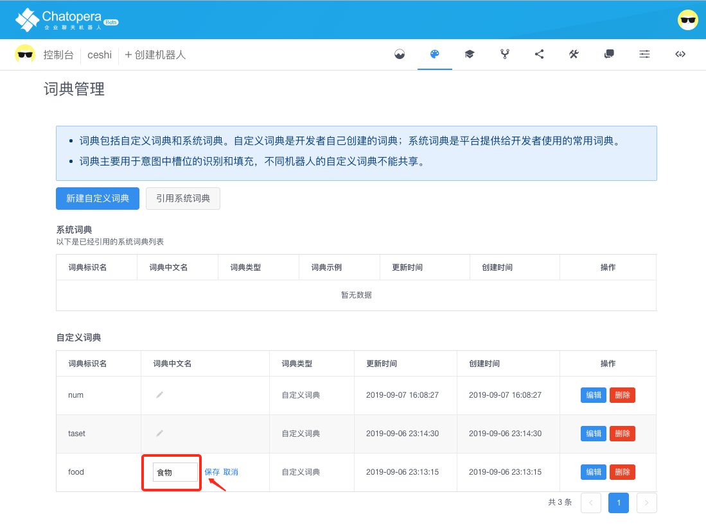</td></tr>
</table>

删除：对于不需要的自定义词典点击删除按钮即可

<table class="image">
<caption align="bottom">删除自定义词典</caption>
<tr><td>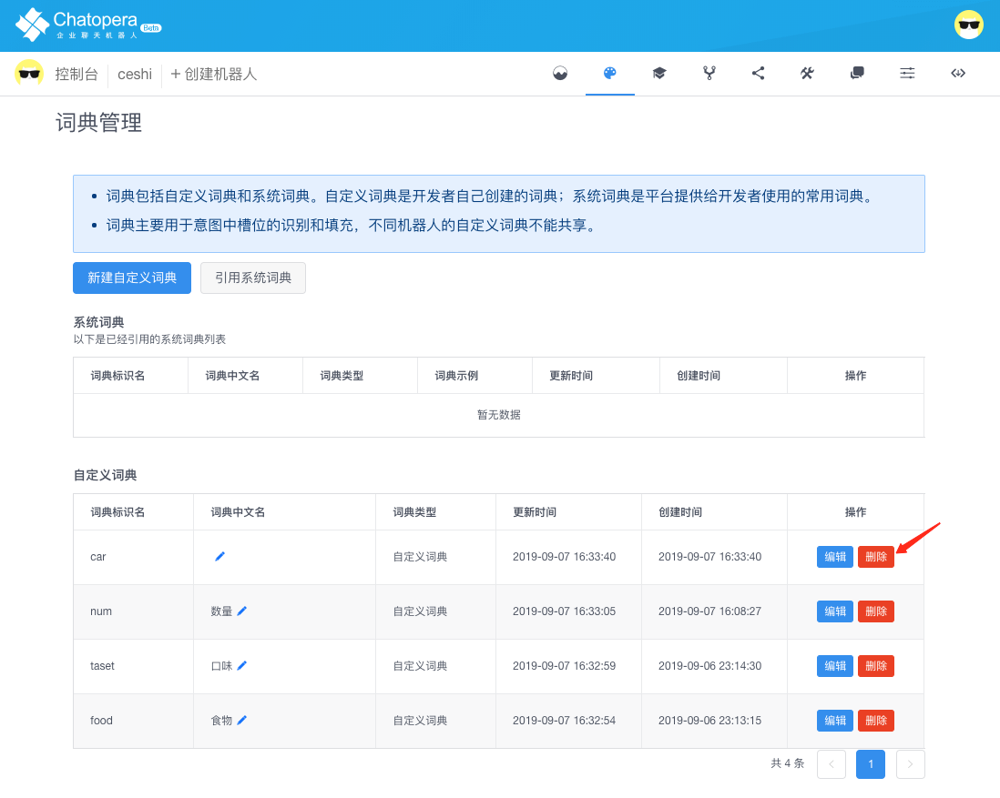</td></tr>
</table>

<table class="image">
<caption align="bottom">删除自定义词典</caption>
<tr><td>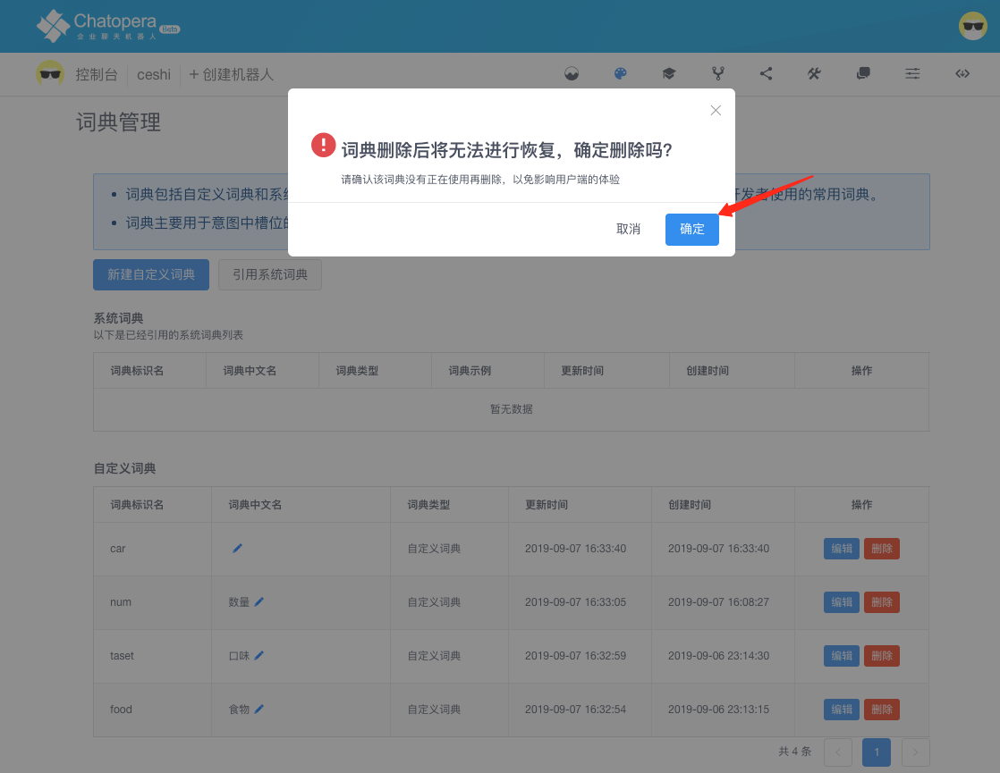</td></tr>
</table>

对于已经绑定了槽位的自定义词典不可删除

<table class="image">
<caption align="bottom">不可删除</caption>
<tr><td></td></tr>
</table>

### 编辑自定义词典（词条）

**添加词条的方法**

请使用分号；分隔词项，第一个词项将作为标准词，后面的词项将作为同义词。

**词条的增删改查**

添加词条：编辑完成后点击添加或者回车

<table class="image">
<caption align="bottom">添加词条</caption>
<tr><td></td></tr>
</table>

删除词条：对于不需要的词条可以进行删除，点击删除按钮即可

修改词条：一个词条的标准词一旦确定不可修改，但是同义词可以修改，点击编辑按钮，出现输入框，可以对同义词进行修改

<table class="image">
<caption align="bottom">修改词条</caption>
<tr><td>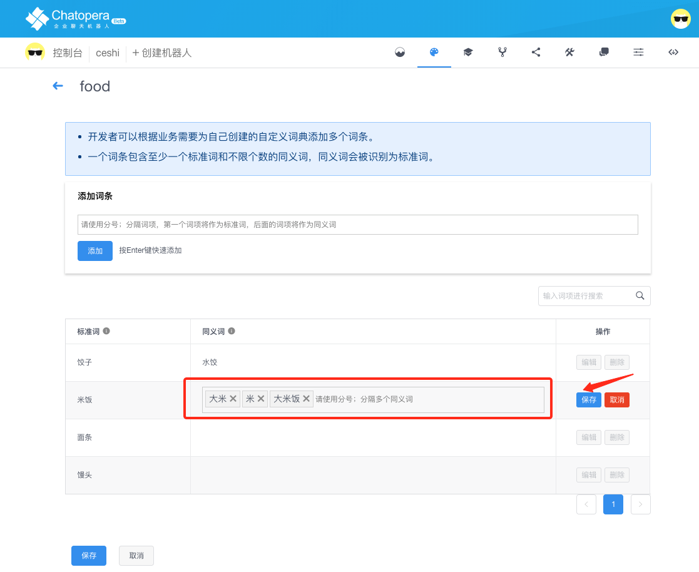</td></tr>
</table>

查找词条：对于词条较多对词典来说，可以快速搜索词条。在搜索框输入需要搜索的词条之后点击放大镜或者点击回车键即可搜索。搜索完成后搜索框中出现一个清除按钮，点击之后清除本次搜索

<table class="image">
<caption align="bottom">查找词条</caption>
<tr><td>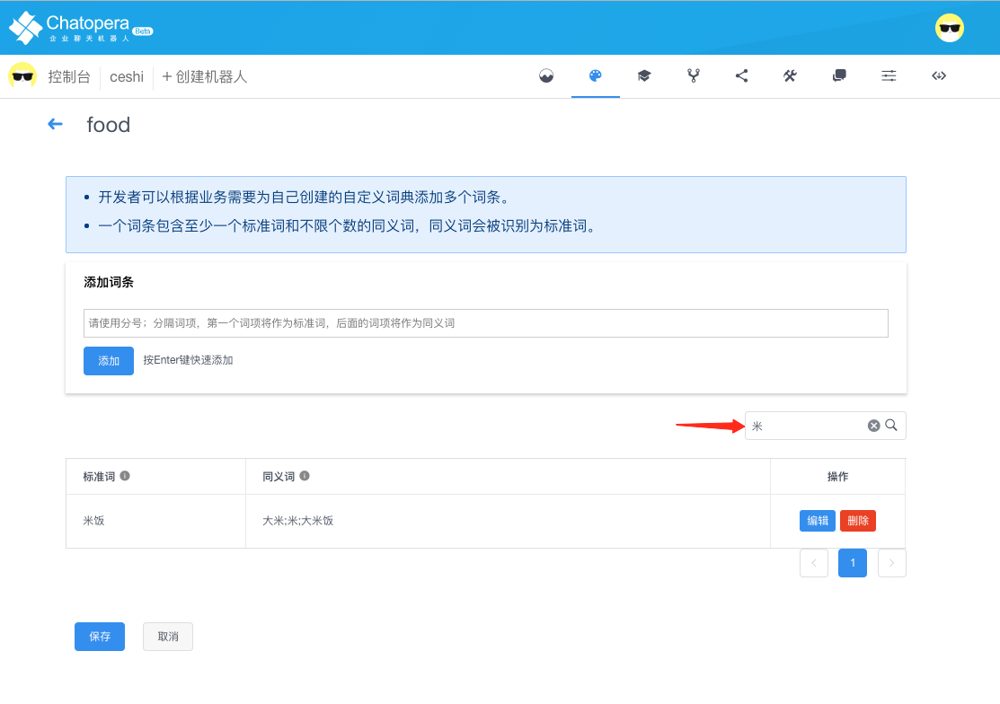</td></tr>
</table>

**保存**

在编辑完所有词条之后，需要进行保存。或者本页词条有变更的情况下进行翻页或者搜索，都需要先进行保存。保存并且训练成功有提示

<table class="image">
<caption align="bottom">保存</caption>
<tr><td></td></tr>
</table>

<table class="image">
<caption align="bottom">保存</caption>
<tr><td>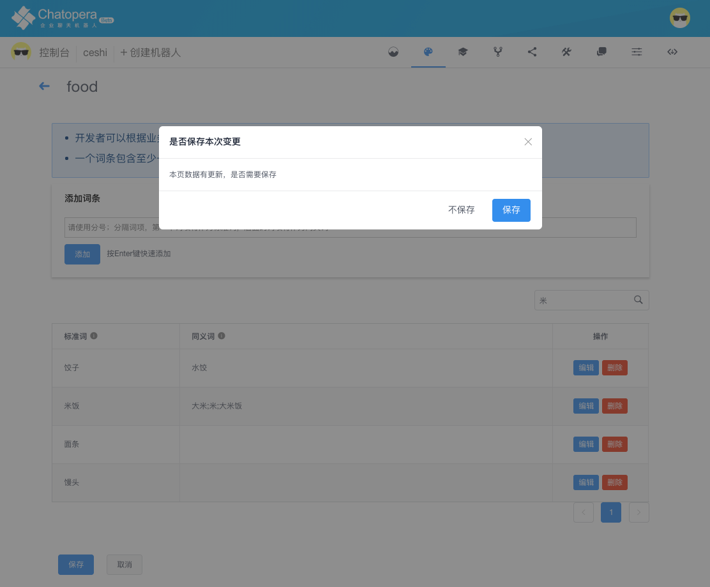</td></tr>
</table>

**自定义词典的维护**

为了用户体验更好，需要对自定义词典进行维护与管理

创建时：在创建词典添加词条时，尽可能多的，全面的添加不同的词条和同义词，便于在槽位中被识别出来（如果用户说的词条在该自定义词典中没有，就会识别不出来）

使用时：在历史消息中可以查看所有机器人与用户的对话，如果发现用户说的词条在该自定义词典中没有，应该立即加上

### 系统词典

**展示系统词典**

系统词典可以直接引用，无需配置词条。已有的系统词典包括  LOC 、PER、 TIME、ORG。在引用系统词典页面中可以看到

<table class="image">
<caption align="bottom">系统词典</caption>
<tr><td>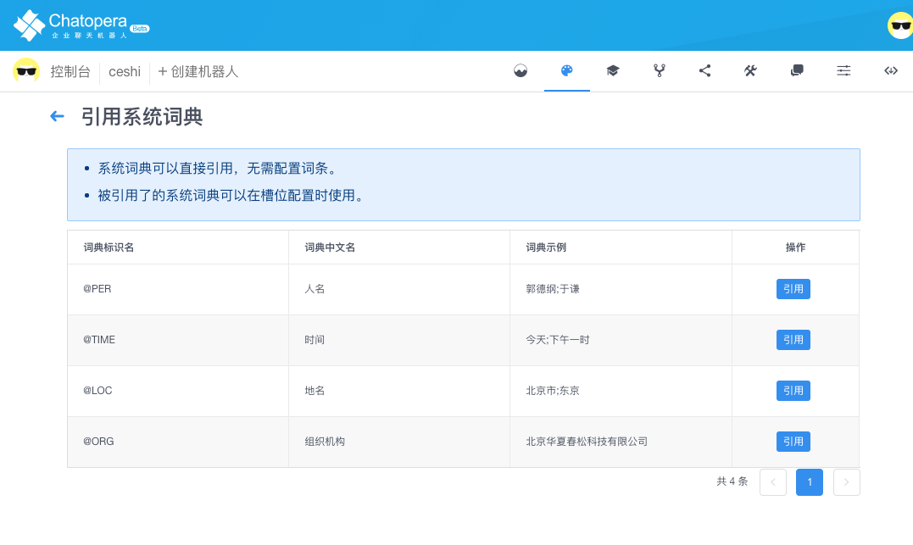</td></tr>
</table>

各个系统词典的作用

- LOC：地名，例如：北京市、东京
- PER ：人名，例如：郭德纲、于谦
- TIME：时间，例如：今天、下午一时
- ORG：组织机构，例如：北京华夏春松科技有限公司

**系统词典引用与取消引用**

对于系统词典可以引用和取消引用。被引用了的系统词典可以在槽位配置时使用

<table class="image">
<caption align="bottom">引用与取消</caption>
<tr><td>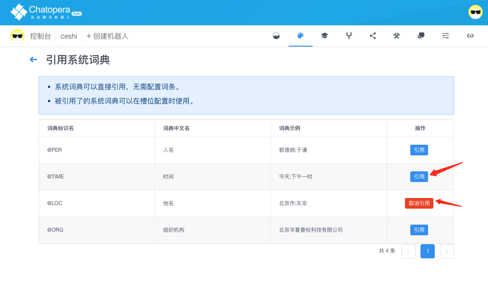</td></tr>
</table>

## 意图管理

## 版本管理

## 系统集成

## 查看使用情况

## 评论

