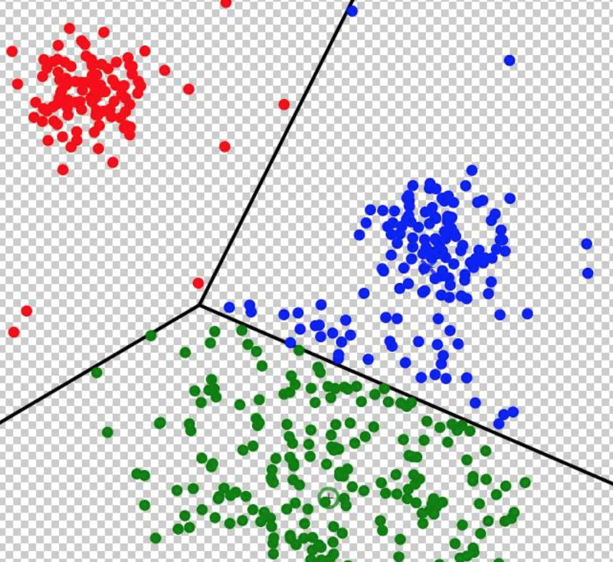
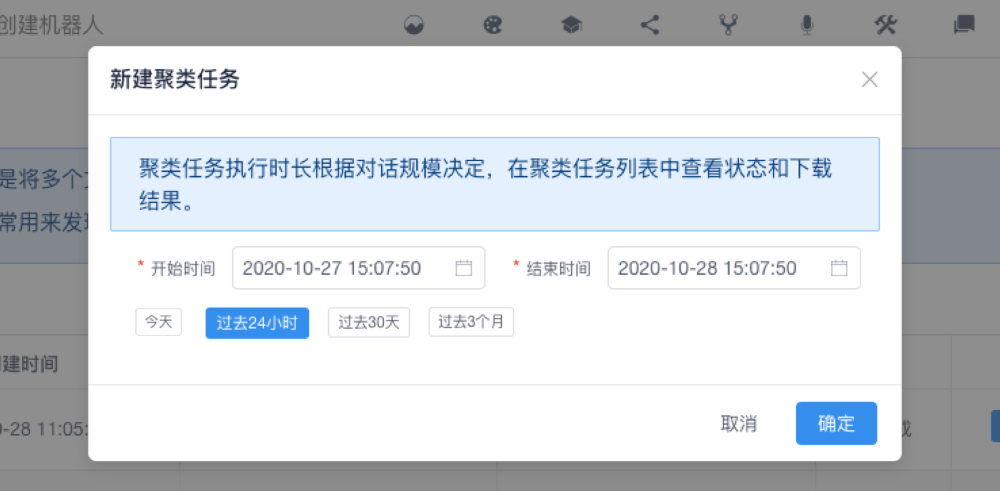
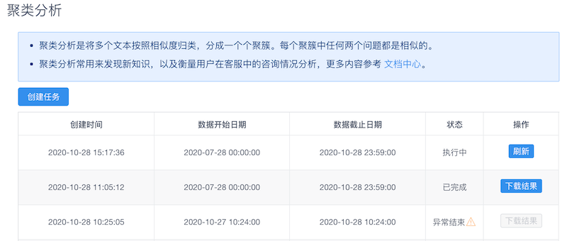
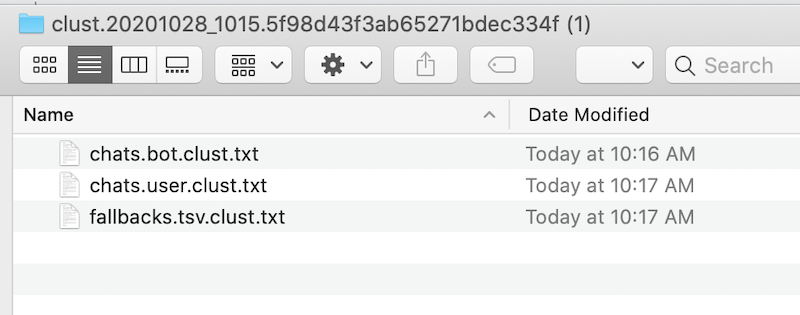

# 聚类分析

## 概述

**Chatopera 机器人平台聚类分析**是将多个文本按照相似度分类，分成一个个聚簇。每个聚簇中任何两个问题都是相似的。聚类分析在运营聊天机器人、提升智能化水平起着关键作用。聚类分析的结果可以用来：

1）优化知识库：发现新知识，新问题或已有问题的相似问；

2）优化多轮对话脚本：发现对话流程，话术，业务流程需求；

3）优化意图识别：新的意图，意图中的参数；

4）优化商业智能：发现新需求，访客痛点，业务流程改造；

5）衡量用户活跃度，分析用户激活、留存、客户服务等环节的问题。

在聊天机器人上线后，可能未必达到及格的程度。比如知识库命中率比较低，这时候，就要经常的使用聚类分析功能，优化知识库，常用方案是每天上午执行过去 24 小时或 3 天的对话历史，然后下载聚类结果，进行机器人优化。

聚类分析，有如上图，不同颜色的零散的点，使用线段尽量将相同颜色的点汇聚在一个区域，聚类分析算法就是寻找最佳的线段。聚类分析算法使用非监督的机器学习算法，不保证聚类结果的准确无误，通常是聚类后方便进一步的人工标注工作，此处恕不赘述细节。

## 提交聚类任务

在机器人详情页面，在导航菜单中打开“聚类分析”页面。
点击“创建任务”。

在弹出的对话窗口中选择聚类针对的时间范围：开始日期距离现在远，结束日期距离现在近。聚类任务分析的数据就是这个时间段内机器人和访客的对话历史数据。

使用快捷方式创建聚类时间范围：今天，过去 24 小时，过去 3 天等。

## 下载聚类结果

提交聚类结果后，自动回到聚类分析页面，聚类分析页面的主要内容是聚类任务的列表，包括每个聚类任务的创建日期，聚类时间范围，状态。

状态分为：执行中、异常结束、执行完成。

针对执行完成的聚类任务，在操作中可以下载结果，点击后浏览器将下载 Zip 压缩包，建议用户安装 [7-Zip 软件](https://www.7-zip.org/)。

执行中的聚类任务，可以通过点击操作中的刷新按钮更新状态信息。

对于异常结束，会有提示，通常是由于聚类时间范围内，没有发生对话历史记录的原因。

## 查看聚类结果

将上一步得到的压缩包解压，解压文件内包含如下文件：

Chatopera 机器人平台提供聚类输出包括：

1）访客发送内容的聚类结果，文件：chats.user.tsv.clust.txt；

2）BOT 发送内容的聚类结果，文件：chats.bot.tsv.clust.txt；

3）BOT 回复为兜底回复时，用户的发送内容的聚类结果，文件：fallbacks.tsv.clust.txt；

4）访客点击没有帮助时，发送的问题，聚类结果，文件：negative.tsv.clust.txt。

每个文件中，包含了聚簇、该聚簇关键词和聚簇内成员等信息。

如果所选聚类时间范围包含数据量太少，也会在聚类结果中提示，因为在这种情况下，没有聚类的价值，通过肉眼就可以完成对话分析。

聚类通常针对的是大规模数据，成千上万、乃至数十万数百万的对话历史记录。

## 计费

**目前，聚类分析只针对对话历史记录产生的数据，包括知识库检索 API 和多轮对话检索 API，执行聚类分析任务不收取费用。**

## 评论

