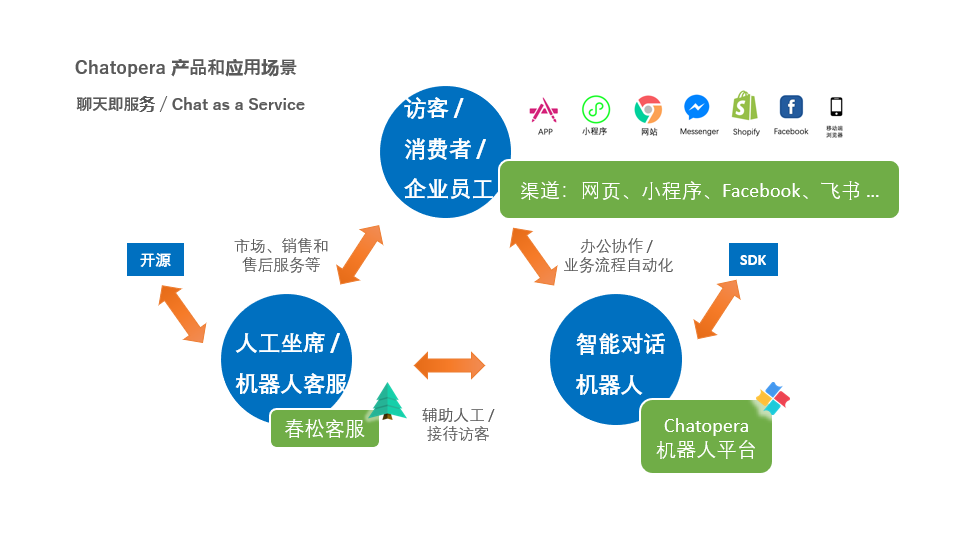

# 服务概述

## Chatopera 机器人平台

用聊天机器人做市场营销、客户服务和自动化流程？如何实现多轮对话？

**Chatopera 机器人平台帮助企业和开发者使用低代码方式定制智能对话机器人。**

[Chatopera 云服务](https://bot.chatopera.com)是[Chatopera 机器人平台](https://docs.chatopera.com/products/chatbot-platform/index.html)的公有云实例，Chatopera 云服务尤其对中小型企业非常友好，按需消费，一站式上线智能对话机器人。

Chatopera 云服务使用按量计费，提供多语言 SDK 集成；同时 Chatopera 可为企业[私有部署 Chatopera 机器人平台](https://docs.chatopera.com/products/chatbot-platform/contract/on-premise.html)。

Chatopera 机器人平台目前支持语言：

- **中文简体（zh_CN）**
- **中文繁体（zh_TW）**
- **英语（en_US）**
- **日语（ja）**
- **泰语（th）**

## 应用场景

智能对话机器人在 Chatopera 的“聊天即服务”整体系统中，占据重要位置。

Chatopera 融合了不同形式的实现聊天机器人的方法，支持定制多轮对话，从而满足企业各种需求，管理对话机器人对话内容。此外，Chatopera 机器人平台还有聊天历史管理、聚类分析和大语言模型等模块，这些服务都是紧紧围绕智能对话机器人的上线展开的。

## 下一步

- [新手任务：使用入门教程一步步实现智能对话机器人](https://docs.chatopera.com/products/chatbot-platform/tutorials/index.html)
