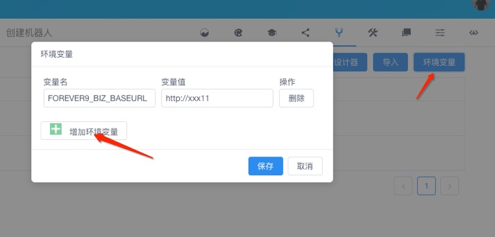

# basics

基本函数库。

## config

获取**环境变量**，环境变量在**多轮对话设计器**和**聊天机器人多轮对话控制台**都可以定义，目的是在设计阶段和运行阶段，多轮对话使用不同的配置。

<table class="image">
<caption align="bottom">配置环境变量</caption>
<tr><td></td></tr>
</table>

`config`作为函数中的全局常量，不需要用户定义，不支持改变该值，只能作为读取用途，并且`config`只是键值对，值只是`string`类型。

```函数
exports.print_key_value = function(key, cb){
    // 通过通配符获得key, 查看其在环境变量中对应对值
    cb(null, "Ok, value is " + config[key]);
}
```

- config 更多使用示例代码：[https://github.com/chatopera/chatbot-samples/search?q=config](https://github.com/chatopera/chatbot-samples/search?q=config)

`环境变量`常用来配置一些生产环境对应的信息。

## http

用于在函数内部，通过 HTTP 协议集成外部系统。

`http`作为函数中的全局常量，不需要用户定义。

```函数
http.get(url[, config])
http.delete(url[, config])
http.head(url[, config])
http.options(url[, config])
http.post(url[, data[, config]])
http.put(url[, data[, config]])
http.patch(url[, data[, config]])
```

Chatopera 机器人平台中，函数内置`http`常量使用[axios](https://www.npmjs.com/package/axios)包实例化，`http`即`axios`。

- http 更多使用示例代码：[https://github.com/chatopera/chatbot-samples/search?q=http](https://github.com/chatopera/chatbot-samples/search?q=http)

- axios 详细使用文档： [https://github.com/axios/axios](https://github.com/axios/axios)

## debug

打印调试日志。

`debug`作为函数中的全局常量，不需要用户定义。

```函数
debug("hello")
debug("hello %s", stringVar)
debug("hello %s, %j", stringVar, jsonVar)
debug("hello %s, %o", stringVar, objVar)
```

- debug 更多使用示例代码：[https://github.com/chatopera/chatbot-samples/search?q=debug](https://github.com/chatopera/chatbot-samples/search?q=debug)

## \_

[lodash](https://lodash.com/docs/4.17.15) 是一个一致性、模块化、高性能的 JavaScript 实用工具库。Lodash 通过降低 array、number、objects、string 等等的使用难度从而让 JavaScript 变得更简单。 Lodash 的模块化方法 非常适用于：

- 遍历 array、object 和 string
- 对值进行操作和检测
- 创建符合功能的函数

鉴于这些特点，Chatopera 内置函数库增加了全局变量 `_` 来使用 lodash v4.17.15 的接口。

比如，可以在函数中这样写将 JSON Array 转化为 JSON Object。

```函数
var array = [
  { 'dir': 'left', 'code': 97 },
  { 'dir': 'right', 'code': 100 }
];

_.keyBy(array, function(o) {
  return String.fromCharCode(o.code);
});
// => { 'a': { 'dir': 'left', 'code': 97 }, 'd': { 'dir': 'right', 'code': 100 } }

_.keyBy(array, 'dir');
// => { 'left': { 'dir': 'left', 'code': 97 }, 'right': { 'dir': 'right', 'code': 100 } }
```

更多 lodash 方法，参考 [https://lodash.com/docs/4.17.15](https://lodash.com/docs/4.17.15)。
