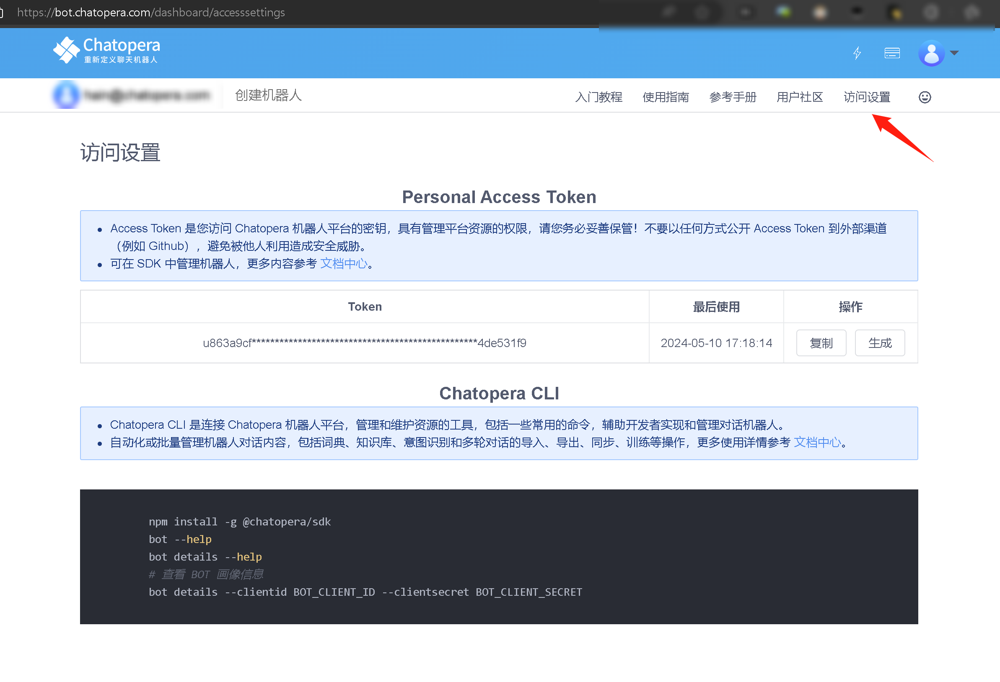

# `Chatopera` 类构造函数 <!-- markup:skip-line -->

## 构造函数

<h4><font color="purple">构造函数</font></h4>

```API
Chatopera(accessToken [, botProvider])
```

<h4><font color="purple">参数说明</font></h4>

| name        | type   | required | description                                                                                                                      |
| ----------- | ------ | -------- | -------------------------------------------------------------------------------------------------------------------------------- |
| accessToken | string | &#10004; | 在[机器人控制台/访问设置](https://bot.chatopera.com/dashboard/accesssettings)中获取，即 `Personal Access Token`                  |
| botProvider | string | &#10008; | Chatopera 机器人平台地址，<br><font color="green">当使用 Chatopera 云服务时，该值为 <https://bot.chatopera.com>，也是默认值</font> |
<!-- markup:table-caption 参数列表 -->

在机器人控制台，打开【访问设置】:



刚刚注册的账户需要点击`生成`进行初始化；点击`复制`将 Token 值复制到粘贴板。

注意：**Personal Access Token(简称：Access Token) 是您访问 Chatopera 机器人平台的密钥，具有管理平台资源的权限，请您务必妥善保管！不要以任何方式公开 Access Token 到外部渠道（例如 Github），避免被他人利用造成安全威胁。**

## 更多实例化例子

不同语言下，`Chatopera` 类的包名或引用方式不同。

<h5><font color="purple">Node.js</font></h5>

```Node.js
const { Chatopera } = require('@chatopera/sdk');
...
const chatopera = new Chatopera(accessToken[, botProvider]);
```

<h5><font color="purple">Java</font></h5>

```Java
import com.chatopera.bot.sdk.Chatopera;
...
Chatopera chatopera = new Chatopera(accessToken[, botProvider]);
```

<h5><font color="purple">Python</font></h5>

```Python
from chatopera import Chatopera
co = Chatopera(accessToken[, botProvider])
```

<h5><font color="purple">PHP</font></h5>

假设使用[composer](https://getcomposer.org/)作为包管理工具，其它安装方式参考[chatopera-php-sdk](https://github.com/chatopera/chatopera-php-sdk)。

```PHP
<?php

include_once **DIR** . "/vendor/autoload.php";
$chatopera = new Chatopera\SDK\Chatopera($accessToken[, $botProvider]);

```

<h5><font color="purple">Go</font></h5>

```Go
import (
 "github.com/chatopera/chatopera-go-sdk"
)
...
var admin = chatopera.NewChatopera(accessToken[, botProvider])
```
