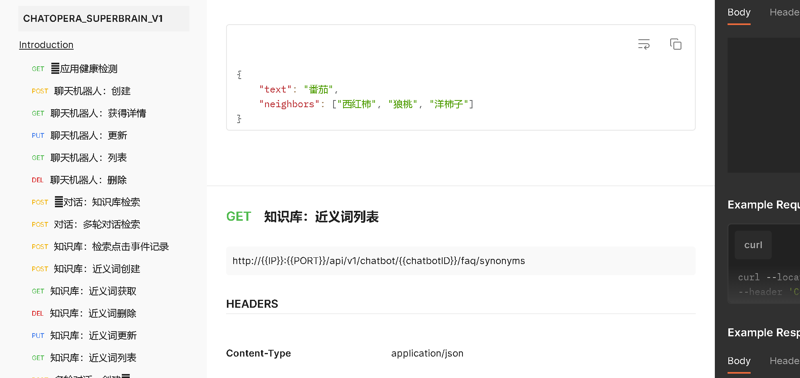

# SDK

Chatopera 机器人平台用户可以在不同的软件系统、程序中接入 Chatopera 机器人。 SDK 是面向不同编程语言和 Chatopera 机器人平台集成的工具库，包括 Node.js、Go、PHP、Python、Java 等。

## 能力概述

SDK 能力概述：使用 `Chatopera` 类创建机器人、获得机器人信息；使用 `Chatbot` 类管理某一机器人的资源； `Chatopera` 类是系统账户级别，`Chatbot` 是单个机器人级别。

`Chatopera` 类使用控制台中【[访问设置](https://bot.chatopera.com/dashboard/accesssettings)】的 `Personal Access Token` 实例化，`Chatbot` 类使用每个机器人的 `clientId` 和 `secret` 初始化。


## 下载安装

SDK 简化了集成的复杂度，某些语言可以通过包管理工具安装。SDK 下载地址参考列表：

| 语言    | 下载地址                                                                      | 使用指南                                                                                                                                                                                                  |
| ------- | ----------------------------------------------------------------------------- | --------------------------------------------------------------------------------------------------------------------------------------------------------------------------------------------------------- |
| Python  | [chatopera-py-sdk](https://pypi.org/project/chatopera/)                       | [示例程序](https://github.com/chatopera/chatopera-py-sdk/blob/master/demo.py) / [技术支持](https://github.com/chatopera/docs/issues/new/choose)                                                           |
| Java    | [chatopera-java-sdk](https://github.com/chatopera/chatopera-sample-java/wiki) | [示例程序](https://github.com/chatopera/chatopera-sample-java) / [技术支持](https://github.com/chatopera/docs/issues/new/choose) / [JavaDocs](https://chatopera.github.io/chatopera-sample-java/apidocs/) |
| Go      | [chatopera-go-sdk](https://github.com/chatopera/chatopera-go-sdk)             | [示例程序](https://github.com/chatopera/chatopera-go-sdk/blob/master/chatopera_test.go) / [技术支持](https://github.com/chatopera/docs/issues/new/choose)                                                 |
| PHP     | [chatopera-php-sdk](https://packagist.org/packages/chatopera/sdk)             | [示例程序](https://github.com/chatopera/chatopera-php-sdk) / [技术支持](https://github.com/chatopera/docs/issues/new/choose)                                                                              |
| Node.js | [chatopera-nodejs-sdk](https://www.npmjs.com/package/@chatopera/sdk)          | [示例程序](https://github.com/chatopera/chatopera-sample-node) / [技术支持](https://github.com/chatopera/docs/issues/new/choose)                                                                          |
<!-- markup:table-caption SDK 下载地址和使用说明 -->

为了方便开发者调用 SDK，每个 SDK 内均有示例程序或测试程序作为参考。

> **提示：** 以上 SDK 同时支持私有部署的 Chatopera 机器人平台。

在聊天机器人的一级菜单，可以进入**集成页面**查看。


<font color="blue">如不能满足您使用环境或者语言的 SDK，请[创建工单](https://github.com/chatopera/docs/issues/new?template=1_help.md)进行描述，Chatopera 将尽快满足您的需求。</font>

## 核心类

在每个语言的 SDK 中，均实现两个类：`Chatopera` 类和`Chatbot` 类。

### `Chatopera` 类

`Chatopera`类是与 Chatopera 机器人平台集成的一个高级类，因为 Chatopera 云服务为开发者提供聊天机器人服务，`Chatopera`类的对象就是 Chatopera 云服务中一个注册账户的代理。

通过左侧导航菜单了解使用详情。

### `Chatbot` 类

`Chatbot` 类是与 Chatopera 云服务集成的一个核心类，因为 Chatopera 云服务为开发者提供聊天机器人服务，`Chatbot` 类的对象就是 Chatopera 云服务中一个聊天机器人的代理。

<!-- markup:markdown-end -->

通过左侧导航菜单了解使用详情。


## Postman RestAPIs Documentation

在 Chatopera SDK 的核心类中，最终都是请求 Chatopera 云服务 RestAPIS，比如：

```
chatbot#command("GET", String.format("/faq/database?q=&&page=%d&limit=%d", page, limit));
```

会请求 `GET http://{{IP}}:{{PORT}}/api/v1/chatbot/{{chatbotID}}/faq/database`。

RestAPIs 包含大约 100 个接口，使用 Postman 在线文档获取详细介绍：

[https://documenter.getpostman.com/view/244455/VUjPH5DB](https://documenter.getpostman.com/view/244455/VUjPH5DB)



## 已知问题

### 在 Windows WSL 内调用 SDK，返回异常 invalid timestamp

错误原因：Windows WSL 的时间同步有 BUG，未能和互联网时间同步。

解决方案：执行手动的时间同步。

假设使用的 WSL 发行版本基于 Ubuntu, 那么可以执行下面的命令解决。

```
sudo apt-get install ntpdate 
sudo ntpdate time.windows.com
```


## 接下来

- [`Chatopera` 类详细说明](https://docs.chatopera.com/products/chatbot-platform/references/sdk/chatopera/index.html)

- [`Chatbot` 类详细说明：对话检索、机器人信息及更新，etc.](https://docs.chatopera.com/products/chatbot-platform/references/sdk/chatbot/index.html)

- [遇到问题？常看“获得帮助”](https://docs.chatopera.com/products/chatbot-platform/index.html#帮助)
