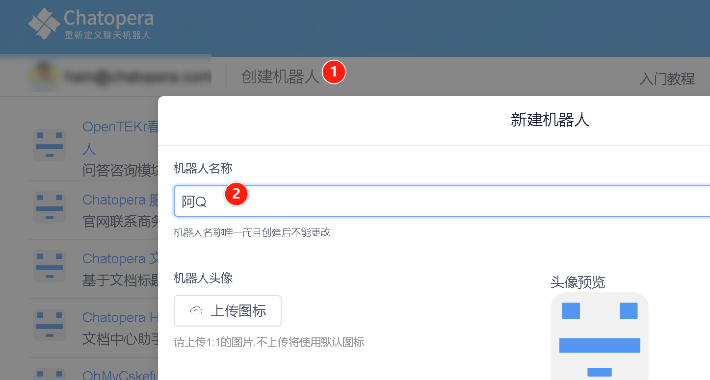
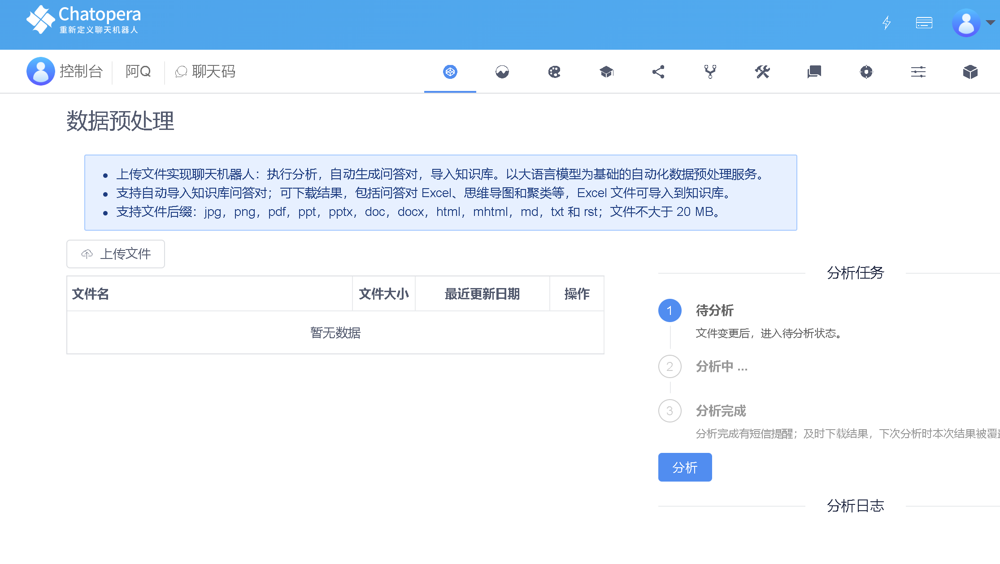
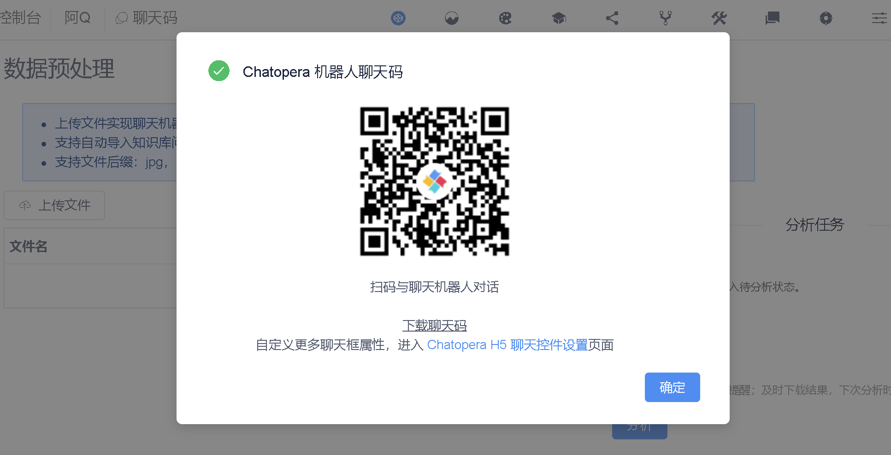

<!-- markup:blank-line -->
# <1/5> 创建机器人

<< 上一步：[入门教程首页](/products/chatbot-platform/tutorials/index.html) | <i class="glyphicon glyphicon-time"></i>阅读本节内容大约需要 3 mins <!-- markup:skip-line -->

> 当您在新手任务中，遇到任何问题，欢迎[联系 Chatopera 工程师](https://dwz.chatopera.com/s99784)获得帮助支持~

## 登录

登录 Chatopera 云服务管理控制台：[https://bot.chatopera.com/dashboard](https://bot.chatopera.com/dashboard)。

## 创建机器人

在工具条菜单中，点击【创建机器人】。填入表单：

| 表单项 | 值 |
| --- | --- |
| 机器人名称 | 阿Q |
<!-- markup:table-caption 创建机器人表单 -->

其它信息默认，点击【确认】。

创建成功后，会自动跳转到`阿Q`的数据预处理。

后面，我们再介绍数据预处理服务。下一步，我们就可以向消费者发布聊天机器人了！

## 发布聊天机器人

步骤如下，在菜单中，点击【聊天码】，弹出类似下图的界面。

该二维码，就是您可以公开发送给消费者的，用来和聊天机器人对话的二维码，Chatopera 称之为【聊天码】。如果您需要 URL 的方式接入，可以点击上图中的【Chatopera H5 聊天控件设置】获得~

恭喜你完成本节任务！

 <!-- markup:skip-line -->

<< 上一步：[入门教程首页](/products/chatbot-platform/tutorials/index.html) | >> 下一步：[<2/5> 自动生成知识库](/products/chatbot-platform/tutorials/2-answer-faq.html) <!-- markup:skip-line -->

