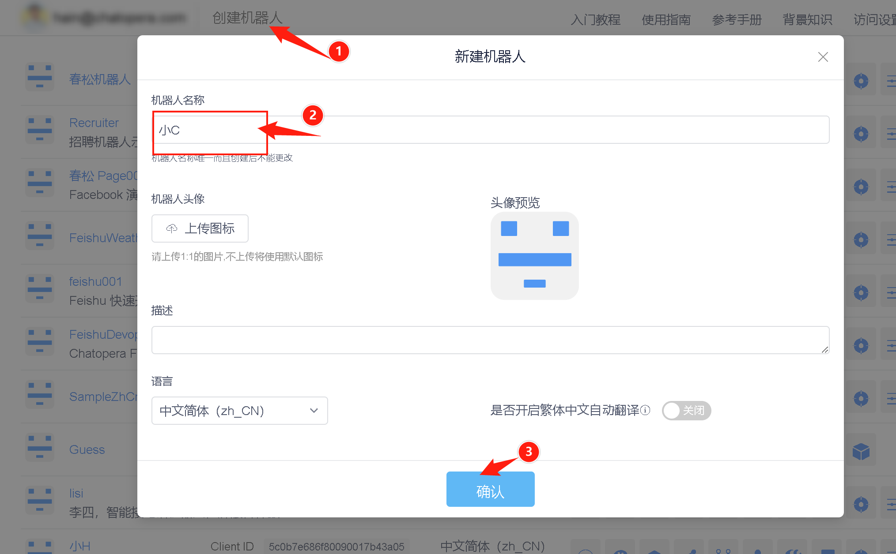
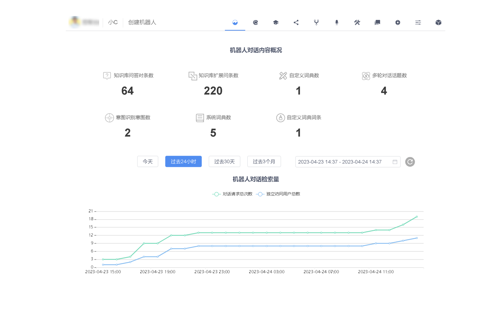
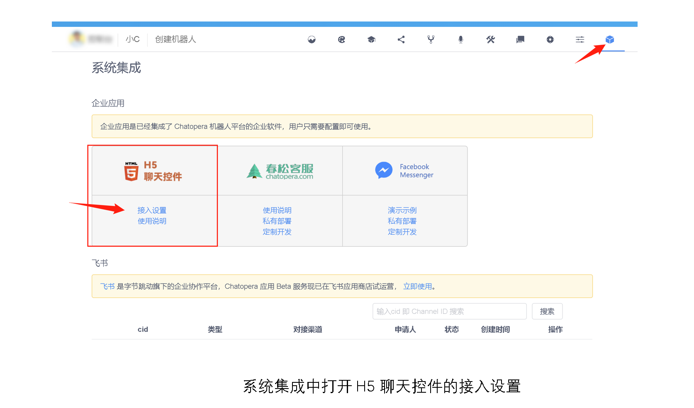
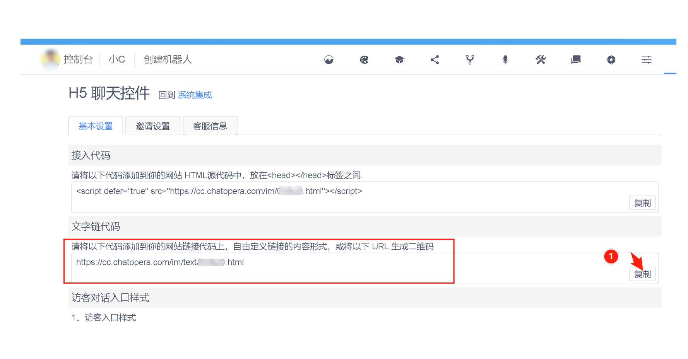
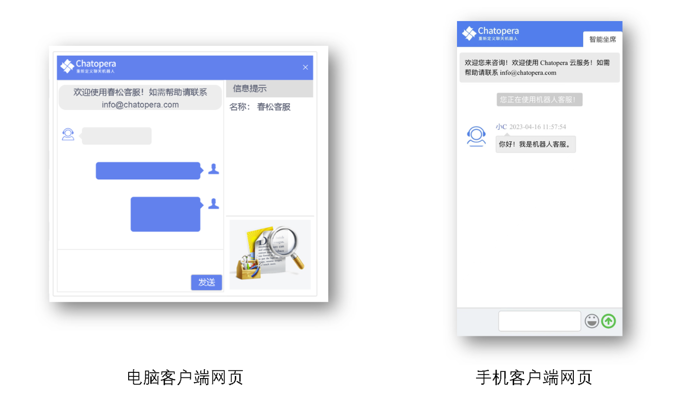

<!-- markup:blank-line -->
# <1/5> 创建机器人 <!-- markup:skip-line -->

<< 上一步：[入门教程首页](https://docs.chatopera.com/products/chatbot-platform/tutorials/index.html) | <i class="glyphicon glyphicon-time"></i>阅读本节内容大约需要 10 mins <!-- markup:skip-line -->

## 登录并创建机器人

登录 [Chatopera 云服务](https://bot.chatopera.com/dashboard) 管理控制台。

[https://bot.chatopera.com/dashboard](https://bot.chatopera.com/dashboard)

在工具条菜单中，点击【创建机器人】。

填入表单：

| 表单项 | 值 |
| --- | --- |
| 机器人名称 | 小C |
| 描述 | 入门教程示例程序 |
<!-- markup:table-caption 创建机器人表单 -->

其它信息默认，点击【确认】。
创建成功后，会自动跳转到`小C`的详情页。

默认的详情页显示对话语料与访问统计信息，可以通过机器人的菜单，导航至机器人的其它页面，比如【机器人设置页面】。在后文，使用`机器人管理控制台`来指代示例程序的详情页。

## 发布聊天机器人

在创建好聊天机器人后，就可以立即发布：让你的聊天机器人面向访客开始服务。访客可以是您自己、您的同事、您的消费者等。过程如下，在`机器人管理控制台`进入系统集成，点击【H5 聊天控件 - 接入设置】。

进入接入设置，找到【文字链代码】，复制该 URL。

将 URL 发送给访客：

* 通过 IM 工具发送，比如微信
* 将该 URL 使用工具生成二维码，然后发送该二维码
* 将该 URL 作为超链接，比如网页 HTML 超链接、微信公众号菜单的按钮的超链接、微信公众号文章阅读原文的地址

该形式很多，只要访问者在浏览器中打开【文字链代码】的 URL 即可与你的聊天机器人对话。

## 体验聊天机器人

将以上的【文字链代码】URL 粘贴到你的浏览器地址栏并打开，然后开始与聊天机器人对话。对于刚刚创建的聊天机器人，你可以进行如下对话：发送【你好】，你将得到机器人的回应。

恭喜你完成本节任务！

 <!-- markup:skip-line -->

<< 上一步：[入门教程首页](https://docs.chatopera.com/products/chatbot-platform/tutorials/index.html) | >> 下一步：[<2/5> 添加对话语料](https://docs.chatopera.com/products/chatbot-platform/tutorials/2-answer-faq.html) <!-- markup:skip-line -->
