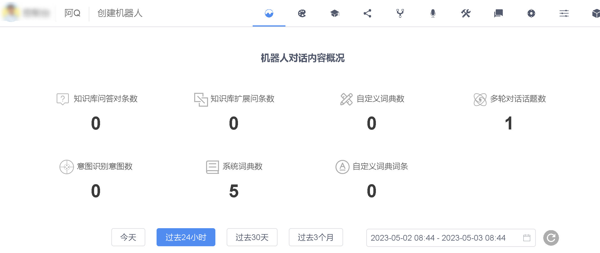
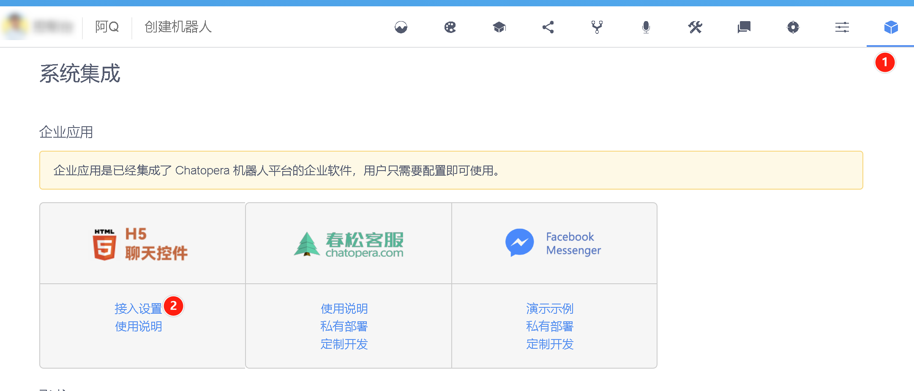
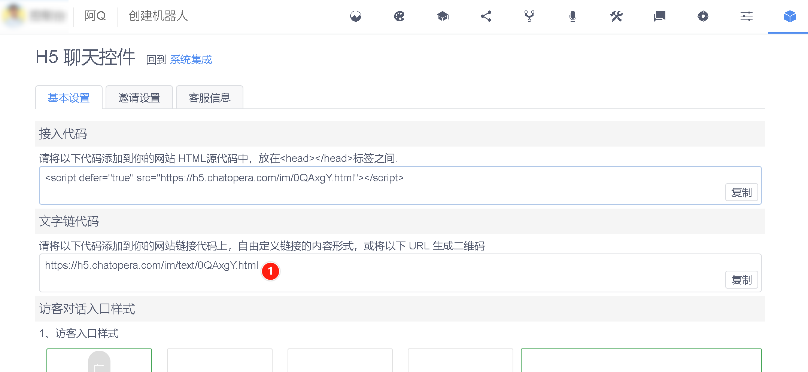

<!-- markup:blank-line -->
# <1/5> 创建机器人

<< 上一步：[入门教程首页](/products/chatbot-platform/tutorials/index.html) | <i class="glyphicon glyphicon-time"></i>阅读本节内容大约需要 3 mins <!-- markup:skip-line -->

## 登录

登录 Chatopera 云服务管理控制台：[https://bot.chatopera.com/dashboard](https://bot.chatopera.com/dashboard)。

## 创建机器人

在工具条菜单中，点击【创建机器人】。填入表单：

| 表单项 | 值 |
| --- | --- |
| 机器人名称 | 阿Q |
<!-- markup:table-caption 创建机器人表单 -->

其它信息默认，点击【确认】。

创建成功后，会自动跳转到`阿Q`的概况页。

## 发布聊天机器人

步骤如下，进入系统集成，点击【H5 聊天控件[^h5-channel] - 接入设置】。

找到【文字链代码】，复制该 URL。

将【文字链代码】URL 在你的浏览器地址栏打开，然后就可以作为访客体验聊天机器人了：发送【你好】，机器人有回应，这是一个默认的对话技能。

恭喜你完成本节任务！

 <!-- markup:skip-line -->

<< 上一步：[入门教程首页](/products/chatbot-platform/tutorials/index.html) | >> 下一步：[<2/5> 添加对话语料](/products/chatbot-platform/tutorials/2-answer-faq.html) <!-- markup:skip-line -->

[^h5-channel]: H5 聊天控件是一个面向访客的发布渠道，访客可以是你自己、你的同事或消费者。H5 聊天控件是聊天机器人快速的提供服务的一种方式。