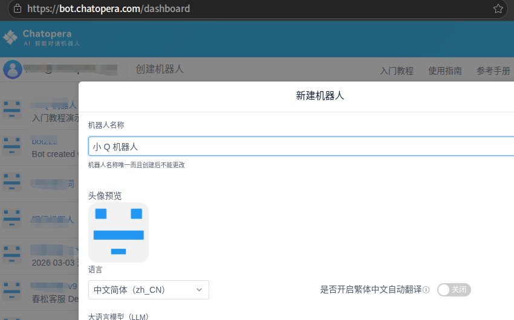
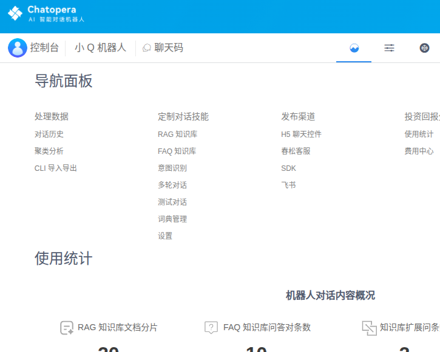
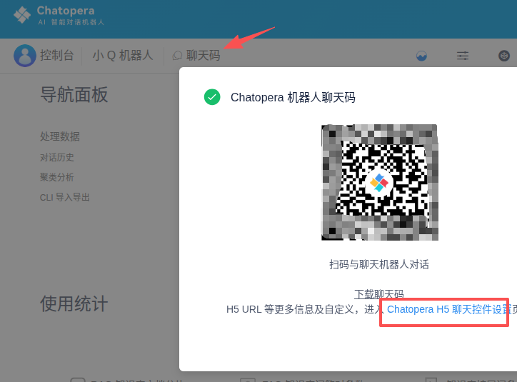
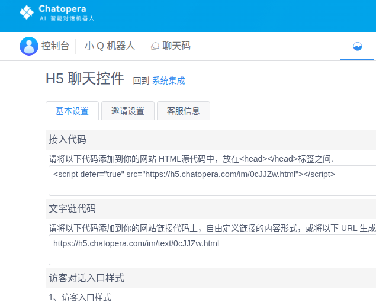
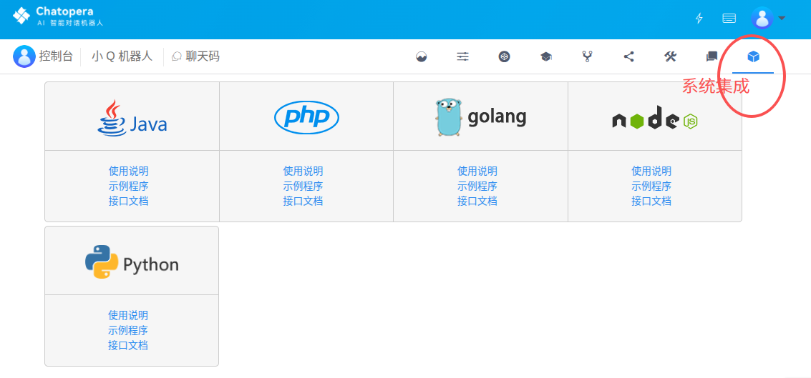

<!-- markup:blank-line -->
# <1/5> 创建机器人

<< 上一步：[入门教程首页](/products/chatbot-platform/tutorials/index.html) | <i class="glyphicon glyphicon-time"></i>阅读本节内容大约需要 15 mins <!-- markup:skip-line -->

> 当您在新手任务中，遇到任何问题，欢迎[联系 Chatopera 工程师](https://dwz.chatopera.com/s99784)获得帮助支持~

## 登录

登录 Chatopera 云服务管理控制台：[https://bot.chatopera.com/dashboard](https://bot.chatopera.com/dashboard)。

## 创建机器人

在工具条菜单中，点击【创建机器人】。填入表单：

| 表单项 | 值 |
| --- | --- |
| 机器人名称 | 小 Q 机器人 |
<!-- markup:table-caption 创建机器人表单 -->

其它信息默认，点击【确认】。

创建成功后，会自动跳转到`小 Q 机器人`的导航面板。

这就是一个立即可用的聊天机器人，在之后的任务中，我们将了解如何丰富小 Q 机器人的对话能力。但是现在您已经可以发布这个机器人给您的访客了[^publish-visitor]！

## 发布聊天机器人

步骤如下，在菜单中，点击【聊天码】，弹出类似下图的界面。

该二维码，就是您可以公开发送给访客的，用来和聊天机器人对话的二维码，Chatopera 称之为**聊天码**。

如果您需要 URL 的方式接入，可以点击上图中的【Chatopera H5 聊天控件设置】获得。

## SDK 集成

您也可以将机器人集成到其它软件和服务中，参考机器人集成页面。

恭喜您完成本节任务！接下来，我们继续改进小 Q 机器人：[回答 80% 的客服问题，使用 RAG 模块](/products/chatbot-platform/tutorials/2-answer-faq.html)。

 <!-- markup:skip-line -->

<< 上一步：[入门教程首页](/products/chatbot-platform/tutorials/index.html) | >> 下一步：[<2/5> 回答 80% 的客服问题，使用 RAG 模块](/products/chatbot-platform/tutorials/2-answer-faq.html) <!-- markup:skip-line -->

[^publish-visitor]: 访客，就是和机器人对话的消费者。