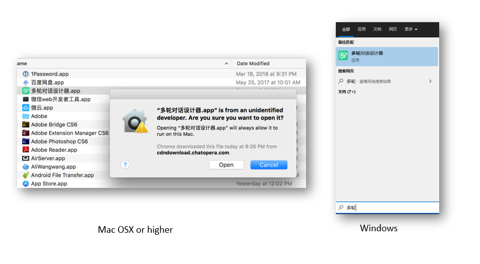

<!-- markup:blank-line -->
# <1/5> 创建机器人 <!-- markup:skip-line -->

<< 上一步：[入门教程首页](https://docs.chatopera.com/products/chatbot-platform/tutorials/index.html) | <i class="glyphicon glyphicon-time"></i>阅读本节内容大约需要 10 mins <!-- markup:skip-line -->

## 登录并创建机器人

登录 [Chatopera 云服务](https://bot.chatopera.com/dashboard) 管理控制台。

[https://bot.chatopera.com/dashboard](https://bot.chatopera.com/dashboard)

在工具条菜单中，点击【创建机器人】。

填入表单：

| 表单项 | 值 |
| --- | --- |
| 机器人名称 | 春松机器人 |
| 描述 | 入门教程示例程序 |

其它信息默认，点击【确认】。
创建成功后，会自动跳转到`春松机器人`的详情页。

默认的详情页显示对话语料与访问统计信息，可以通过机器人的菜单，导航至机器人的其它页面，比如【机器人设置页面】。在后文，使用`春松机器人管理控制台`来指代示例程序的详情页。

现在，春松机器人的对话语料还是初始状态。接下来在多轮对话设计器中添加【春松机器人】。

## 添加机器人到多轮对话设计器

在电脑应用启动中心，打开【多轮对话设计器】，**如果你还没有安装，使用[链接](https://docs.chatopera.com/products/chatbot-platform/howto-guides/cde-install.html)进行安装**。

在多轮对话设计器一级菜单中，点击【添加】。

打开春松机器人管理控制台，进入【设置】页面。

拷贝 `Client Id` 和 `Secret` 到多轮对话设计器【添加表单】，点击【确认】。这里你也可能遇到问题，比如提示[【信息不匹配，请确认机器人信息】](#信息不匹配请确认机器人信息)，参考本文后面的[《可能遇到的问题》](#可能遇到的问题)获得解决方案。

然后，多轮对话设计器会跳转到聊天机器人列表，在列表中，找到`春松机器人`，在对应的操作中点击【打开】，进入春松机器人的话题列表页面。这时，只能看到一个话题：`greetings`。这个话题是创建机器人时默认初始化生成的。

## 和机器人进行第一次对话

在话题列表中，点击 `greetings` 话题的【编辑】按钮，这时进入脚本编辑面板。

在脚本编辑面板中间，有一个聊天对话框，在文本发送区域，输入`你好`，然后点击【发送】。

当你看到春松机器人回复了`你好！`，那么本步骤就完成了！这个对话就是右侧的脚本实现的。

脚本是建立对话机器人思维体系的描述形式，现在，你可以简单的认为：`+` 后就是机器人可以处理的问题的规则；`-`后是该规则发生时，机器人的反应。**通过描述规则和反应，机器人建立了一个“大脑”，Chatopera 多轮对话以此为出发点，建立了一套简单可行的实现机器人智能对话的标准。**

恭喜你完成本节任务！

 <!-- markup:skip-line -->

<< 上一步：[入门教程首页](https://docs.chatopera.com/products/chatbot-platform/tutorials/index.html) | >> 下一步：[<2/5> 添加知识库问答对](https://docs.chatopera.com/products/chatbot-platform/tutorials/2-answer-faq.html) <!-- markup:skip-line -->

## 可能遇到的问题

### 信息不匹配，请确认机器人信息

提示如下：

如果经过验证，你填写的信息没有错误，那么可能是电脑的时间日期与互联网标准时间之间有很大误差，需要先在操作系统上同步互联网时间，以下是 Windows 上同步互联网时间的方法，你也可以手动设置，其它操作系统，都有类似的操作。

