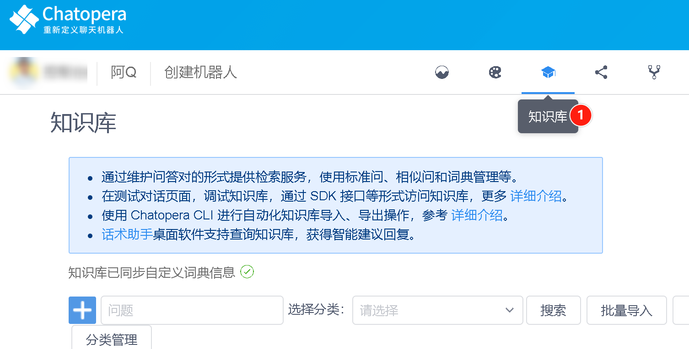
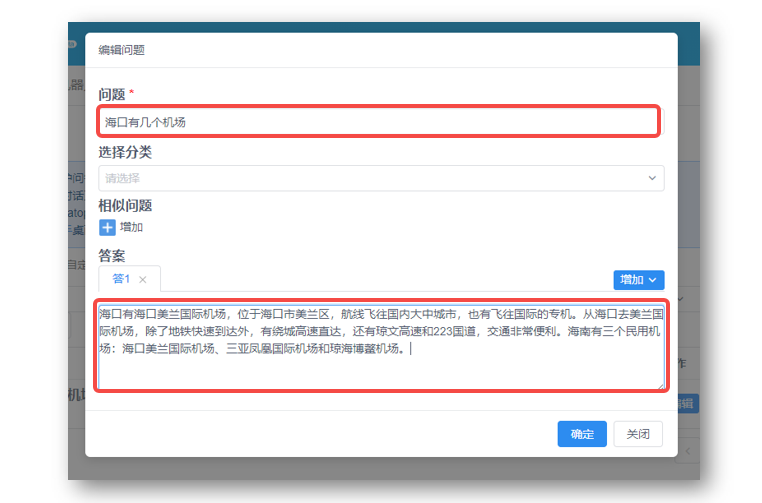
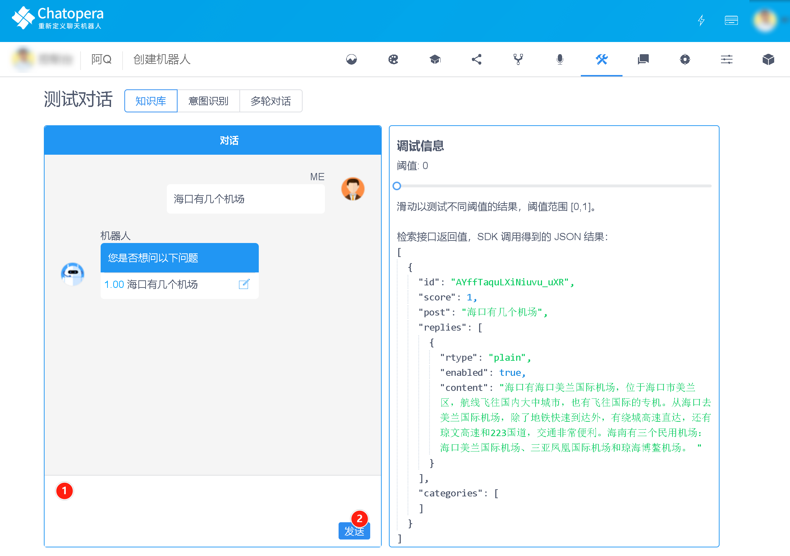
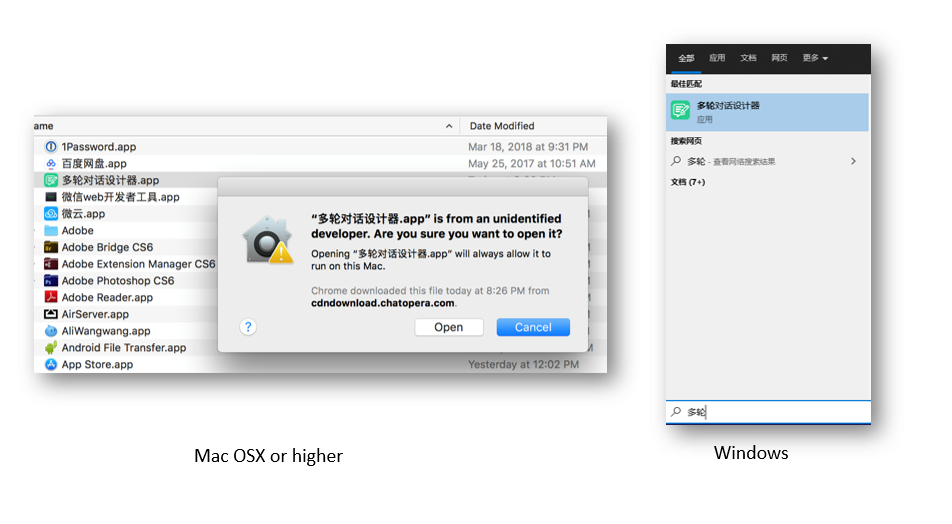
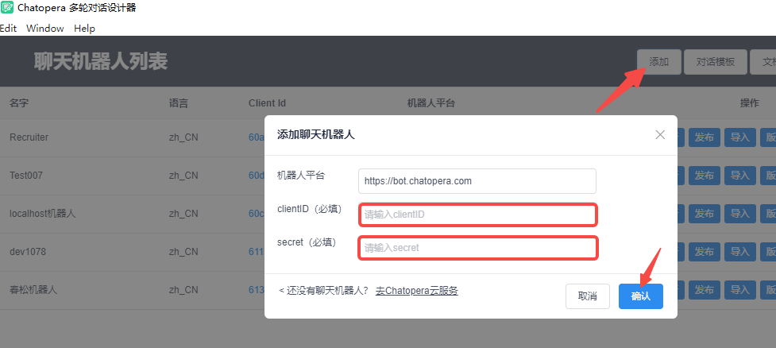
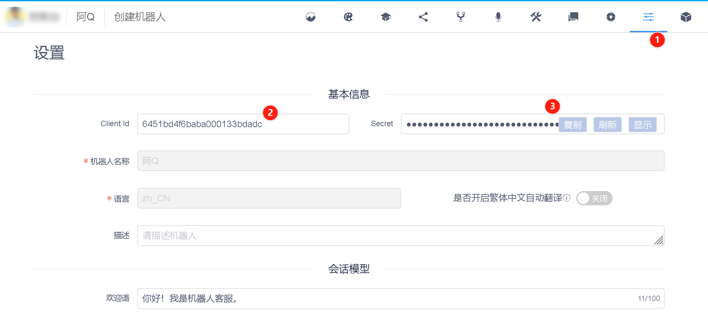
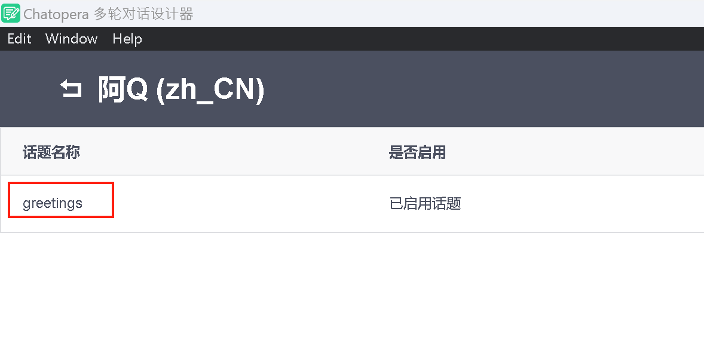
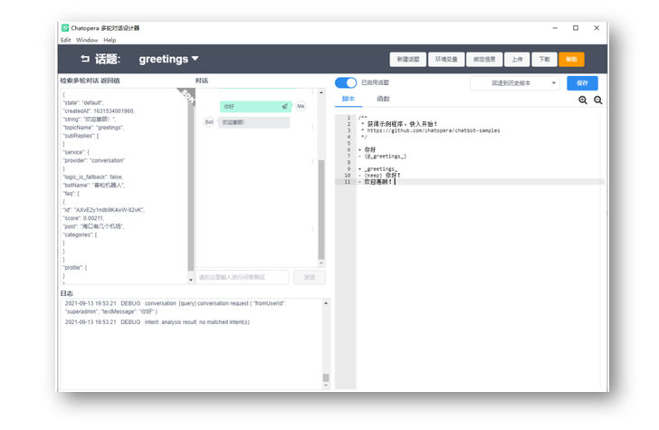
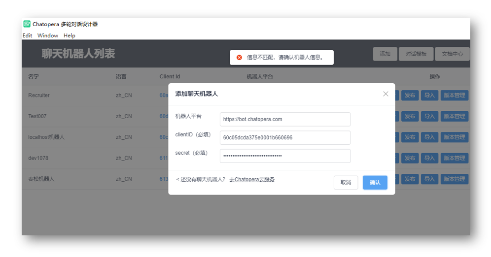
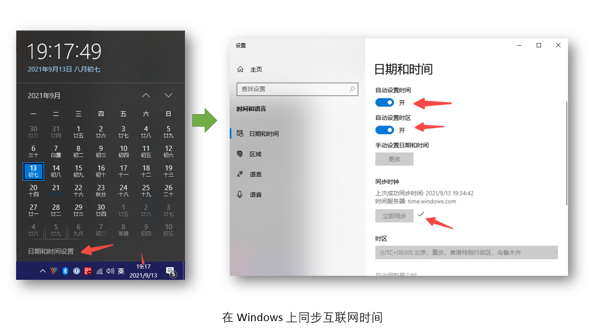

<!-- markup:blank-line -->
# <2/5> 生成预处理问答对

<< 上一步：[<1/5> 创建机器人](/products/chatbot-platform/tutorials/1-create-bot.html) | <i class="glyphicon glyphicon-time"></i>阅读本节内容大约需要 5 mins <!-- markup:skip-line -->

现在我们生成预处理问答对，让`阿Q`可以回答更多的问题。

## 管理知识库问答对

进入 `阿Q`的知识库管理页。



### 添加知识库问答对

在知识库菜单的左侧点击加号【➕】，这时弹出创建问答对的表单。复制粘贴下面的问题和答案：

```问题
海口有几个机场
```

```答案
海口有海口美兰国际机场，位于海口市美兰区，航线飞往国内大中城市，也有飞往国际的专机。从海口去美兰国际机场，除了地铁快速到达外，有绕城高速直达，还有琼文高速和223国道，交通非常便利。海南有三个民用机场：海口美兰国际机场、三亚凤凰国际机场和琼海博鳌机场。
```



然后点击【确定】，这样就为`阿Q`增加了一条“知识”，它可以回答这个问题。

### 测试知识库问答对

进入 `阿Q`的测试对话页，并在下图 1 位置输入：`海口有几个机场`。点击【发送】。`阿Q` 的回复类似下面。



验证通过。我们继续介绍另外一个强大的对话管理模块：多轮对话。

## 管理多轮对话脚本

### 安装多轮对话设计器


| 版本   | 下载地址                                                                                                                                                                         |
| -----  | ---------------------------------------------------------------------------------------------------------------------------------------------------------------------------- |
| v2.5.7 | [macOS](http://cdndownload2.chatopera.com/installation%2Fcde%2F%E5%A4%9A%E8%BD%AE%E5%AF%B9%E8%AF%9D%E8%AE%BE%E8%AE%A1%E5%99%A8-2.5.7.dmg) \| [Windows](http://cdndownload2.chatopera.com/installation%2Fcde%2F%E5%A4%9A%E8%BD%AE%E5%AF%B9%E8%AF%9D%E8%AE%BE%E8%AE%A1%E5%99%A8-2.5.7.exe) |
<!-- markup:table-caption 多轮对话设计器下载地址 -->

提示：

* 点击下载地址未能开始下载时，将下载地址拖拽到新的 Tab 页，启动下载
* 下载后，得到应用安装包，双击后根据提示进行安装[^install-cde]

### 添加机器人

安装完成后，在电脑应用中心，启动【多轮对话设计器】。



在多轮对话设计器一级菜单中，点击【添加】，此处需要 `阿Q` 的 `Client Id` 和 `Secret`。



在浏览器中，进入 `阿Q`的设置页。



复制 `Client Id` 和 `Secret` 到多轮对话设计器【添加表单】，点击【确认】[^help1]。

回到列表后，找到`阿Q`，点击右侧操作中的【打开】，进入阿Q的话题列表页。这时，可以看到默认的话题：`greetings`。



### 和机器人进行对话

点击 `greetings` 话题的【编辑】按钮，进入 `阿Q`的`greetings` 脚本编辑窗口。



在脚本编辑窗口中间，有对话框，在文本发送区域，输入`你好`，然后点击【发送】。

当你看到机器人回复了`你好！`，那么本步骤就完成了！恭喜你完成本节任务！

 

<< 上一步：[<1/5> 创建机器人](/products/chatbot-platform/tutorials/1-create-bot.html) | >> 下一步：[<3/5> 添加脚本和函数](/products/chatbot-platform/tutorials/3-add-scripts-function.html)

## 可能遇到的问题

### 信息不匹配，请确认机器人信息

提示如下：


如果经过验证，你填写的信息没有错误，那么可能是电脑的时间日期与互联网标准时间之间有很大误差，需要先在操作系统上同步互联网时间，以下是 Windows 上同步互联网时间的方法，你也可以手动设置，其它操作系统，都有类似的操作。




[^help1]: 可能遇到问题，比如提示[【信息不匹配，请确认机器人信息】](#信息不匹配请确认机器人信息)，参考本文后面的[《可能遇到的问题》](#可能遇到的问题)获得解决方案。
[^install-cde]: 安装过程中遇到问题查看[可能遇到的问题](https://docs.chatopera.com/products/chatbot-platform/howto-guides/convs/cde-install.html#%E5%8F%AF%E8%83%BD%E9%81%87%E5%88%B0%E7%9A%84%E9%97%AE%E9%A2%98)，如遇新问题[创建工单](https://github.com/chatopera/docs/issues)