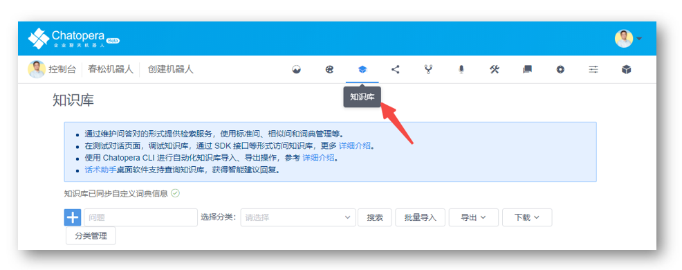
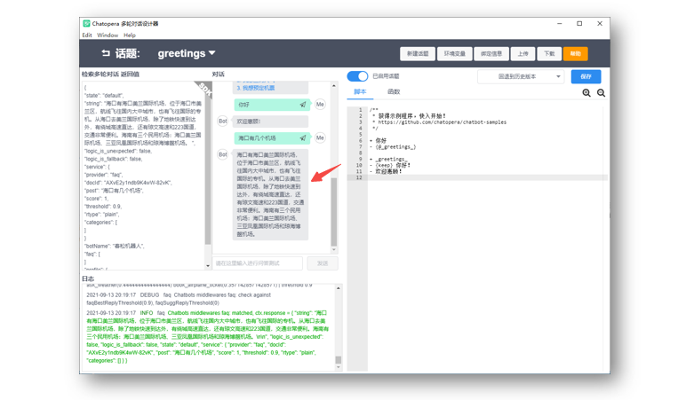
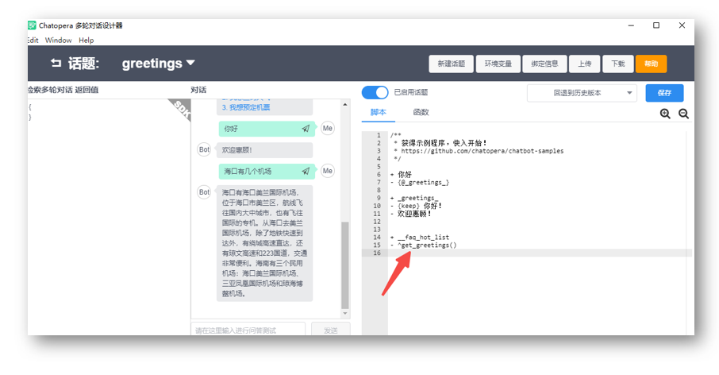
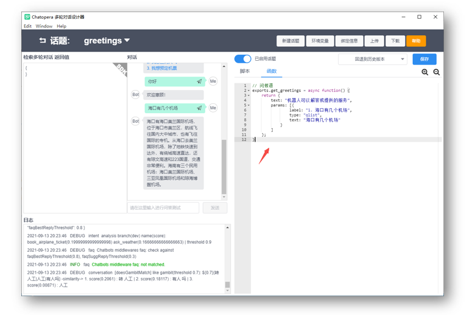
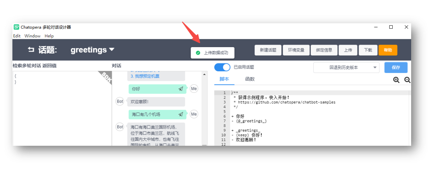
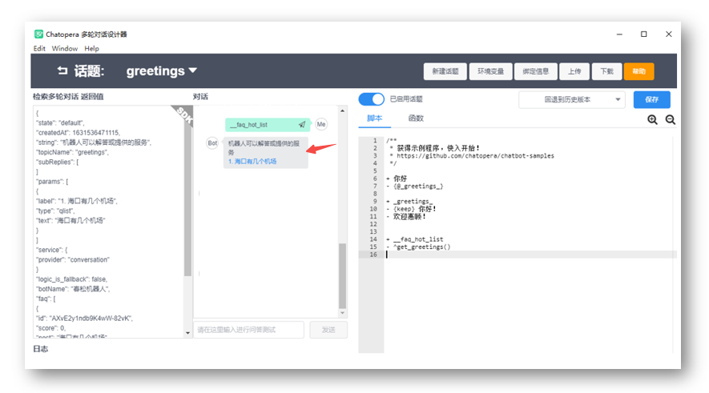

# <2/5> 使用知识库回答“海口有几个机场” 

<< 上一步：[<1/5> 创建机器人并添加到多轮对话设计器](1-create-bot.md)

现在，春松机器人中，还不能回答一些实际的问题。我们先从知识库开始，设定问答对，让机器人可以回答常见问题。

## 进入知识库管理页面

来到春松机器人管理控制台，在机器人菜单上点击【知识库】。



此时进入了知识库管理页面。

## 添加问答对

点击知识库管理页面的加号【➕】，在知识库菜单的左侧，这时弹出创建问答对的表单。


| 表单项 | 值 |
| --- | --- |
| 问题 | 海口有几个机场 |
| 答案 | 海口有海口美兰国际机场，位于海口市美兰区，航线飞往国内大中城市，也有飞往国际的专机。从海口去美兰国际机场，除了地铁快速到达外，有绕城高速直达，还有琼文高速和223国道，交通非常便利。海南有三个民用机场：海口美兰国际机场、三亚凤凰国际机场和琼海博鳌机场。 |

点击【确定】。

## 在多轮对话设计器内对话

回到上一节中打开的 `greetings` 脚本编辑面板。这时发送“海口有几个机场”，得到回答：

```
海口有海口美兰国际机场，位于海口市美兰区，航线飞往国内大中城市 ...
```



此时，我们就完成了第一个知识库问答对的添加和对话测试，这部分工作是不是很简单？


## 添加问候语

在很多应用聊天机器人的场景中，通常是进入对话窗口，机器人都会主动的打招呼，甚至是展示一些热门的对话、介绍。接下来，我们就做这样的一个个性化的问候语。

### 添加脚本

在 `greetings` 脚本编辑窗口，增加这样的一段内容：

```
+ __faq_hot_list
- ^get_greetings()
```

添加后，脚本编辑区域看起来是这样。




### 添加函数

接下来，点击【脚本】旁边的【函数】，进入函数编辑窗口，增加这样一段内容：

```
// 问候语
exports.get_greetings = async function() {
    return {
        text: "机器人可以解答或提供的服务",
        params: [{
                label: "1. 海口有几个机场",
                type: "qlist",
                text: "海口有几个机场"
            }
        ]
    };
}
```

添加后，函数编辑区域看起来是这样。



点击【保存】或 `Ctrl + s`（Windows）/ `Command + s`(Mac)，此时，得到提示信息:

```
上传数据成功
```



### 测试对话

在聊天对话框，输入 `__faq_hot_list`，得到机器人回复：

```
机器人可以解答或提供的服务
1. 海口有几个机场
```



当你看到了这样的回答，那么本步骤就完成了！可以说，`__faq_hot_list` 是我们约定的一个暗号，当对话用户一进入对话现场，我们就可以主动向机器人发送暗号，获得预定义的回复，让机器人主动的开始对话。

恭喜你完成本节任务！


<< 上一步：[<1/5> 创建机器人并添加到多轮对话设计器](1-create-bot.md) | >> 下一步：[<3/5> 使用意图识别完成“预定机票”](3-book-ticket-task.md)

## 本节对话脚本

为方便理解，将多轮对话设计器里的完整内容，附在下面。

### 脚本

```
+ 你好
- {@_greetings_}

+ _greetings_
- {keep} 你好！
- 欢迎惠顾！

+ __faq_hot_list
- ^get_greetings()

```

### 函数

```
// 问候语中关联常见问题
exports.get_greetings = async function() {
    return {
        text: "机器人可以解答或提供的服务",
        params: [{
            label: "1. 海口有几个机场",
            type: "qlist",
            text: "海口有几个机场"
        }]
    };
}
```


## 评论

<script src="https://utteranc.es/client.js"
        repo="chatopera/docs"
        issue-term="pathname"
        label="Comment"
        theme="github-light"
        crossorigin="anonymous"
        async>
</script>
