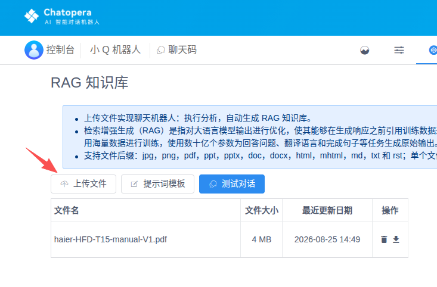
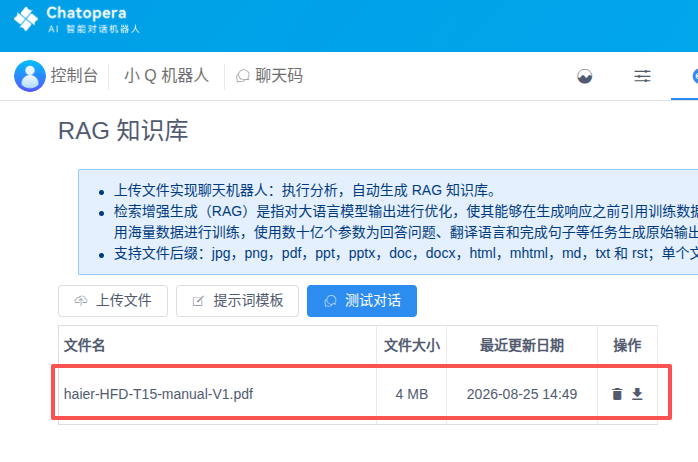
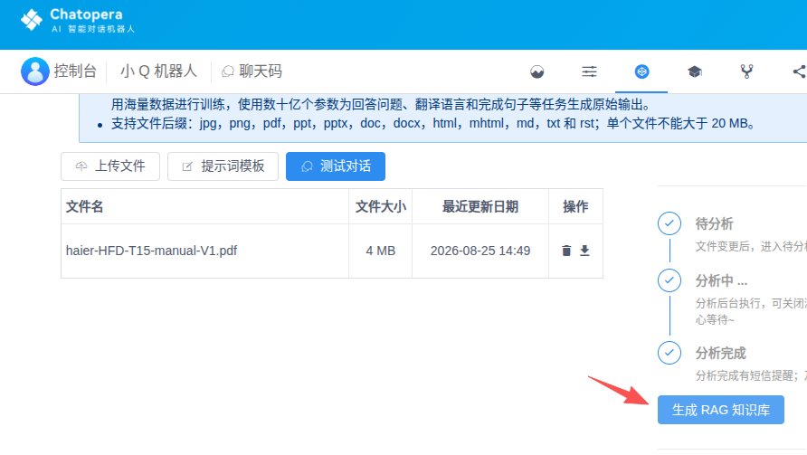
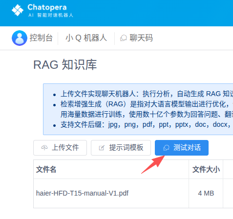
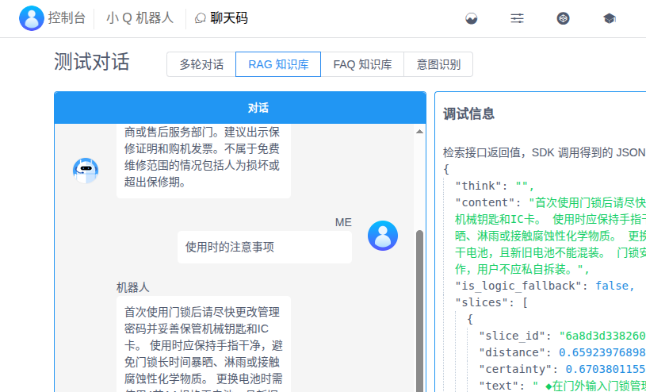

<!-- markup:blank-line -->
# <2/5> 回答 80% 的客服问题，使用 RAG 模块

<< 上一步：[<1/5> 创建机器人](/products/chatbot-platform/tutorials/1-create-bot.html) | <i class="glyphicon glyphicon-time"></i>阅读本节内容大约需要 5 mins <!-- markup:skip-line -->

> 当您在新手任务中，遇到任何问题，欢迎[联系 Chatopera 工程师](https://dwz.chatopera.com/s99784)获得帮助支持~

## 回复访客的咨询问题

我们设定 小 Q 机器人是一款智能门锁的 AI 客服，为了模拟对话，我们从海尔官网下载了[HFD-T15 智能门锁](https://docs.chatopera.com/assets/files/haier-HFD-T15-manual-V1.pdf)的使用说明书[^haier-explain]。

下载说明书：[连接](https://docs.chatopera.com/assets/files/haier-HFD-T15-manual-V1.pdf)。

那么，我们就可以利用这份说明书，升级聊天机器人了，并且，借助这个方法，80% 的访客咨询都可以得到解答。

## 上传说明书到 RAG 知识库

首先，我们打开这个说明书 PDF 文件，做一点浏览，感受一下文件的内容：有文字、图片、链接等。可以说，这是一份"普通的文件"，没有特殊的格式。

下一步，我们从浏览器中，打开小 Q 机器人的【RAG 模块】控制台：点击【上传文件】。

然后，选择我们刚刚下载的 haier-HFD-T15-manual-V1.pdf，然后，可以看到文件上传成功。

接着，点击右侧的【生成 RAG 知识库】。

## 测试对话

点击【测试对话】，这样就进入了如下界面。

这个界面，是给访客使用前，我们调试用途的工具。

现在您可以上传更多资料：Word, PPT, 图片，Markdown，HTML 等。丰富或者修正小 Q 机器人的聊天能力～

恭喜您完成本节任务！接下来，我们看看上线后的优化。

<< 上一步：[<1/5> 创建机器人](/products/chatbot-platform/tutorials/1-create-bot.html) | >> 下一步：[<3/5> 快速修复不好的回答，使用 FAQ 模块](/products/chatbot-platform/tutorials/3-add-scripts-function.html)

[^haier-explain]: 本文档仅使用海尔产品文档作为机器人语料示例，并不代表海尔官方对产品的介绍、承诺保证。关于海尔产品的介绍、更新，请进入海尔官网进行了解。