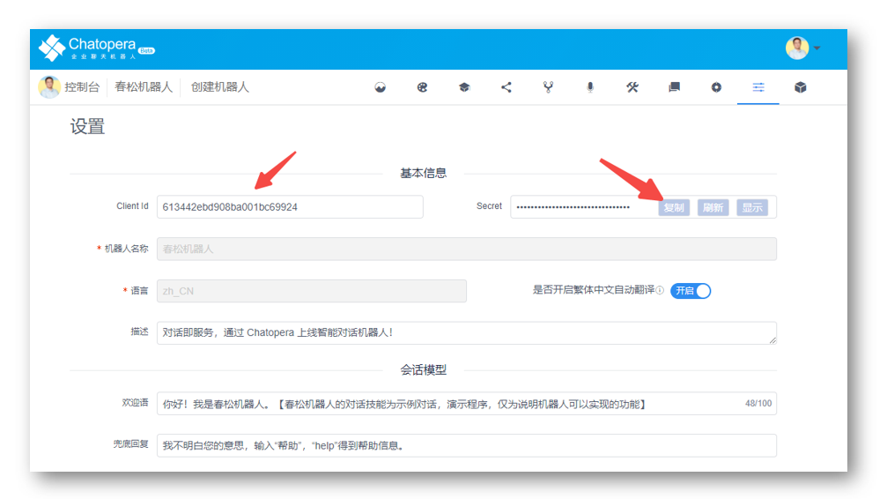

<!-- markup:blank-line -->
# <2/5> 添加对话语料 <!-- markup:skip-line -->

<< 上一步：[<1/5> 创建机器人](https://docs.chatopera.com/products/chatbot-platform/tutorials/1-create-bot.html) | <i class="glyphicon glyphicon-time"></i>阅读本节内容大约需要 10 mins <!-- markup:skip-line -->

现在，机器人还不能回答一些实际的问题。我们先从知识库开始，设定问答对，让机器人可以回答知识库里的问题。

## 管理知识库问答对

来到机器人管理控制台，在机器人菜单上点击【知识库】。


此时进入了知识库管理页面。

### 添加知识库问答对

点击知识库管理页面的加号【➕】，在知识库菜单的左侧，这时弹出创建问答对的表单。


设置问答对内容：

```问题
海口有几个机场
```

```答案
海口有海口美兰国际机场，位于海口市美兰区，航线飞往国内大中城市，也有飞往国际的专机。从海口去美兰国际机场，除了地铁快速到达外，有绕城高速直达，还有琼文高速和223国道，交通非常便利。海南有三个民用机场：海口美兰国际机场、三亚凤凰国际机场和琼海博鳌机场。
```

其它默认，然后点击【确定】，这时你可以看到知识库问答对列表里，有了一条记录。

### 测试知识库问答对

对刚刚添加的知识库问答对进行验证，在机器人管理控制台中进入【测试对话】，并在下图 2 位置输入：海口有几个机场。然后点击【发送】。


确认测试对话窗口得到了如下的回复。


这样你就为机器人增加了一条“知识”，它可以回答这个问题，知识库模块是一个很强大的对话管理模块，你现在还不需要立即深入了解，在入门教程中，我们继续为你介绍另外一个强大的对话管理模块：多轮对话。


## 管理多轮对话脚本


### 安装多轮对话设计器

Chatopera 机器人的多轮对话融合了多种聊天机器人实现方案，提供了聊天机器人的集成开发环境 - 多轮对话设计器。完成以下步骤，你需要先安装[多轮对话设计器](https://docs.chatopera.com/products/chatbot-platform/howto-guides/convs/cde-install.html)。

安装文档：[https://docs.chatopera.com/products/chatbot-platform/howto-guides/convs/cde-install.html](https://docs.chatopera.com/products/chatbot-platform/howto-guides/convs/cde-install.html)


### 添加机器人

安装完成后，在电脑应用启动中心，打开【多轮对话设计器】。


在多轮对话设计器一级菜单中，点击【添加】。


打开机器人管理控制台，进入【设置】页面。



拷贝 `Client Id` 和 `Secret` 到多轮对话设计器【添加表单】，点击【确认】。这里你也可能遇到问题，比如提示[【信息不匹配，请确认机器人信息】](#信息不匹配请确认机器人信息)，参考本文后面的[《可能遇到的问题》](#可能遇到的问题)获得解决方案。

然后，多轮对话设计器会跳转到聊天机器人列表，在列表中，找到`小C`，在对应的操作中点击【打开】，进入小C的话题列表页面。这时，只能看到一个话题：`greetings`。这个话题是创建机器人时默认初始化生成的。


### 和机器人进行对话

在话题列表中，点击 `greetings` 话题的【编辑】按钮，这时进入脚本编辑面板。


在脚本编辑面板中间，有一个聊天对话框，在文本发送区域，输入`你好`，然后点击【发送】。

当你看到机器人回复了`你好！`，那么本步骤就完成了！这个对话就是右侧的脚本实现的。

脚本是建立对话机器人思维体系的描述形式，现在，你可以简单的认为：`+` 后就是机器人可以处理的问题的规则；`-`后是该规则发生时，机器人的反应。**通过描述规则和反应，机器人建立了一个“大脑”，Chatopera 多轮对话以此为出发点，建立了一套简单可行的实现机器人智能对话的标准。**

### 测试知识库问答对

在多轮对话设计器中，同样可以测试知识库问答对。比如发送文本：

```文本
海口有几个机场
```

得到回答：

```文本
海口有海口美兰国际机场，位于海口市美兰区，航线飞往国内大中城市 ...
```


此时，你就掌握了添加和测试对话语料，这部分工作是不是很简单 :-)

### 使用脚本和函数

在很多应用聊天机器人的场景中，通常是进入对话窗口，机器人都会主动的打招呼，以及展示一些热门的对话技能。接下来，我们就实现个性化的问候语。

#### 添加脚本

在 `greetings` 脚本编辑窗口，增加这样的一段内容：

```脚本
+ __faq_hot_list
- {keep} ^get_greetings()
```

添加后，脚本编辑区域看起来是这样。


#### 添加函数

接下来，点击【脚本】旁边的【函数】，进入函数编辑窗口，增加这样一段内容：

```函数
// 问候语中关联常见问题
exports.get_greetings = async function() {
    return {
        text: "机器人可以解答或提供的服务",
        params: [{
                label: "1. 海口有几个机场",
                type: "qlist",
                text: "海口有几个机场"
            }
        ]
    };
}
```

这段代码就是 JavaScript，一个非常容易掌握的编程语言。在 Chatopera 云服务中，使用 Node.js 运行时执行这些代码。

添加后，函数编辑区域看起来是这样。


其中，`exports.` 后面就是函数的名字，可以在机器人的 `-` 后面使用，处理逻辑。

点击【保存】，此时，得到提示信息: `上传数据成功`。


### 测试对话

在聊天对话框，输入：

```文本
__faq_hot_list
```

得到机器人回复：

```文本
机器人可以解答或提供的服务
1. 海口有几个机场
```


当你看到了这样的回答，那么本步骤就完成了！恭喜你完成本节任务！

 <!-- markup:skip-line -->

可以说，`__faq_hot_list` 是我们约定的一个暗号，当对话用户进入对话场景，我们就主动向机器人发送暗号，获得预定义的回复，让机器人主动的开始对话。

<< 上一步：[<1/5> 创建机器人](https://docs.chatopera.com/products/chatbot-platform/tutorials/1-create-bot.html) | >> 下一步：[<3/5> 添加意图“预定机票”](https://docs.chatopera.com/products/chatbot-platform/tutorials/3-book-ticket-task.html) <!-- markup:skip-line -->


## 可能遇到的问题

### 信息不匹配，请确认机器人信息

提示如下：


如果经过验证，你填写的信息没有错误，那么可能是电脑的时间日期与互联网标准时间之间有很大误差，需要先在操作系统上同步互联网时间，以下是 Windows 上同步互联网时间的方法，你也可以手动设置，其它操作系统，都有类似的操作。


