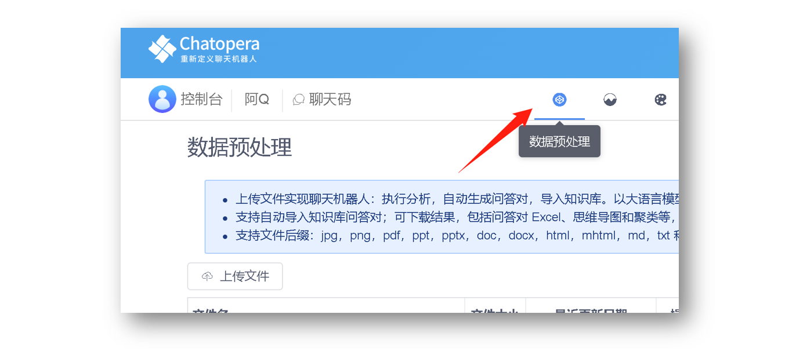

<!-- markup:blank-line -->
# <2/5> 生成预处理问答对

<< 上一步：[<1/5> 创建机器人](/products/chatbot-platform/tutorials/1-create-bot.html) | <i class="glyphicon glyphicon-time"></i>阅读本节内容大约需要 5 mins <!-- markup:skip-line -->

现在我们生成预处理问答对，让`阿Q`可以回答更多的问题。

## 上传文件

点击机器人菜单中【数据预处理】一栏。

下载[示例文件](https://docs.chatopera.com/assets/files/doc-sample-preprocessing.docx)得到文件 [doc-sample-preprocessing.docx](https://docs.chatopera.com/assets/files/doc-sample-preprocessing.docx)，下载地址 [https://dwz.chatopera.com/k9iO12](https://docs.chatopera.com/assets/files/doc-sample-preprocessing.docx)。

点击网页中的【上传文件】按钮，从操作系统中选择刚刚下载的文件 [doc-sample-preprocessing.docx](https://docs.chatopera.com/assets/files/doc-sample-preprocessing.docx)。

## 启动分析任务

此时，可以看到文件已经上传成功，继续点击页面右侧的【分析】按钮，如下图。

然后，页面中弹出对话框，对于选项保持默认即可，点击【确定】。

此时，分析任务启动，等待大约 10 秒中，界面会自动更新状态，可以看到分析任务变为【分析中】。因为当前文件内容少，大约 1 分钟后，分析状态变成了【分析完成】。进入机器人的知识库。

此时，问答对已经根据上传的文件自动生成。

## 测试知识库问答对

进入 `阿Q`的测试对话页，并在下图 1 位置输入：`海口有几个机场`。点击【发送】。`阿Q` 的回复类似下面。

验证通过。

恭喜你完成本节任务！

 <!-- markup:skip-line -->

我们继续介绍另外一个强大的对话管理模块：[多轮对话](/products/chatbot-platform/tutorials/3-add-scripts-function.html)。

<< 上一步：[<1/5> ](/products/chatbot-platform/tutorials/1-create-bot.html) | >> 下一步：[<3/5> 编写多轮对话](/products/chatbot-platform/tutorials/3-add-scripts-function.html)
