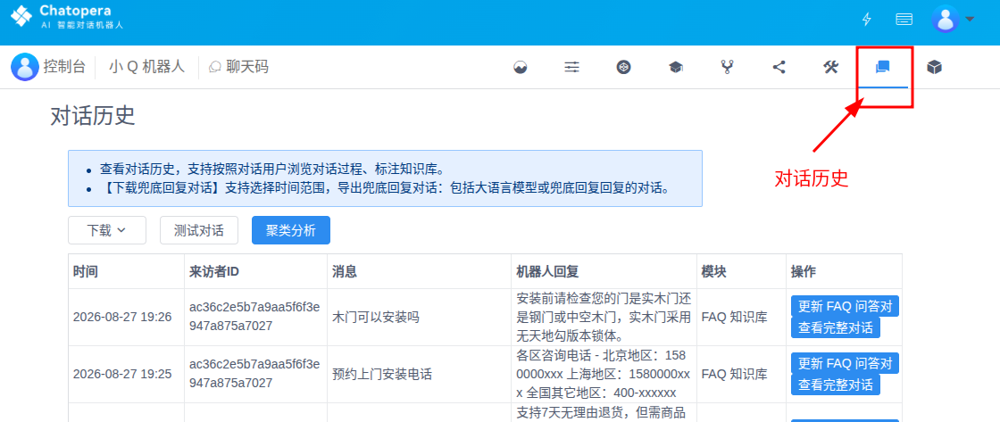
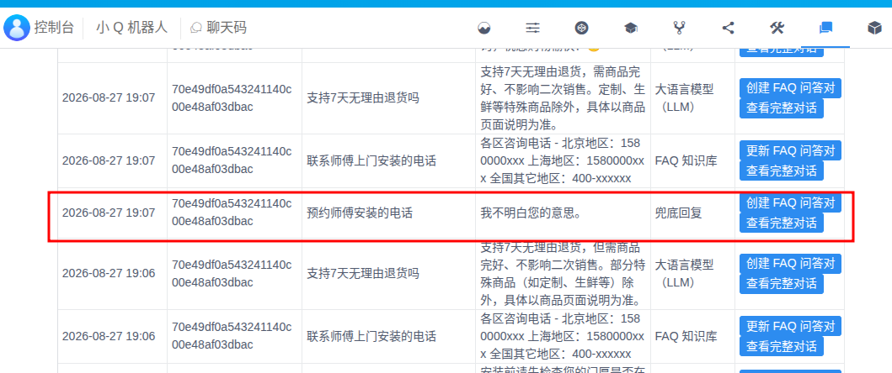
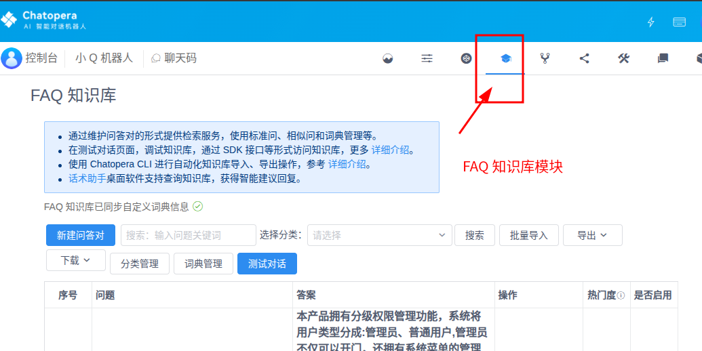
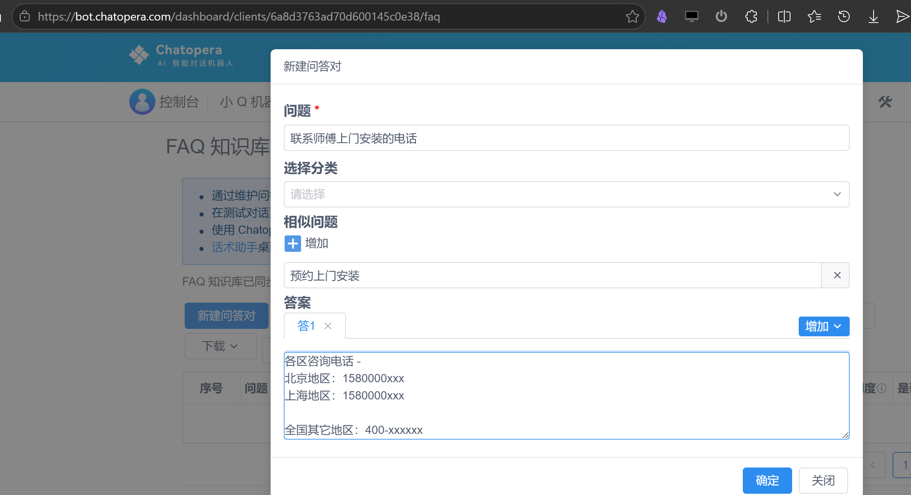
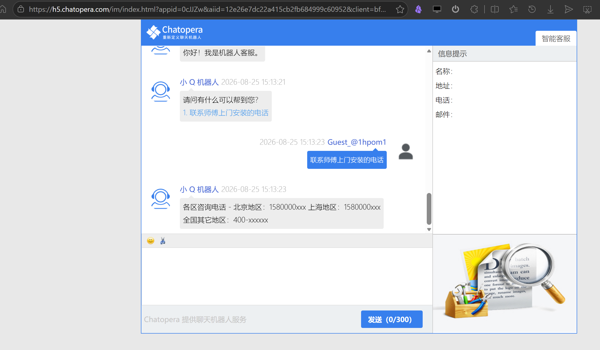

<!-- markup:blank-line -->
# <3/5> 快速修复不好的回答，使用 FAQ 模块
<< 上一步：[<2/5> 回答 80% 的客服问题，使用 RAG 模块](/products/chatbot-platform/tutorials/2-answer-faq.html) | <i class="glyphicon glyphicon-time"></i>阅读本节内容大约需要 20 mins 

> 当您在新手任务中，遇到任何问题，欢迎[联系 Chatopera 工程师](https://dwz.chatopera.com/s99784)获得帮助支持~

## 查看访客会话

上线只是开始：机器人的对话能力的优化，是个持续迭代的过程。从上线时刻，我们就要关注机器人和访客的对话情况。

进入小 Q 机器人的【对话历史】模块。

在这里，您可以浏览到每个访客和机器人对话的过程，并且能看到机器人回答的技能模块：RAG 知识库，FAQ 知识库，多轮对话等。

## 过滤不好的回答

我们需要重点关注的是那些机器人没有能回答好的问题，尤其是模块属于【兜底回复】的问答。

比如，我们发现机器人对于问题【预约师傅安装的电话】的回答是兜底回复。

## 添加问答对解决

对于没有回答好的问题，我们可以通过 FAQ 知识库解决，具体做法如下。

首先，进入 FAQ 知识库模块。

点击【新建问答对】

| 表单项 | 值 |
| --- | --- |
| 问题 | 联系师傅上门安装的电话 |
| 答1 | 各区咨询电话 - 北京地区：1580000xxx， 上海地区：1580000xxx |
<!-- markup:table-caption 新建问答对表单 -->

点击【确定】。

然后，如果访客再次的问这个问题，就能得到准确的解答了～

通过 FAQ 知识库的形式，我们可以修复很多不好的回答。

上线后的优化非常重要，优化的过程，是一个长期的，比如三个月。
也可能因为一些问题有时效性，我们的服务有更新，导致问答对需要长期的维护。

我们的 FAQ 知识库，也会越来越多，如何批量的导入和维护呢？下一节，您将学习高级用法：[批量导入 FAQ 知识库，使用 CDE 和 CLI](/products/chatbot-platform/tutorials/4-add-intent.html)。

<< 上一步：[<2/5> 回答 80% 的客服问题，使用 RAG 模块](/products/chatbot-platform/tutorials/2-answer-faq.html) | >> 下一步：[<4/5> 批量导入 FAQ 知识库，使用 CDE 和 CLI](/products/chatbot-platform/tutorials/4-add-intent.html)

