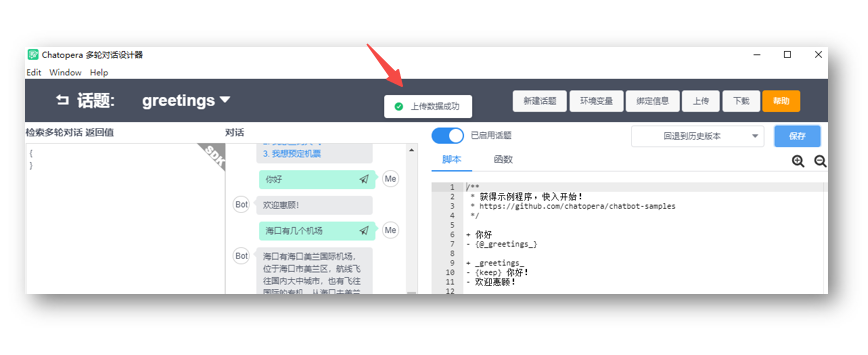
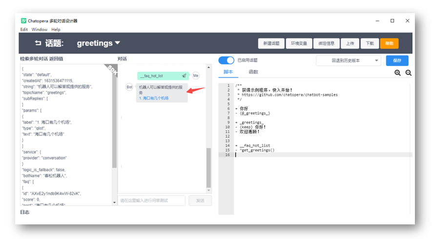

<!-- markup:blank-line -->
# <3/5> 使用脚本和函数
<< 上一步：[<2/5> 添加对话语料](/products/chatbot-platform/tutorials/2-answer-faq.html) | <i class="glyphicon glyphicon-time"></i>阅读本节内容大约需要 5 mins 

接下来，我们为 `阿Q`添加个性化的问候语。

## 添加脚本

在多轮对话设计器中，打开 `阿Q` 话题 `greetings` 脚本编辑窗口。


增加这样的一段内容：

```脚本
+ __faq_hot_list
- {keep} ^get_greetings()
```

点击保存。

## 添加函数

接下来，点击【脚本】旁边的【函数】，进入函数编辑窗口，追加下面一段内容[^function-js]：

```函数
// 问候语中关联常见问题
exports.get_greetings = async function() {
    return {
        text: "机器人可以解答或提供的服务",
        params: [{
                label: "1. 海口有几个机场",
                type: "qlist",
                text: "海口有几个机场"
            }
        ]
    };
}
```


添加后，函数编辑区域看起来是这样。


点击【保存】，此时，得到提示信息: `上传数据成功`。



## 测试对话



在聊天对话框，输入：

```文本
__faq_hot_list
```

机器人回复：

```文本
机器人可以解答或提供的服务
1. 海口有几个机场
```


当你看到了这样的回答，那么本步骤就完成了！恭喜你完成本节任务！

 

<< 上一步：[<2/5> 添加对话语料](/products/chatbot-platform/tutorials/2-answer-faq.html) | >> 下一步：[<4/5> 添加意图“预定机票”](/products/chatbot-platform/tutorials/4-book-ticket-task.html)

[^function-js]: 这是一段 JavaScript 代码，JavaScript 是非常容易掌握的编程语言。
