<!-- markup:blank-line -->
# <4/5> 批量导入 FAQ 知识库，使用 CDE 和 CLI

<< 上一步：[<3/5> 设置热门问题](/products/chatbot-platform/tutorials/3-add-scripts-function.html) | <i class="glyphicon glyphicon-time"></i>阅读本节内容大约需要 7 mins 

> 当您在新手任务中，遇到任何问题，欢迎[联系 Chatopera 工程师](https://dwz.chatopera.com/s99784)获得帮助支持~

## 有很多问答对

RAG 知识库和 FAQ 知识库，是小 Q 机器人的两个主要的知识来源，因为 FAQ 知识库有快速、准确的特点，会形成越来越多的问答对。我们在机器人之间迁移，或者对机器人进行备份，都需要执行批量操作。

加入我们通过程序，能通过访问数据库、爬取网站等形式，构建很多的 FAQ 问答对，是对优化小 Q 的对话能力最好的方式。

那么，如何快速批量的导入 FAQ 问答对呢？这需要我们了解两个部分：

1. faq 知识库问答对的数据结构 - Chatopera 云服务支持 faq json 文件；
2. 如何自动化的导入 - 通过在命令行终端执行 Chatopera CLI 指令。

下面，我们通过实际操作来介绍。

## 创建机器人项目根目录

启动一个命令行终端：

| 操作系统 | 工具 |
| --- | --- |
| Linux | Bash Shell |
| macOS | Terminal 应用 |
| Windows PowerShell | PowerShell（本文档示例不支持 CMD Prompt） |

比如，PowerShell 的界面如下：


打开终端后，执行下面的命令：

```bash
mkdir -p ~/chatopera/bot_q
```


这时，我们就创建了一个新的文件夹：`用户的HOME目录/chatopera/bot_q`，后面简称为【机器人项目根目录】。

继续使用命令行，进入机器人项目根目录。

```bash
cd ~/chatopera/bot_q
```

接下来，使用 Chatopera CLI 创建机器人配置文件 `.env`，过程如下：

* 在命令行终端，进入机器人项目根目录
* 运行命令 `bot env`

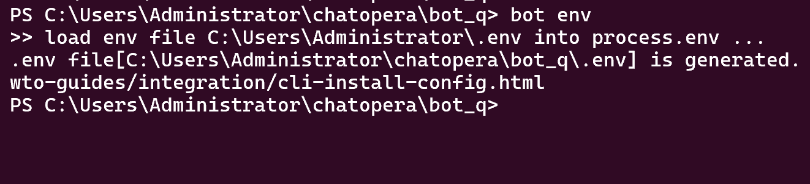

成功运行后，可以得到这样的文件和目录结构：

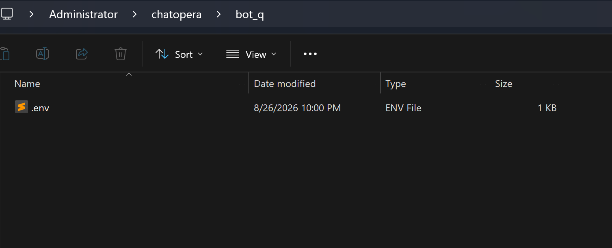


## 编辑 .env 文件

使用文本编辑工具打开 .env 文件，比如记事本、VSCode 或 Notepad 等。

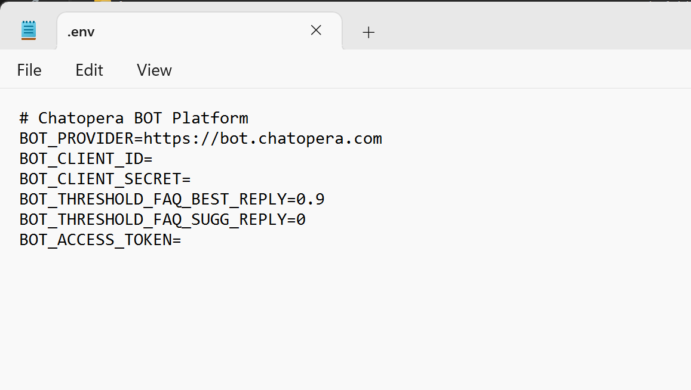


这时，我们要修改 `BOT_CLIENT_ID` 和 `BOT_CLIENT_SECRET`。进入机器人管理控制台，在设置中，找到 clientId 和 secret.

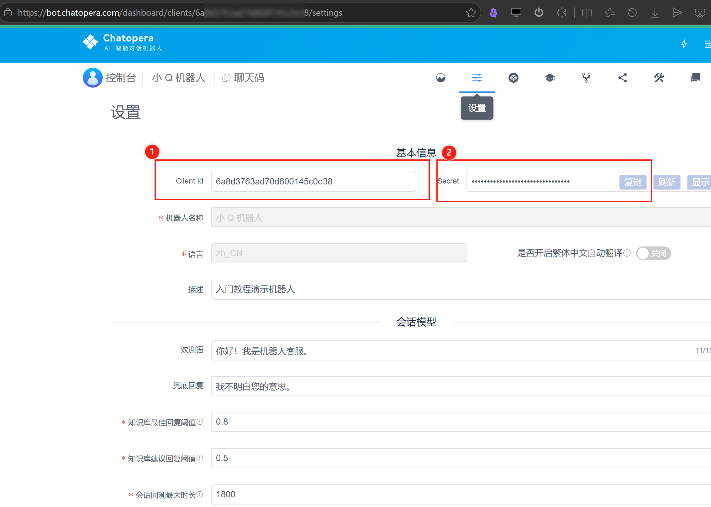

将 clientId 和 secret 粘贴到 .env 文件中，类似下图：

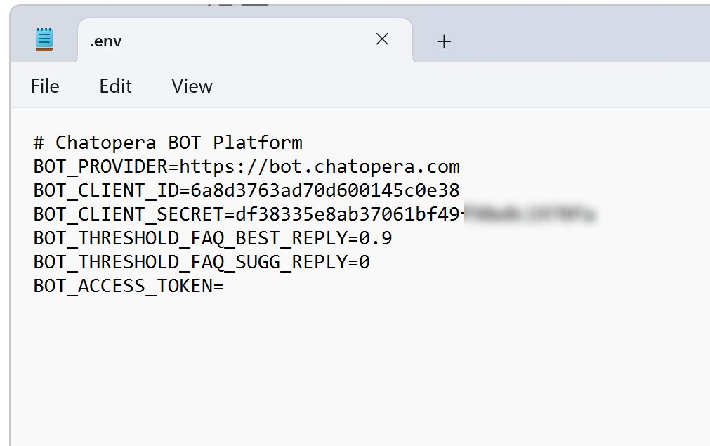

保存，并关闭 .env 文件，在命令行终端，测试配置成功，执行 `bot details`，此命令要在机器人根目录下运行。

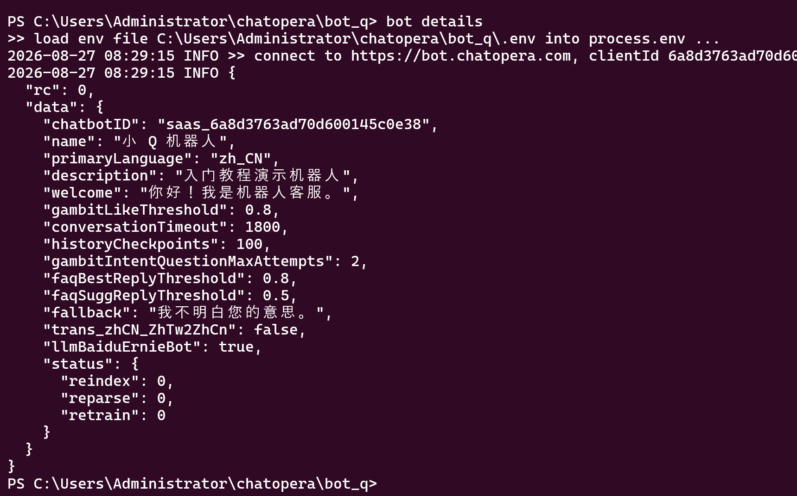

这就意味着，我们的 Chatopera CLI 工具和 Chatopera 云服务中的机器人连接上了。

## 存储 FAQ JSON 文件

在执行批量导入前，我们先获得一个知识库 JSON 文件示例。

首先，在文件管理器中，打开【机器人项目根目录】。

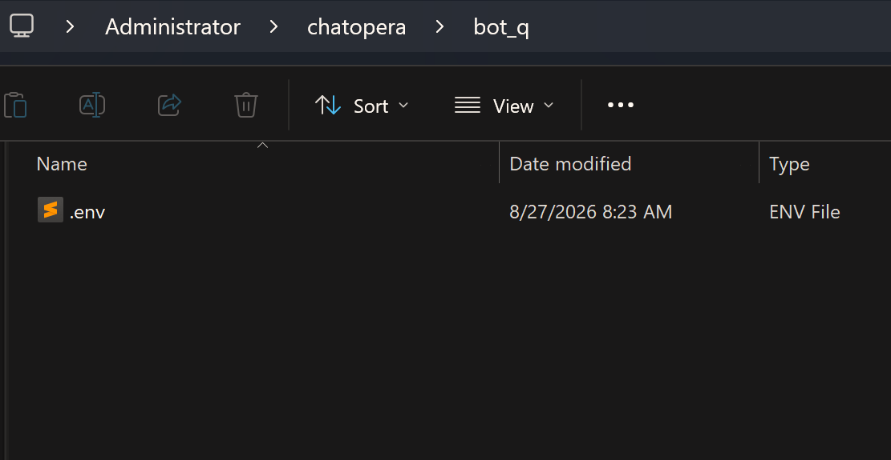


这一步，也可以通过命令完成：

| 操作系统 | 命令 |
| --- | --- |
| Linux/macOS | `open .` |
| Windows PowerShell | `start .` |

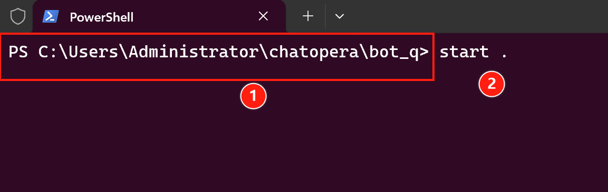


然后，在这个目录下，创建文件夹：`faq`。接着下载保存文件[haier-HFD-T15-manual-V1.faq.json](https://docs.chatopera.com/assets/files/haier-HFD-T15-manual-V1.faq.json) [^20260827082742]，然后将haier-HFD-T15-manual-V1.faq.json保存到 `faq` 文件夹。

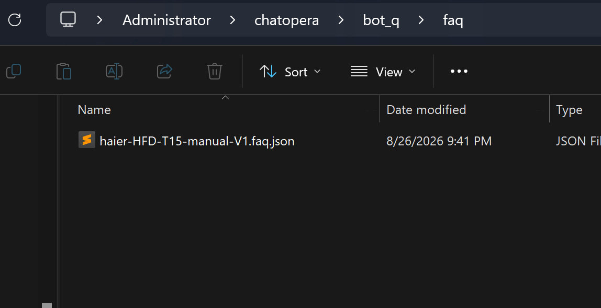

[^20260827082742]: haier-HFD-T15-manual-V1.faq.json 文件下载地址，https://docs.chatopera.com/assets/files/haier-HFD-T15-manual-V1.faq.json


## 执行导入命令

在命令行中，运行下面的命令：

```bash
cd ~/chatopera/bot_q
bot faq --action import --filepath ./faq/haier-HFD-T15-manual-V1.faq.json
```

1. 进入【机器人项目根目录】
2. 执行导入


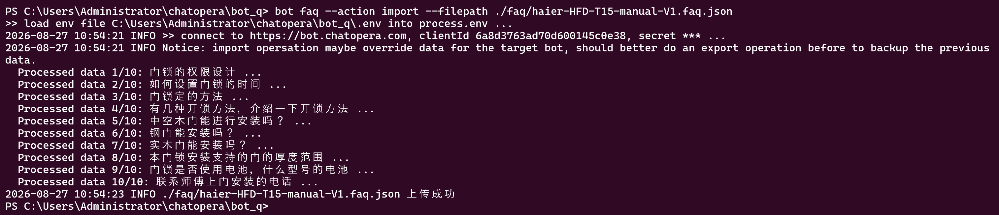

FAQ 批量导入完成。

## 回顾一下 JSON 数据结构

FAQ JSON 文件的格式，参考 haier-HFD-T15-manual-V1.faq.json 这个文件。

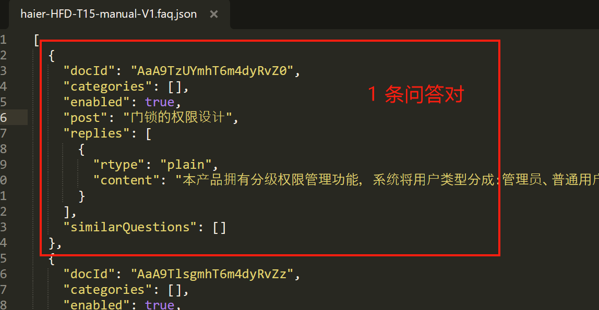

* FAQ JSON 文件的最外层是 `[]`
* 每条问答对是一个 JSON Object `{}`
* docId, 选填，为每个问答对分配的唯一标识，如果目前机器人有了这个 docId，那么将会进行更新，而不是新建问答对
* categories，选填，为问答对指定分类，支持层级，比如 `["动物", "哺乳动物"]`
* post，必填，问题
* replies，必填，回答
* similarQuestions，选填，问题的更多说法，比如 `["高级会员的权益", "VIP 的权益"]`

## 祝贺您入门了 CLI 的使用

Chatopera CLI 还有很多的用途，通过[命令行界面（CLI）](https://docs.chatopera.com/products/chatbot-platform/references/cli.html)可以进一步的学习！

现在，我们就进入入门教程的最后一个任务： [<5/5> 优化打招呼和热门问题列表](/products/chatbot-platform/tutorials/5-stats-history.html)。

<< 上一步：[<3/5> 设置热门问题](/products/chatbot-platform/tutorials/3-add-scripts-function.html) | >> 下一步：[<5/5> 优化打招呼和热门问题列表](/products/chatbot-platform/tutorials/5-stats-history.html) 


