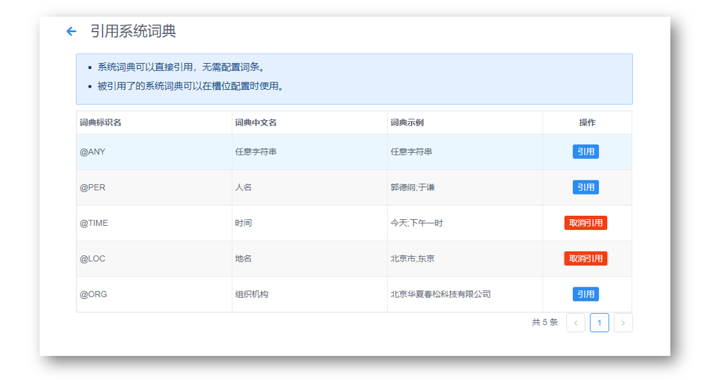
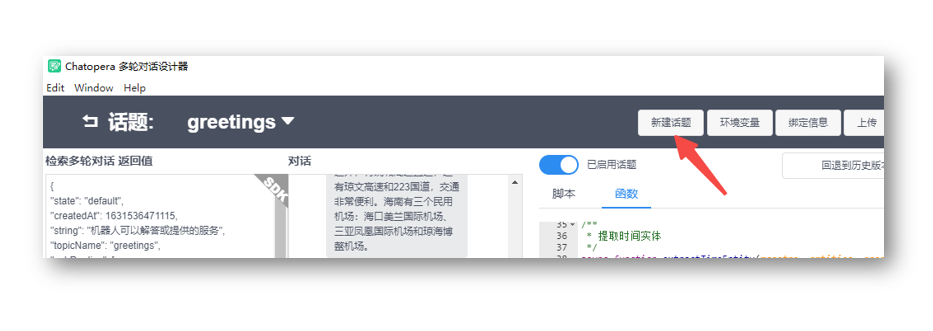
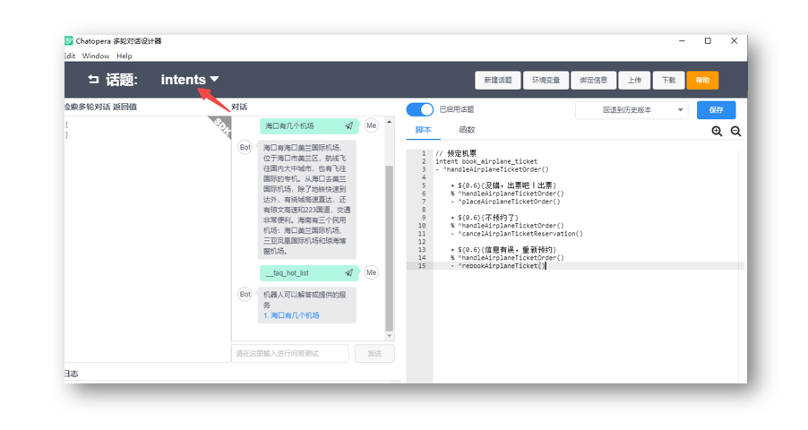

<!-- markup:blank-line -->
# <4/5> 添加意图对话 

<< 上一步：[<3/5> 添加脚本和函数](/products/chatbot-platform/tutorials/3-add-scripts-function.html) | <i class="glyphicon glyphicon-time"></i>阅读本节内容大约需要 7 mins 

我们希望`阿Q`可以引导访客完成下单机票，这需要使用意图识别模块和多轮对话设计器。

## 引用系统词典

`阿Q`需要识别访客的输入文本中包含的地名和时间信息，比如出发城市、到达城市和航班时间。

在浏览器中，进入`阿Q`的词典页，点击【引用系统词典】。


找到 `@TIME` 和 `@LOC`，点击【引用】，如下图所示。



## 创建意图

在浏览器中，进入 `阿Q` 的意图管理页面。


点击【新建意图】。


复制粘贴以下内容到表单中。

```意图标识名
book_airplane_ticket
```

点击【确定】。现在，就有了一个意图，接下来为这个意图添加训练数据。

## 添加用户说法


在 `book_airplane_ticket` 的操作中，点击【编辑】，进入意图识别编辑页面。

我们为预约机票添加一些说法。


复制下面三行内容；粘贴到【用户说法】中；点击【添加】。

```说法
预约机票
预定飞机票
我想预约机票
```

## 添加意图槽位

接下来，我们开始添加槽位信息。
槽位编辑面板在【用户说法】的下面，按照如下信息逐个【添加】：

| 槽位名称 | 词典 | 必填 | 追问 |
| --- | --- | --- | --- |
| `fromPlace` | `@LOC` | 是 | 您从哪个城市或机场出发？ |
| `date` | `@TIME` | 是 | 您的计划出发日期是什么时候? |
| `destPlace` | `@LOC` | 是 | 您要去的目的城市或机场是哪里？ |
<!-- markup:table-caption 添加槽位表单 -->

这部分编辑好以后，看起来是这样的。


有了用户说法和槽位后，就可以训练了，滚动到槽位表格下面，点击【保存】。在保存后，会提示进行模型的训练，大约几秒钟后，提示`训练成功，可进行测试`。

## 测试意图

在浏览器中，进入`阿Q`的测试对话页。


在测试对话页面，选择【意图识别】，然后在聊天窗口中，发送：

```文本
我想预约机票
```

这时候阿Q会回答：`您从哪个城市或机场出发？` 或 `您的计划出发日期是什么时候?`。


现在阿Q可以识别意图了，但是要将意图识别和其它的对话语料融合，还需要按照下面步骤实现。

## 融合到多轮对话

回到多轮对话设计器，假设还在刚刚的 `greetings` 话题编辑窗口。




点击【新建话题】，话题名称填写`intents`。


此时会进入一个新的脚本编辑窗口，在脚本编辑区域，添加如下内容：

```脚本
// 预约机票 
intent {keep} book_airplane_ticket
- ^handleAirplaneTicketOrder()

    + ${0.6}{没错，出票吧｜出票}
    % ^handleAirplaneTicketOrder()
    - {keep} ^placeAirplaneTicketOrder()
    
    + ${0.6}{不预约了}
    % ^handleAirplaneTicketOrder()
    - {keep} ^cancelAirplanTicketReservation()
    
    + ${0.6}{信息有误，重新预约}
    % ^handleAirplaneTicketOrder()
    - {keep} ^rebookAirplaneTicket()
```



点击【保存】，然后，点击【函数】，进入函数编辑窗口，在上一节编辑的函数后，追加如下内容：

```函数
// 提取时间实体
async function extractTimeEntity(maestro, entities, property) {
    debug("extractTimeEntity name %s, value %s", property, entities[property]["val"])
    let dates = await maestro.extractTime(entities[property]["val"], "YYYY年MM月DD日 HH:mm");
    return dates.length > 0 ? dates[0] : "";
}

// 确认订单信息
exports.handleAirplaneTicketOrder = async function() {

    debug("[handleAirplaneTicketOrder] this.intent", JSON.stringify(this.intent))
    let entities = _.keyBy(this.intent.entities, 'name');
    let date = await extractTimeEntity(this.maestro, entities, "date");

    this.intent.extras = {
        date: date
    }

    return {
        text: `和您确认一下信息，出发地${entities["fromPlace"]["val"]}，目的地${entities["destPlace"]["val"]}，出发时间${this.intent.extras.date}`,
        params: [{
                label: "没错，出票吧",
                type: "button",
                text: "没错，出票吧"
            },
            {
                label: "信息有误，重新预约",
                type: "button",
                text: "我想预约机票"
            },
            {
                label: "不预约了",
                type: "button",
                text: "不预约了"
            },
        ]
    }
}

// 下单
exports.placeAirplaneTicketOrder = async function() {
    this.intent.drop = true;
    let entities = _.keyBy(this.intent.entities, 'name');

    return {
        text: "{CLEAR} 已帮您购买",
        params: [{
            type: 'card',
            title: "查看详情",
            thumbnail: "https://gitee.com/chatopera/cskefu/attach_files/1143210/download/AIRPLANE_20220801113300.jpg",
            summary: `${this.intent.extras.date}，国泰航空 CA001，国泰机场, ${entities["fromPlace"]["val"]} - ${entities["destPlace"]["val"]} `,
            hyperlink: "https://www.chatopera.com/"
        }]
    }
}

// 不预约了
exports.cancelAirplanTicketReservation = async function() {
    this.intent.drop = true;
    return {
        text: "{CLEAR} 好的，下次再帮您预约"
    }
}

// 重新预约机票
exports.rebookAirplaneTicket = async function() {
    debug("rebookAirplaneTicket this.intent", this.intent);
    this.intent.drop = true;
    return "^topicRedirect(\"intents\", \"book_airplane_ticket\", true)"
}
```

点击【保存】。

## 测试意图会话

在多轮对话设计器内的聊天窗口，发送文本：

```文本
我想预约机票
```

这时，`阿Q`识别了意图，并进行交互。


如果你看到了类似下面的消息：


恭喜你完成本节任务！

 

<< 上一步：[<3/5> 添加脚本和函数](/products/chatbot-platform/tutorials/3-add-scripts-function.html) | >> 下一步：[<5/5> 查看统计和历史](/products/chatbot-platform/tutorials/5-stats-history.html) 