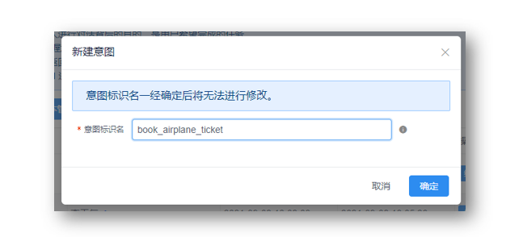

<!-- markup:blank-line -->
# <4/5> 识别订票意图

<< 上一步：[<3/5> 设置欢迎语中的热门问题](/products/chatbot-platform/tutorials/3-add-scripts-function.html) | <i class="glyphicon glyphicon-time"></i>阅读本节内容大约需要 7 mins 

如何让`阿Q`可以引导访客完成预约机票呢？这需要使用意图识别模块和多轮对话设计器。

## 引用系统词典

`阿Q`需要识别访客的输入文本中包含的地名和时间信息，比如出发城市、到达城市和航班时间。

在浏览器中，进入`阿Q`的词典页，点击【引用系统词典】。


找到 `@TIME` 和 `@LOC`，点击【引用】，如下图所示。


## 创建意图

在浏览器中，进入 `阿Q` 的意图管理页面。


点击【新建意图】，复制粘贴以下内容到表单中。

```意图标识名
book_airplane_ticket
```

点击【确定】。现在，就有了一个意图，接下来为这个意图添加训练数据：槽位和说法。



* 槽位：该意图中的关键信息。
* 说法：表明意图的开场白。

## 添加槽位

在 `book_airplane_ticket` 的操作中，点击【编辑】，进入意图识别编辑页面。


我们开始添加槽位信息，槽位编辑面板在【用户说法】的下面，按照如下信息**逐个**【添加】：

| 槽位名称 | 词典（下拉选择）| 必填 | 追问 |
| --- | --- | --- | --- |
| `fromPlace` | `@LOC` | 是 | 您从哪个城市或机场出发？ |
| `date` | `@TIME` | 是 | 您的计划出发日期是什么时候? |
| `destPlace` | `@LOC` | 是 | 您要去的目的城市或机场是哪里？ |
<!-- markup:table-caption 添加槽位表单 -->

添加完成后，看起来是这样的。


## 添加说法

接下来，我们为预约机票添加一些说法。复制下面的内容；粘贴到【用户说法】中；点击【添加】。

```说法
预约机票
预定飞机票
我想预约机票
我要预约从{fromPlace}出发的机票
帮我预约{date}的机票
```


添加完成后，看起来是这样的。


## 训练意图识别模型

滚动到槽位表格下面，点击【保存】。


在保存后，会提示进行模型的训练，大约几秒钟后，提示`训练成功，可进行测试`。

## 测试意图识别

在浏览器中，进入`阿Q`的测试对话页。


在测试对话页面，选择【意图识别】，然后在聊天窗口中，发送：

```文本
我想预约机票
```

这时候阿Q会回答：`您从哪个城市或机场出发？` 或 `您的计划出发日期是什么时候?`。


现在阿Q 可以识别意图了，这样只是让机器人具备了【听懂】访客订票的意图，在机器人人的大脑中，该能力还是零散的，相当于是一个独立的树枝：要提供一个真正的业务能力，我们还需要将这个树枝安装到树干上！

下面，我们就进入 [<5/5> 提交订票表单](/products/chatbot-platform/tutorials/5-stats-history.html) 完成这个工作~

<< 上一步：[<3/5> 设置欢迎语中的热门问题](/products/chatbot-platform/tutorials/3-add-scripts-function.html) | >> 下一步：[<5/5> 提交订票表单](/products/chatbot-platform/tutorials/5-stats-history.html) 