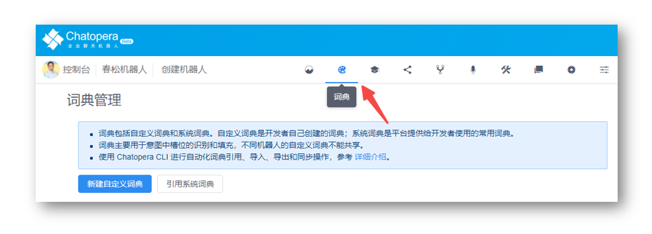
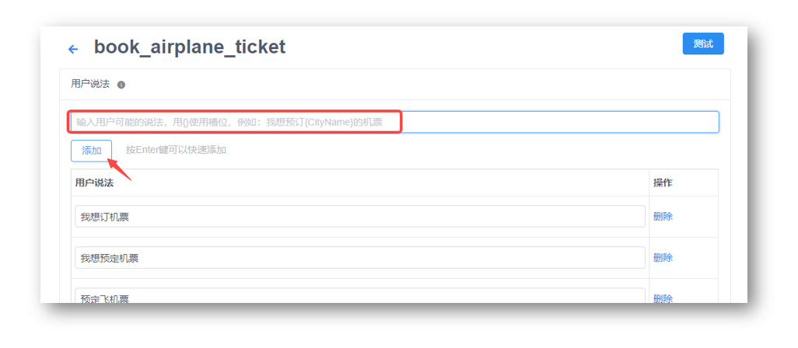
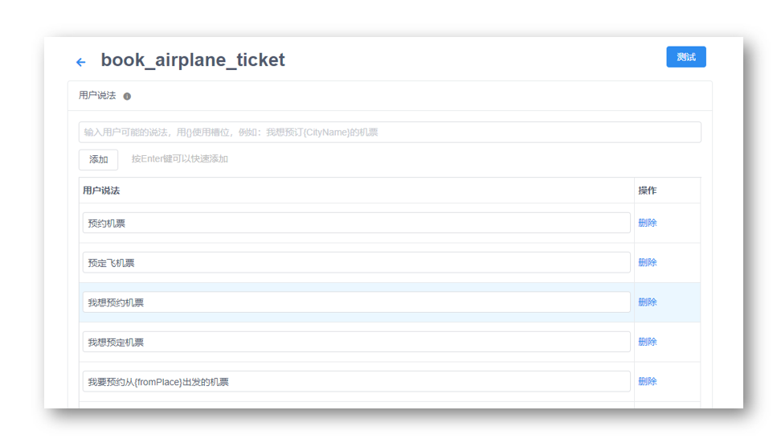
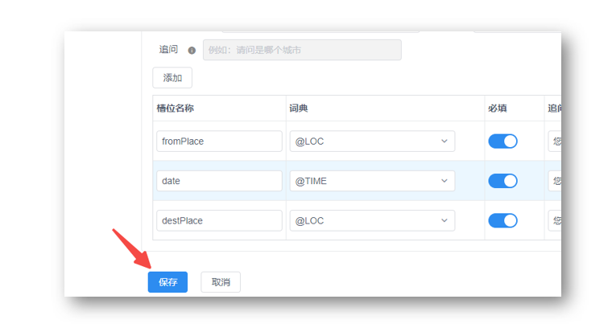
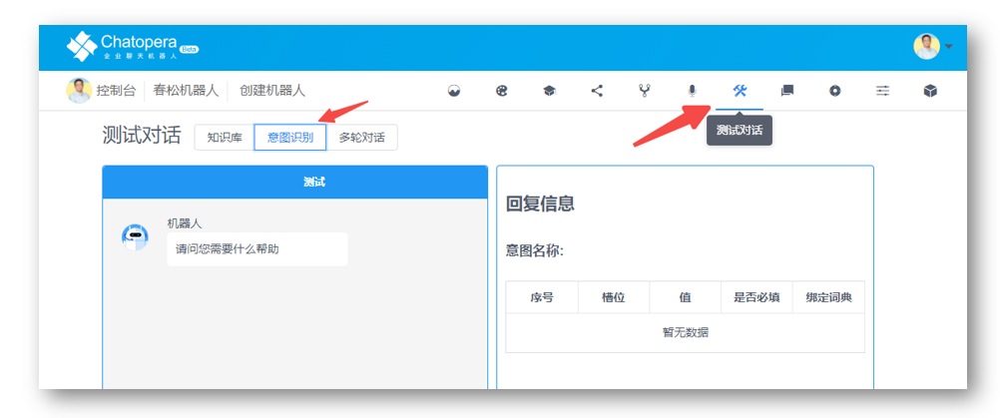
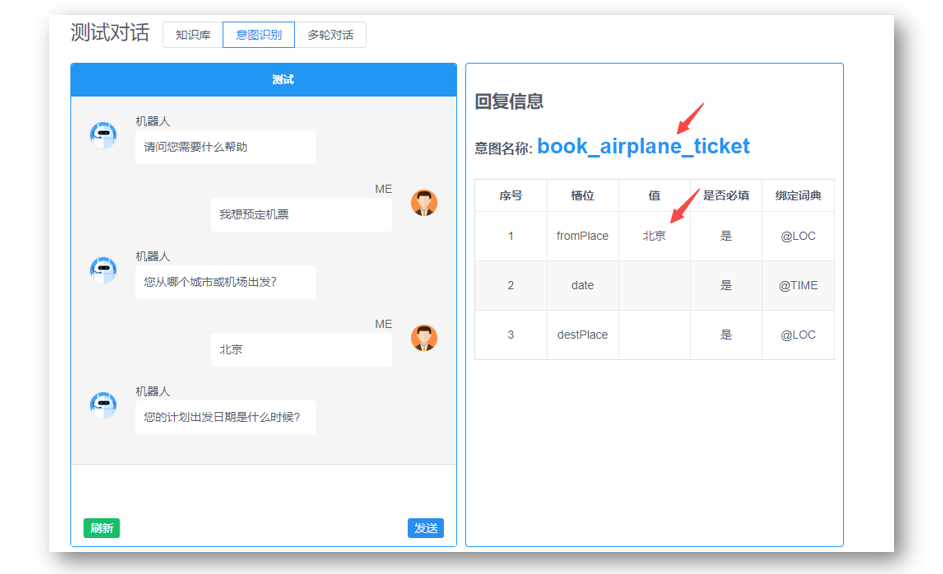
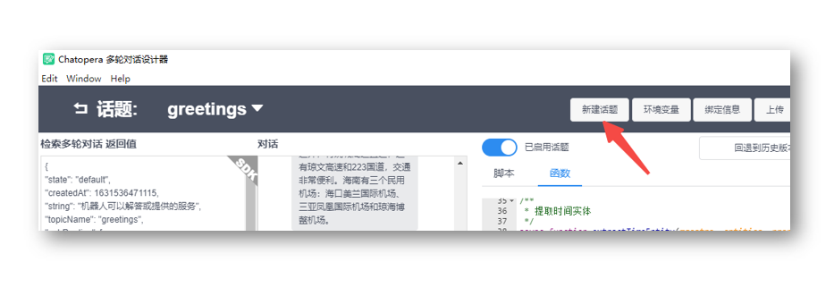

<!-- markup:blank-line -->
# <4/5> 添加意图“预定机票” 

<< 上一步：[<3/5> 使用脚本和函数](/products/chatbot-platform/tutorials/3-add-scripts-function.html) | <i class="glyphicon glyphicon-time"></i>阅读本节内容大约需要 5 mins 

完成本节内容，春松机器人能够为对话用户提供预约机票的服务：通过自然语言交互的形式获取到了要购买机票相关的信息，假设集成了一个出票接口，完成出票。

## 引用系统词典

在预约飞机票的应用场景下，春松机器人需要识别对话用户的输入文本中包含的地名和时间信息，比如最基本的几个信息：出发城市、到达城市和航班时间。

再次回到机器人管理控制台，在机器人菜单上点击【词典】。



在词典管理页面，点击【引用系统词典】。


跳转到新的页面后，找到 `@TIME` 和 `@LOC`，点击【引用】，如上图所示。稍后我们就可以让机器人在意图识别中能“学习”到这些“概念”。

## 创建意图

在机器人菜单上点击【意图】。


此时进入了意图识别管理页面，点击【新建意图】。


在弹出的表单中填写：

```意图标识名
book_airplane_ticket
```

点击【确定】，回到意图识别列表，然后修改 `book_airplane_ticket` 的中文描述。

```意图中文名
预约飞机票
```

点击【保存】。现在，就有了一个意图，接下来为这个意图添加训练数据。

## 添加用户说法

在 `book_airplane_ticket` 的操作中，点击【编辑】，进入意图识别编辑页面。

添加说法，说法就是代表对话用户要发起这个任务的文本。



我们为预约机票添加一些说法，**复制下面三行内容；在机器人控制台的说法输入中粘贴；点击【添加】**。

```说法
预约机票
预定飞机票
我想预约机票
```

## 添加意图槽位

接下来，我们开始添加槽位信息，槽位就是在预约机票任务中，需要的关键信息：出发城市、到达城市和航班时间。
槽位编辑面板在【用户说法】的下面，按照如下信息逐个【添加】：

| 槽位名称 | 词典 | 必填 | 追问 |
| --- | --- | --- | --- |
| `fromPlace` | `@LOC` | 是 | 您从哪个城市或机场出发？ |
| `date` | `@TIME` | 是 | 您的计划出发日期是什么时候? |
| `destPlace` | `@LOC` | 是 | 您要去的目的城市或机场是哪里？ |
<!-- markup:table-caption 添加槽位表单 -->

这部分编辑好以后，看起来是这样的。


## 使用带有槽位的说法

在说法中，支持使用槽位，用`{槽位名称}`的形式。这样，对话用户可以同时表明意图和关键信息。
回到槽位上面的用户说法编辑窗口，粘贴下面两行内容：

```说法
我要预约从{fromPlace}出发的机票
帮我预约{date}的机票
```



有了用户说法和槽位后，就可以训练了，滚动到槽位表格下面，点击【保存】。



在保存后，会提示进行模型的训练，大约几秒钟后，提示`训练成功，可进行测试`。

## 测试意图识别

刚刚的模型效果怎么样？聊几句试试。在机器人管理控制台，进入【测试对话】页面。



这里是另一个可以测试对话的地方，在这里可以对不同问答模块做单独的测试。**但是稍后，我们会处理意图识别的会话，还要使用多轮对话设计器实现。**

在测试对话页面，选择【意图识别】，然后在聊天窗口中，发送：

```文本
我想预定机票
```

这时候机器人会回答：`您从哪个城市或机场出发？` 或 `您的计划出发日期是什么时候?`。具体机器人问什么，是和之前添加槽位的顺序相关。对话的效果如下：



现在机器人可以识别意图了，能提取到关键的信息了。

## 完成意图会话

接着，我们希望意图识别的对话，能集成到出票的服务上。借助多轮对话设计器，这个任务很简单，在多轮对话中，意图匹配器能帮助我们达到这个目标！

回到多轮对话设计器，假设还在刚刚的 `greetings` 编辑窗口。点击【新建话题】，话题名称填写`intents`。



这时候，进入了一个新的脚本编辑窗口，在脚本编辑区域，添加如下内容：

```脚本
// 预约机票 
intent {keep} book_airplane_ticket
- ^handleAirplaneTicketOrder()

    + ${0.6}{没错，出票吧｜出票}
    % ^handleAirplaneTicketOrder()
    - {keep} ^placeAirplaneTicketOrder()
    
    + ${0.6}{不预约了}
    % ^handleAirplaneTicketOrder()
    - {keep} ^cancelAirplanTicketReservation()
    
    + ${0.6}{信息有误，重新预约}
    % ^handleAirplaneTicketOrder()
    - {keep} ^rebookAirplaneTicket()
```


此时，我们看到脚本编辑窗口的内容，比上一节要复杂一些，实际上这些脚本有很好的可读性，同时对人类和机器人友好，很方便解释。在完成新手任务后，你可以继续学习它们：匹配器、回复和上下轮钩子。学习它们也很容易！

然后，点击【函数】，进入函数编辑窗口，在上一节编辑的函数后，增加如下内容：

```函数
// 提取时间实体
async function extractTimeEntity(maestro, entities, property) {
    debug("extractTimeEntity name %s, value %s", property, entities[property]["val"])
    let dates = await maestro.extractTime(entities[property]["val"], "YYYY年MM月DD日 HH:mm");
    return dates.length > 0 ? dates[0] : "";
}

// 确认订单信息
exports.handleAirplaneTicketOrder = async function() {

    debug("[handleAirplaneTicketOrder] this.intent", JSON.stringify(this.intent))
    let entities = _.keyBy(this.intent.entities, 'name');
    let date = await extractTimeEntity(this.maestro, entities, "date");

    this.intent.extras = {
        date: date
    }

    return {
        text: `和您确认一下信息，出发地${entities["fromPlace"]["val"]}，目的地${entities["destPlace"]["val"]}，出发时间${this.intent.extras.date}`,
        params: [{
                label: "没错，出票吧",
                type: "button",
                text: "没错，出票吧"
            },
            {
                label: "信息有误，重新预约",
                type: "button",
                text: "我想预约机票"
            },
            {
                label: "不预约了",
                type: "button",
                text: "不预约了"
            },
        ]
    }
}

// 下单
exports.placeAirplaneTicketOrder = async function() {
    this.intent.drop = true;
    let entities = _.keyBy(this.intent.entities, 'name');

    return {
        text: "{CLEAR} 已帮您购买",
        params: [{
            type: 'card',
            title: "查看详情",
            thumbnail: "https://gitee.com/chatopera/cskefu/attach_files/1143210/download/AIRPLANE_20220801113300.jpg",
            summary: `${this.intent.extras.date}，国泰航空 CA001，国泰机场, ${entities["fromPlace"]["val"]} - ${entities["destPlace"]["val"]} `,
            hyperlink: "https://www.chatopera.com/"
        }]
    }
}

// 不预约了
exports.cancelAirplanTicketReservation = async function() {
    this.intent.drop = true;
    return {
        text: "{CLEAR} 好的，下次再帮您预约"
    }
}

// 重新预约机票
exports.rebookAirplaneTicket = async function() {
    debug("rebookAirplaneTicket this.intent", this.intent);
    this.intent.drop = true;
    return "^topicRedirect(\"intents\", \"book_airplane_ticket\", true)"
}
```

完成添加脚本和函数后，点击【保存】。这时候，多轮对话设计器里的更新就上传到 Chatopera 云服务了。

## 测试意图会话

在多轮对话设计器内的聊天窗口，发送文本：

```文本
我想预约机票
```

这时，机器人识别了意图，并追问槽位的信息。我们输入城市和时间。当机器人获得了全部必填的槽位信息后，会弹出操作提示。


我们可以点击操作按钮或发送文本：“出票”，“重新预约”和“取消预约”。我们发送文本：

```文本
出票
```

如果你看到了类似下面的消息：


恭喜你完成本节任务！距离完成新手任务还有两节内容！

 <!-- markup:skip-line -->

<< 上一步：[<3/5> 使用脚本和函数](/products/chatbot-platform/tutorials/3-add-scripts-function.html) | >> 下一步：[<5/5> 查看统计和历史](https://docs.chatopera.com/products/chatbot-platform/tutorials/5-stats-history.html) 