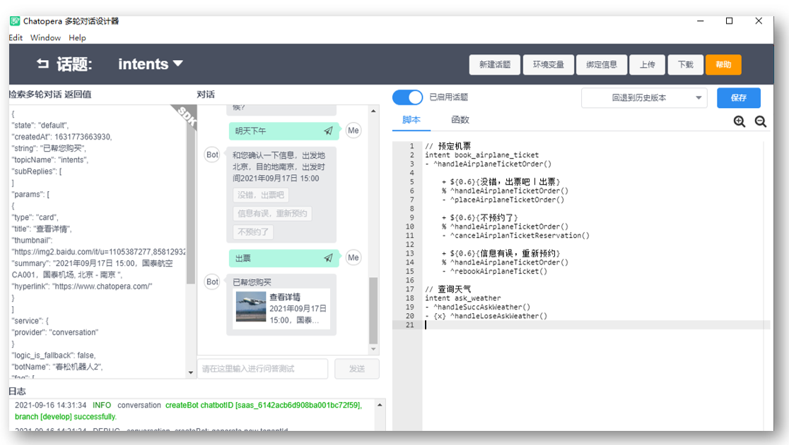

<!-- markup:blank-line -->
# <4/5> 添加函数查询天气 <!-- markup:skip-line -->

<< 上一步：[<3/5> 添加意图“预定机票”](https://docs.chatopera.com/products/chatbot-platform/tutorials/3-book-ticket-task.html) | <i class="glyphicon glyphicon-time"></i>阅读本节内容大约需要 10 mins <!-- markup:skip-line -->

现在我们还需要支持一个问答技能：查询天气。比如，对话用户发送“上海天气怎么样？”，机器人回答当天的天气情况。

## 创建和训练意图

假设你已经完成了上一节，了解意图创建和训练的过程。下面通过一些必要信息，你来创建一个意图并完成训练。

### 创建意图

创建意图名称：

```意图标识名
ask_weather
```

更改中文名：

```意图中文名
查天气
```


### 添加槽位

| 槽位名称 | 词典 | 必填 | 追问 |
| --- | --- | --- | --- |
| `loc` | `@LOC` | 是 | 您要问哪里的天气信息？ |
<!-- markup:table-caption 添加槽位表单 -->

### 用户说法

复制以下 5 行内容到说法添加窗口，然后点击“添加”。

```说法
查询天气
我想查询{loc}的天气
{loc}的天气怎么样
{loc}的天气情况
{loc}的天气
```

点击【保存】，完成训练。

### 测试对话

进入机器人管理控制台，测试对话页面。选择【意图识别】，发送：

```文本
北京的天气
```


在右侧面板，机器人显示，已经识别了意图和城市。

## 完成意图会话

回到多轮对话设计器里的春松机器人脚本编辑窗口，在上一步，我们创建了 `intents` 话题，现在继续编辑这个话题的脚本。

### 添加脚本

在脚本中**追加**下面的内容：

```脚本
// 查询天气
intent ask_weather
- ^handleSuccAskWeather()
- {x} ^handleLoseAskWeather()
```

有了上节的经验，现在看起来，这个意图会话的脚本是不是很熟悉了？

现在，脚本编辑区域看起来如下。



### 添加函数

在函数中**追加**下面的内容：

```函数
/**
 * 第三方服务类
 */

var WForewast = function(apiKey) {
    if (!apiKey) throw new Error('Invalid token, get it from http://www.heweather.com/my/service');
    this.key = apiKey;
}


WForewast.prototype.getWeatherByCity = function(city) {
    return new Promise((resolve, reject) => {
        if (!city)
            return reject("城市名不能为空");
        let url = config["HEWEATHER_URL"] + "/weather?city=" + encodeURIComponent(city) + "&key=" + this.key
        http
            .get(url)
            .then((res) => {
                if (res.data.HeWeather5[0] && res.data.HeWeather5[0].suggestion) {
                    resolve(res.data.HeWeather5[0].suggestion);
                } else {
                    reject("天气建议未返回约定结果！");
                }

            })
            .catch(function(err) {
                if (err) return reject(err);
            });
    })
}

const wf = new WForewast(config["HEWEATHER_KEY"]);

// 查询天气
exports.handleSuccAskWeather = async function() {
    debug("handleSuccAskWeather this.intent", this.intent);
    let entities = _.keyBy(this.intent.entities, 'name');
    let loc = entities["loc"]["val"];
    try {
        let result = await wf.getWeatherByCity(loc);
        debug("LOC %s result %j", loc, result);
        return loc + "天气：" + result["comf"]["txt"] + "(数据来源：和风天气)";
    } catch (e) {
        debug(e)
        return `很抱歉，没有获得${loc}的天气信息。`
    }

}

// 超过追问次数，进入失败函数
exports.handleLoseAskWeather = async function() {
    debug("handleLoseAskWeather this.intent", this.intent);
    return "未得到您的查询信息，您可以说：我想查询北京的天气。";
}
```

### 添加环境变量

在这个对话中，机器人在识别意图和城市后，请求第三方接口，通过互联网 HTTP API 的形式，查询天气信息，这个第三方接口需要认证，我们使用【环境变量】添加认证信息。


| 变量名 | 变量值 |
| --- | --- |
| HEWEATHER_URL | <https://free-api.heweather.com/v5> |
| HEWEATHER_KEY | 182f1b6826d94c6285a489d2414f3ad0 |
<!-- markup:table-caption 添加环境变量 -->

点击【确认】，再点击【保存】。

## 测试意图会话

在多轮对话设计器内的聊天窗口，发送文本：

```文本
北京的天气
```

那么，根据当天的情况，机器人发送回复内容。


当看到类似上面的内容，恭喜你，这个查询天气的对话技能就实现了！

## 更新欢迎语

在体验程序中，机器人打招呼时，发送了技能的介绍，包含三项：

```文本
机器人可以解答或提供的服务
1. 海口有几个机场
2. 我想查询天气
3. 我想预定机票
```

现在，你的春松机器人也可以回答这三个问题了，所以，进入多轮对话设计器的春松机器人函数编辑窗口，找到 `exports.get_greetings` ，也就是在第一节中我们增加的函数内容，将其实现替换为下面内容：

```函数
// 问候语中关联常见问题
exports.get_greetings = async function() {
    return {
        text: "机器人可以解答或提供的服务",
        params: [{
                label: "1. 海口有几个机场",
                type: "qlist",
                text: "海口有几个机场"
            },
            {
                label: "2. 我想查询天气",
                type: "qlist",
                text: "我想查询天气"
            },
            {
                label: "3. 我想预定机票",
                type: "qlist",
                text: "我想预定机票"
            }
        ]
    };
}
```

点击【保存】。

## 测试打招呼

在多轮对话设计器的聊天窗口，发送文本：

```文本
__faq_hot_list
```


如果你得到了以上的回复内容，恭喜你完成本节任务！

 <!-- markup:skip-line -->

<< 上一步：[<3/5> 添加意图“预定机票”](https://docs.chatopera.com/products/chatbot-platform/tutorials/3-book-ticket-task.html) | >> 下一步：[<5/5> 查看统计和历史](https://docs.chatopera.com/products/chatbot-platform/tutorials/5-stats-history.html) <!-- markup:skip-line -->

## 可能遇到的问题

### 和风天气接口调用异常

在这个对话中，天气查询服务使用的提供商是 [和风天气](https://www.qweather.com/)，在环境变量中，我们配置的 `KEY` 每天只有 1,000 次查询权限，当服务无法返回天气信息时，很可能是超过当天调用配额。解决办法：你可以注册和风天气并获得私享的密钥信息。

注册和风天气开发者：[https://dev.qweather.com/](https://dev.qweather.com/)

