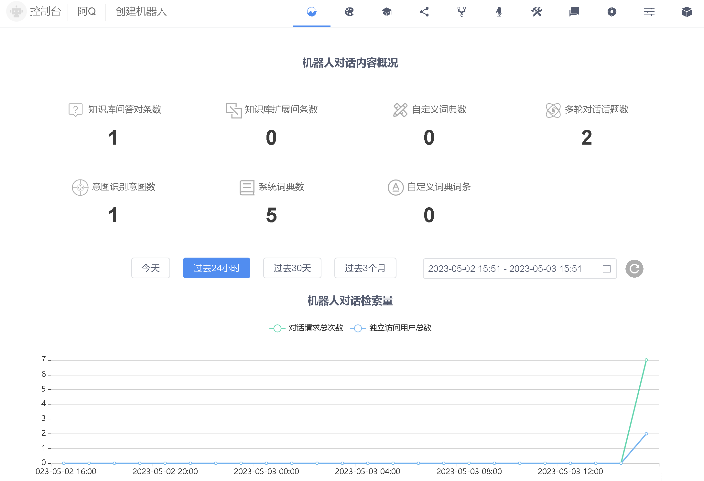

<!-- markup:blank-line -->
# <5/5> 查看使用情况

<< 上一步：[<4/5> 添加意图对话](/products/chatbot-platform/tutorials/4-add-intent.html) | <i class="glyphicon glyphicon-time"></i>阅读本节内容大约需要 1 min

## 查看机器人对话数据

经过了上面的几个环节，`阿Q` 就能提供服务了。查看 `阿Q`的概况页，对话语料数据和请求数据现在有了变化。

## 你创造了一个智能对话机器人

太棒了！你已经完成了新手入门任务！

<< 上一步：[<4/5> 添加意图对话](/products/chatbot-platform/tutorials/4-add-intent.html)

<!-- markup:markdown-end -->

## 接下来

本篇是 Chatopera 云服务入门教程的最后一节，当你看到这里，就可以正式使用 Chatopera 云服务了，衷心的感谢你选择 Chatopera 云服务！回到 [首页](/products/chatbot-platform/index.html)。
