<!-- markup:blank-line -->
# <5/5> 优化打招呼和热门问题列表

<< 上一步：[<4/5> 批量导入 FAQ 知识库，使用 CDE 和 CLI](/products/chatbot-platform/tutorials/4-add-intent.html) | <i class="glyphicon glyphicon-time"></i>阅读本节内容大约需要 15 min

> 当您在新手任务中，遇到任何问题，欢迎[联系 Chatopera 工程师](https://dwz.chatopera.com/s99784)获得帮助支持~

当我们批量导入了知识库问答对，再次以访客的身份打开机器人 H5 页面，我们看到的就是下面的界面。

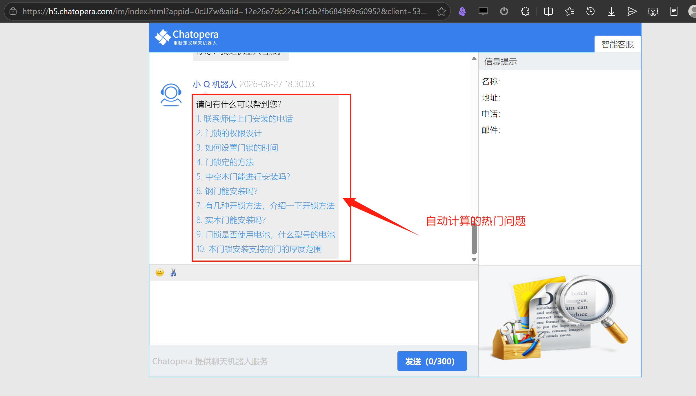

我们发现，机器人的打招呼的信息变了，这是因为，Chatopera 会根据 FAQ 知识库自动识别最常出现的问题，随着越来越多的访客和机器人对话，这个热门问题列表会根据统计信息动态的变化，默认显示最热门的 10 条问答对。

这个默认的打招呼的逻辑，可能不符合您的应用场景，比如我们想将问题列表固定，那么如何做呢？

这个过程分为三个步骤：

1. 拉取多轮对话
2. 查看 greetings 话题脚本
3. 修改函数

## 拉取多轮对话

在 VSCode[^install-cde]中打开【机器人根目录】，确认在根目录下有 .env 文件，CDE 将使用该文件和机器人服务连接。

[^install-cde]: 依赖我们已经安装了 [CDE](https://docs.chatopera.com/products/chatbot-platform/howto-guides/cde/guide101_zh.html)

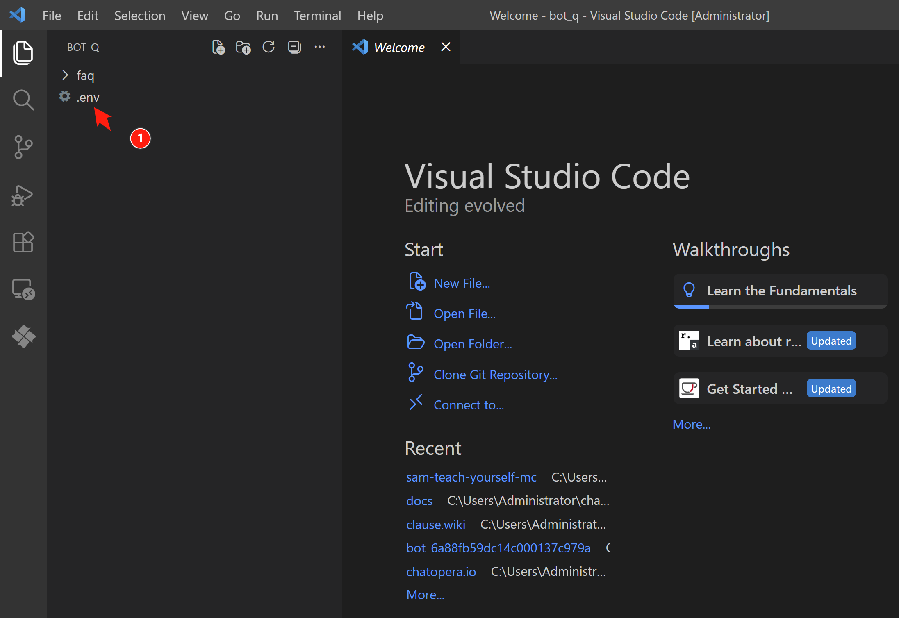

然后，点击左侧菜单中的 Chatopera 图标。

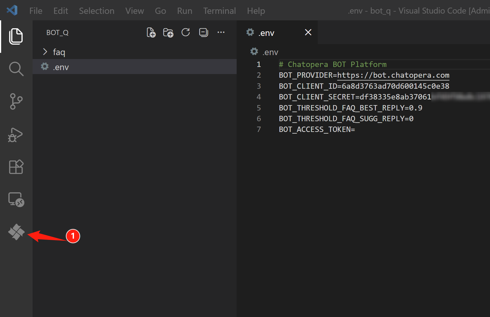

您将看到类似如下的界面。

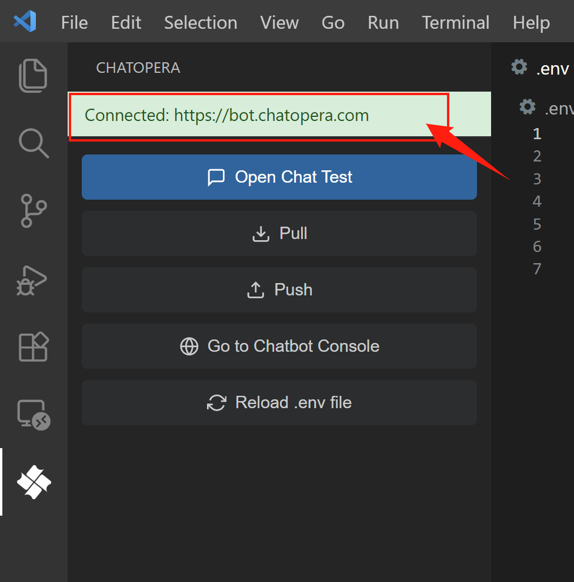

提示连接到了远程的机器人服务，接着点击：pull。这时，CDE 下载了机器人的多轮对话内容，执行完成后，可以看到右下角的通知。


## 测试对话

测试对话，点击【Open Chat Test】，这时我们会看到出现了对话面板。

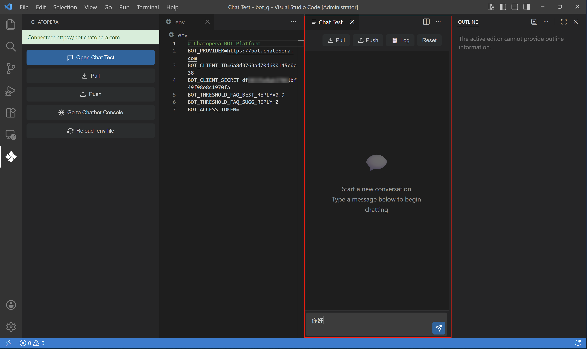

通过发送消息，获得机器人的回复。

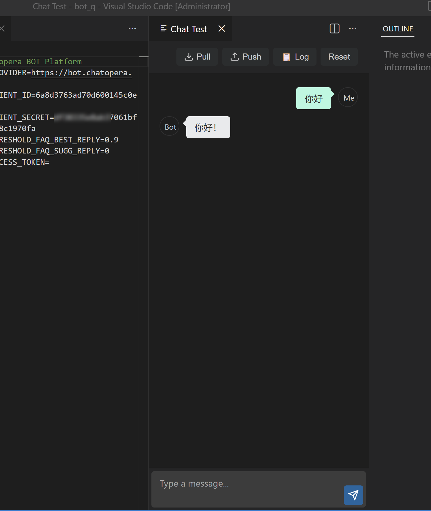

## 查看调试日志

当我们想要了解机器人的问答的逻辑的时候，可以点击【Log】，获得调试日志。

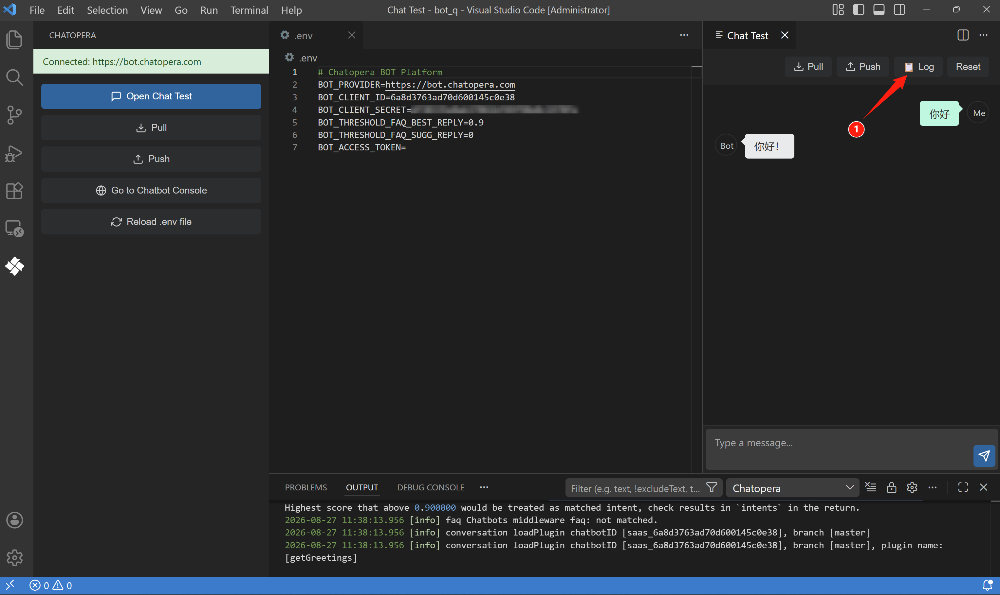

## 查看 greetings 话题脚本

这一步，我们在 VSCode 左侧菜单中，打开文件夹浏览，找到 `conversations/greetings.ms` 文件，并打开，如下图。

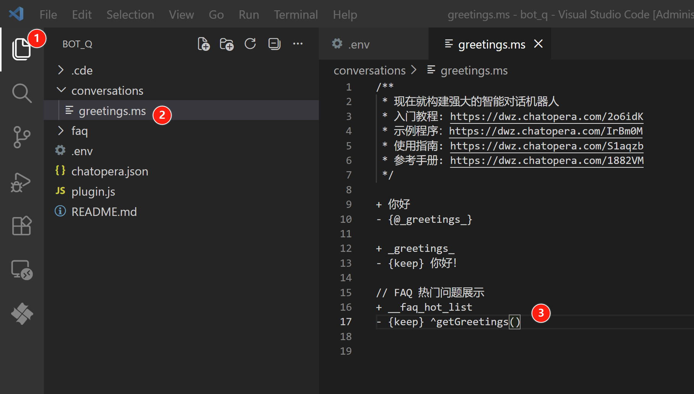

这时，我们可以发现一个叫 `__faq_hot_list` 的匹配器，并且使用了函数 `getGreetings` 的返回值做回复。

## 修改函数

为了实现修改打招呼的热门问题列表，我们只需要在函数中，修改 `getGreetings` 的返回值，过程如下。

首先，打开 plugin.js 文件，找到 `getGreetings` 函数。

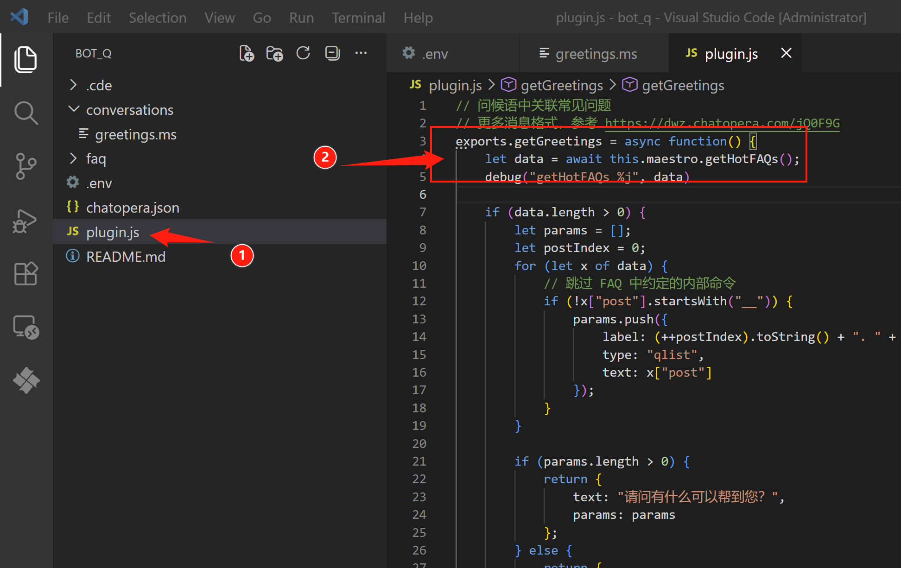


修改 `getGreetings` 的定义，让其内容如下：

```JavaScript
// 问候语中关联常见问题
// 更多消息格式，参考 https://dwz.chatopera.com/jQ0F9G
exports.getGreetings = async function () {
    return {
        text: "请问有什么可以帮到您？",
        params: [
            {
                label: "1. 联系师傅上门安装的电话",
                type: "qlist",
                text: "联系师傅上门安装的电话"
            },
            {
                label: "2. 门锁的权限设计",
                type: "qlist",
                text: "门锁的权限设计"
            },
            {
                label: "3. 本门锁安装支持的门的厚度范围",
                type: "qlist",
                text: "本门锁安装支持的门的厚度范围"
            }
        ]
    };
}
```

保存，然后进行 【push】，如下图点击。

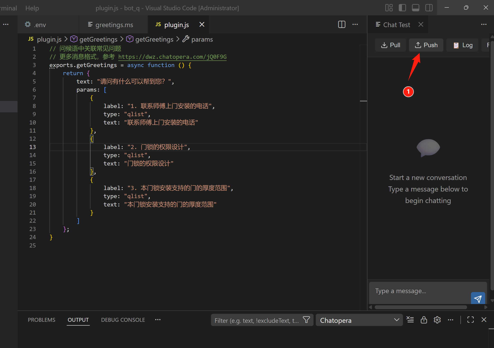

这时，在右下角，我们得到提示：

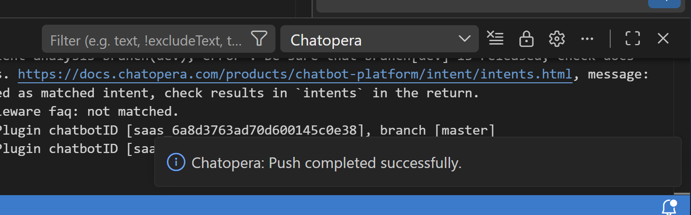

在对话测试窗口，发送 `__faq_hot_list`，看到如下的内容。

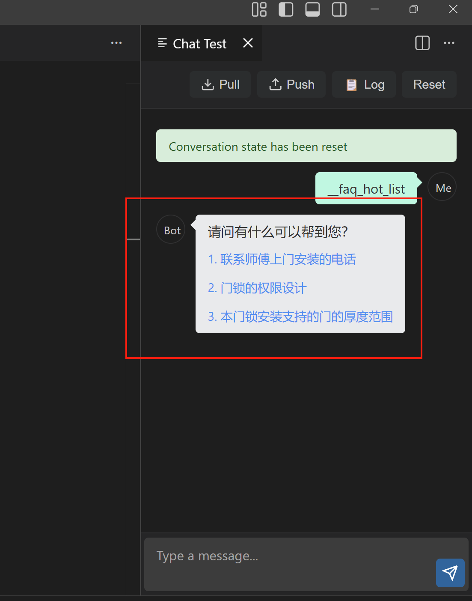

说明，我们的欢迎语更新完成。

这时，如果我们再回到访客的角色，刷新 H5 的页面，看到的内容则变成了下图。

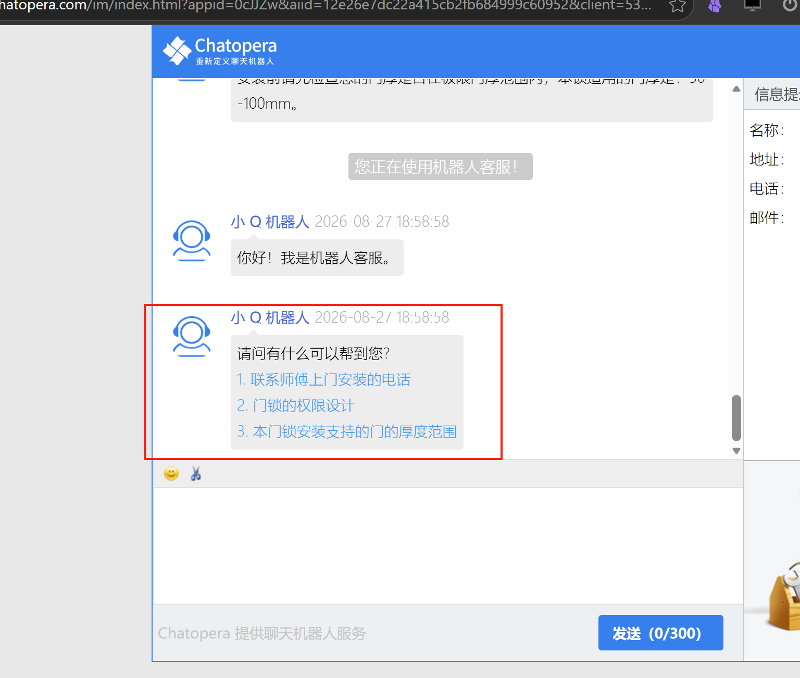

## 入门教程完成

本篇是 Chatopera 云服务入门教程的最后一节，当你看到这里，就可以正式使用 Chatopera 云服务了，衷心的感谢你选择 Chatopera 云服务！

## 使用进阶

* [使用指南](https://docs.chatopera.com/products/chatbot-platform/howto-guides/index.html)中，是回答您可能问的一些问题
* [参考手册](https://docs.chatopera.com/products/chatbot-platform/references/index.html)是关于 SDK/API/CLI 的使用
* [背景知识](https://docs.chatopera.com/products/chatbot-platform/explanations/index.html)介绍了有关 Chatopera 云服务的工作原理

## 更多示例程序

继续进阶，请查看更多聊天机器人示例程序 [@Chatopera/chatbot-samples](https://github.com/chatopera/chatbot-samples) - 

* [GitHub](https://github.com/chatopera/chatbot-samples)
* [Gitee](https://gitee.com/chatopera/chatbot-samples)

