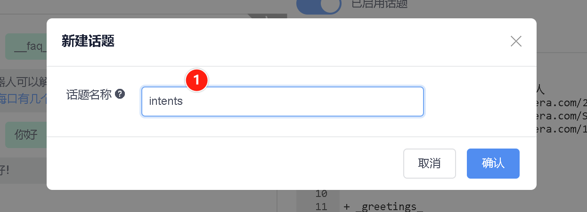
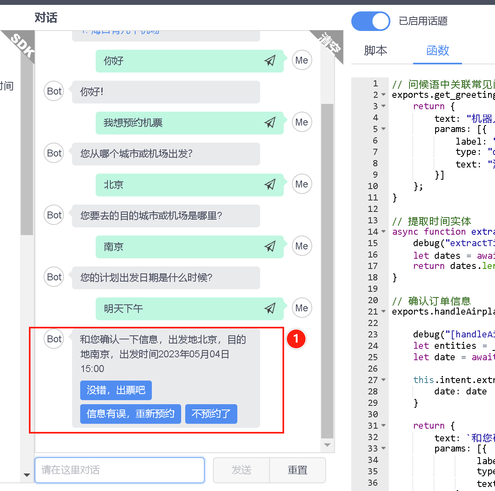

<!-- markup:blank-line -->
# <5/5> 提交订票表单

<< 上一步：[<4/5> 识别订票意图](/products/chatbot-platform/tutorials/4-add-intent.html) | <i class="glyphicon glyphicon-time"></i>阅读本节内容大约需要 10 min

> 当您在新手任务中，遇到任何问题，欢迎[联系 Chatopera 工程师](https://dwz.chatopera.com/s99784)获得帮助支持~

要想让机器人处理用户的意图，将意图会话这个树枝安装到机器人大脑的树干上，就需要使用多轮对话设计器。

## 处理订票会话表单

回到多轮对话设计器，在刚刚打开的 `greetings` 话题编辑窗口。


点击【新建话题】，话题名称填写`intents`。



此时会进入一个新的脚本编辑窗口，在脚本编辑区域，复制粘贴以下的内容：

```脚本
// 预约机票 
intent {keep} book_airplane_ticket
- ^handleAirplaneTicketOrder()

    + ${0.6}{没错，出票吧｜出票}
    % ^handleAirplaneTicketOrder()
    - {keep} ^placeAirplaneTicketOrder()
    
    + ${0.6}{不预约了}
    % ^handleAirplaneTicketOrder()
    - {keep} ^cancelAirplanTicketReservation()
    
    + ${0.6}{信息有误，重新预约}
    % ^handleAirplaneTicketOrder()
    - {keep} ^rebookAirplaneTicket()
```


点击【保存】。然后，点击【函数】，进入函数内容后面，追加下面的内容：

```函数
// 提取时间实体
async function extractTimeEntity(maestro, entities, property) {
    debug("extractTimeEntity name %s, value %s", property, entities[property]["val"])
    let dates = await maestro.extractTime(entities[property]["val"], "YYYY年MM月DD日 HH:mm");
    return dates.length > 0 ? dates[0] : "";
}

// 确认订单信息
exports.handleAirplaneTicketOrder = async function() {
    debug("[handleAirplaneTicketOrder] this.intent", JSON.stringify(this.intent))
    let entities = _.keyBy(this.intent.entities, 'name');
    let date = await extractTimeEntity(this.maestro, entities, "date");

    this.intent.extras = {
        date: date
    }

    return {
        text: `和您确认一下信息，出发地${entities["fromPlace"]["val"]}，目的地${entities["destPlace"]["val"]}，出发时间${this.intent.extras.date}`,
        params: [{
                label: "没错，出票吧",
                type: "button",
                text: "没错，出票吧"
            },
            {
                label: "信息有误，重新预约",
                type: "button",
                text: "我想预约机票"
            },
            {
                label: "不预约了",
                type: "button",
                text: "不预约了"
            },
        ]
    }
}

// 下单
exports.placeAirplaneTicketOrder = async function() {
    this.intent.drop = true; // **关闭当前意图会话**
    let entities = _.keyBy(this.intent.entities, 'name');

    return {
        text: "{CLEAR} 已帮您购买",
        params: [{
            type: 'card',
            title: "查看详情",
            thumbnail: "https://gitee.com/chatopera/cskefu/attach_files/1143210/download/AIRPLANE_20220801113300.jpg",
            summary: `${this.intent.extras.date}，国泰航空 CA001，国泰机场, ${entities["fromPlace"]["val"]} - ${entities["destPlace"]["val"]} `,
            hyperlink: "https://www.chatopera.com/"
        }]
    }
}

// 不预约了
exports.cancelAirplanTicketReservation = async function() {
    this.intent.drop = true; // **关闭当前意图会话**
    return {
        text: "{CLEAR} 好的，下次再帮您预约"
    }
}

// 重新预约机票
exports.rebookAirplaneTicket = async function() {
    debug("rebookAirplaneTicket this.intent", this.intent);
    this.intent.drop = true; // **关闭当前意图会话**
    return "^topicRedirect(\"intents\", \"book_airplane_ticket\", true)"
}
```

点击【保存】。

## 测试机票预约对话

在多轮对话设计器内的对话窗口，发送文本：

```文本
我想预约机票
```

这时，`阿Q`识别了意图，并进行交互。


如果你看到了类似下面的消息：



恭喜你完成本节任务！

 

本篇是 Chatopera 云服务入门教程的最后一节，当你看到这里，就可以正式使用 Chatopera 云服务了，衷心的感谢你选择 Chatopera 云服务！

## 更多示例程序

继续进阶，请查看更多聊天机器人示例程序 [@Chatopera/chatbot-samples](https://github.com/chatopera/chatbot-samples) - 

* [GitHub](https://github.com/chatopera/chatbot-samples)
* [Gitee](https://gitee.com/chatopera/chatbot-samples)