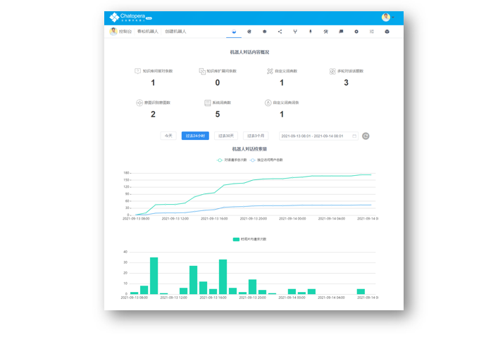

<!-- markup:blank-line -->
# <5/5> 查看统计和历史 <!-- markup:skip-line -->

<< 上一步：[<4/5> 添加函数查询天气](https://docs.chatopera.com/products/chatbot-platform/tutorials/4-request-weather-info.html) | <i class="glyphicon glyphicon-time"></i>阅读本节内容大约需要 1 mins <!-- markup:skip-line -->

## 查看机器人对话数据

经过了上面的几个环节，一个有对话能力的，提供实际价值的机器人服务就实现了。在春松机器人管理控制台的首页，机器人的对话语料和请求数据现在有了变化。在这里你可以感受到，你投入的精力和它带来的价值。

## 你创造了一个智能对话机器人

太棒了！你已经完成了新手入门任务！

<< 上一步：[<4/5> 添加函数查询天气](https://docs.chatopera.com/products/chatbot-platform/tutorials/4-request-weather-info.html) <!-- markup:skip-line -->

<!-- markup:markdown-end -->

## 接下来

本篇是 Chatopera 云服务入门教程的最后一节，当你看到这里，就可以正式开始使用 Chatopera 云服务了，衷心的感谢你选择 Chatopera 云服务！发布机器人到不同渠道、Chatopera 的背景知识、查阅更多信息和获得帮助等，回到 [Chatopera 云服务文档中心首页](https://docs.chatopera.com/products/chatbot-platform/index.html)。
