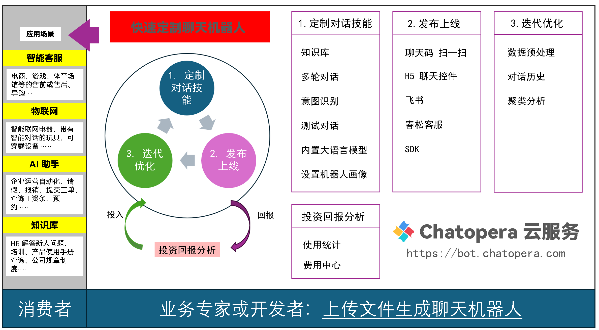

# 入门教程

入门教程帮助你系统性的了解 Chatopera 云服务。在系统性的了解后，才能快速的利用 Chatopera 云服务定制聊天机器人。

## 系统思考

在开始之前，您先要对 Chatopera 云服务有一个系统的认识，那就是下面这张图。

作为定制聊天机器人的工具，Chatopera 将定制机器人的生命周期分成了三个：

* 1、定制对话技能；
* 2、发布上线；
* 3、迭代优化。
* 针对全部活动，进行投入产出的分析。

在入门教程中，是快速的以点带面的方式完成一个聊天机器人，如果您在开始做入门教程之前，先观察上图并建立印象，那么将会大大帮助您掌握 Chatopera 云服务。在遇到具体问题或深入使用，请参考[使用指南](https://docs.chatopera.com/products/chatbot-platform/howto-guides/index.html)、[参考手册](https://docs.chatopera.com/products/chatbot-platform/references/index.html) 和 [背景知识](https://docs.chatopera.com/products/chatbot-platform/explanations/index.html)。

## 准备工作

确保你已经注册了 [Chatopera 云服务账号](https://docs.chatopera.com/products/chatbot-platform/howto-guides/account/account-mgr.html)。接下来就发布第一个聊天机器人吧！

## 新手任务

入门教程包括 5 个简单的新手任务，你只需要一步步的按照顺序操作即可：点击、复制、粘贴。完成入门教程需要 ~20 分钟。

[<1/5> 创建机器人](/products/chatbot-platform/tutorials/1-create-bot.html)

[<2/5> 自动生成知识库](/products/chatbot-platform/tutorials/2-answer-faq.html)

[<3/5> 设置热门问题](/products/chatbot-platform/tutorials/3-add-scripts-function.html)

[<4/5> 识别订票意图](/products/chatbot-platform/tutorials/4-add-intent.html)

[<5/5> 提交订票表单](/products/chatbot-platform/tutorials/5-stats-history.html)