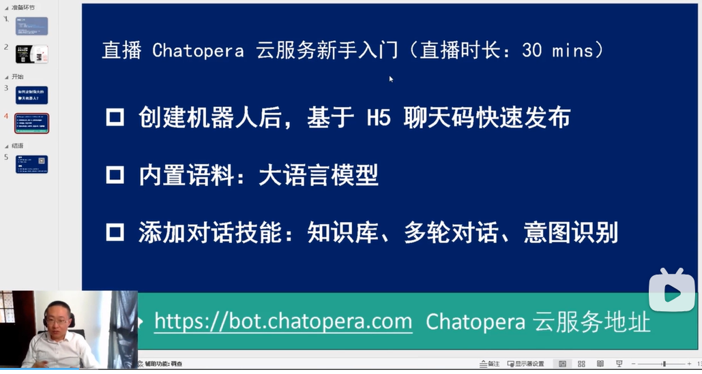

# 入门教程

入门教程帮助你系统性的了解 Chatopera 云服务。在系统性的了解后，才能快速的利用 Chatopera 云服务定制聊天机器人。

## 准备工作

确保你已经注册了 [Chatopera 云服务账号](https://docs.chatopera.com/products/chatbot-platform/howto-guides/account/account-mgr.html)。接下来就发布第一个聊天机器人吧！

## 新手任务

入门教程包括 5 个简单的新手任务，你只需要一步步的按照顺序操作即可：点击、复制、粘贴。完成入门教程需要 ~20 分钟。

[<1/5> 创建机器人](/products/chatbot-platform/tutorials/1-create-bot.html)

[<2/5> 生成预处理问答对](/products/chatbot-platform/tutorials/2-answer-faq.html)

[<3/5> 添加脚本和函数](/products/chatbot-platform/tutorials/3-add-scripts-function.html)

[<4/5> 添加意图对话](/products/chatbot-platform/tutorials/4-add-intent.html)

[<5/5> 查看使用情况](/products/chatbot-platform/tutorials/5-stats-history.html)

## 入门教程视频

您可以通过视频，快速的了解产品的使用和入门。在观看视频后，动手完成新手任务吧！

* [B 站](https://www.bilibili.com/video/BV1cj421U7qu)
* [YouTube](https://youtu.be/HOuRGvKaWgk)

