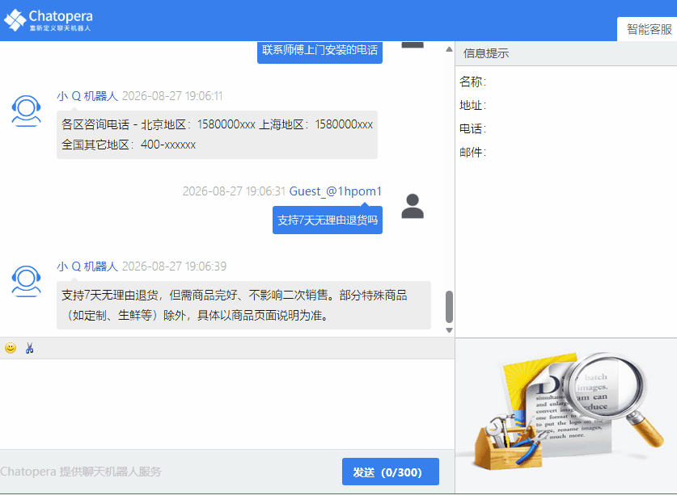

# 入门教程

入门教程帮助您了解和熟悉 Chatopera 云服务，开始快速的定制聊天机器人。

Chatopera 云服务的主要应用场景是智能客服，因此，我们将引导您实现一个智能门锁的机器人客服示例，在课程的最后，您将得到类似下面的机器人服务及 H5 页面~

您也可以现在去体验试试呢！--> [**Demo 机器人地址**](https://h5.chatopera.com/im/text/0cJJZw.html)

## 面向读者

Chatopera 云服务是一个低代码的开发、发布聊天机器人的平台，因此，本文档面向的读者，需要具备以下的技能：

* 有使用过命令行工具、CLI 工具的经验，比如 Windows PowerShell, Linux Bash, macOS 终端工具；
* 有 JavaScript 编程经验，使用过 JavaScript 或 Node.js
* 有使用过集成开发环境，比如 VSCode, IntelliJ IDEA, Sublime Text 等

## 获得帮助

当您在新手任务中，遇到任何问题，欢迎[联系 Chatopera 工程师](https://dwz.chatopera.com/s99784)获得帮助支持~

## 提前准备

CDE 和 CLI 是 Chatopera 发布的开发者工具，它们依赖 Node.js 环境和 VSCode，使用下面的连接获得详细的安装过程。

* 安装 [Chatopera CDE, CLI 工具](https://docs.chatopera.com/products/chatbot-platform/howto-guides/cde/guide101_zh.html)

## 分成 5 个小任务

[<1/5> 创建机器人](/products/chatbot-platform/tutorials/1-create-bot.html)

[<2/5> 回答 80% 的客服问题，使用 RAG 模块](/products/chatbot-platform/tutorials/2-answer-faq.html)

[<3/5> 快速修复不好的回答，使用 FAQ 模块](/products/chatbot-platform/tutorials/3-add-scripts-function.html)

[<4/5> 批量导入 FAQ 知识库，使用 CDE 和 CLI](/products/chatbot-platform/tutorials/4-add-intent.html)

[<5/5> 优化打招呼和热门问题列表](/products/chatbot-platform/tutorials/5-stats-history.html)