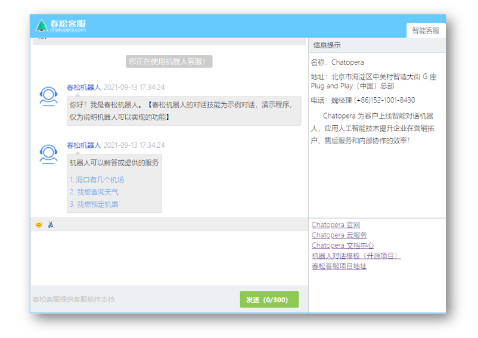

# 入门教程

你可以将入门教程看作是一个充满趣味而简单的新手任务，这个过程是轻松而且富有知识的。在开始动手之前，可以先体验一个智能对话机器人，完成这个教程后，你会得到一个具有同样对话能力的机器人。

## 春松机器人

体验地址：[https://oh-my.cskefu.com/im/text/0nhckh.html](https://oh-my.cskefu.com/im/text/0nhckh.html)

这个示例对话机器人 - 春松机器人，设计的对话，只是为了方便在入门的过程中理解和学习，待完成《入门教程》，你可以用 Chatopera 云服务开发出具有更强大的对话能力、适用于各种场景的智能对话机器人。

## 准备工作

确保你已经创建了 [Chatopera 云服务账号](/products/chatbot-platform/howto-guides/account-mgr.html)以及[安装了多轮对话设计器](/products/chatbot-platform/howto-guides/cde-install.html)。多轮对话设计器是桌面软件，在撰写本文档时，最新版本是 `v2.x`，在[版本列表](/products/chatbot-platform/howto-guides/cde-install.html#安装)中，获得最新的安装包并升级。然后就发布你在 Chatopera 云服务的第一个聊天机器人吧 - [<1/5> 创建机器人并添加到多轮对话设计器](1-create-bot.md)!

## 评论

