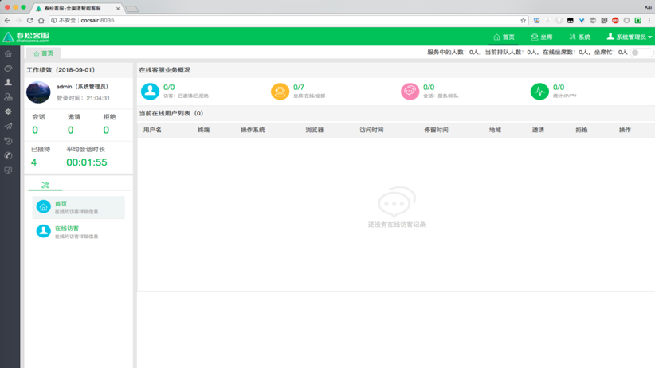
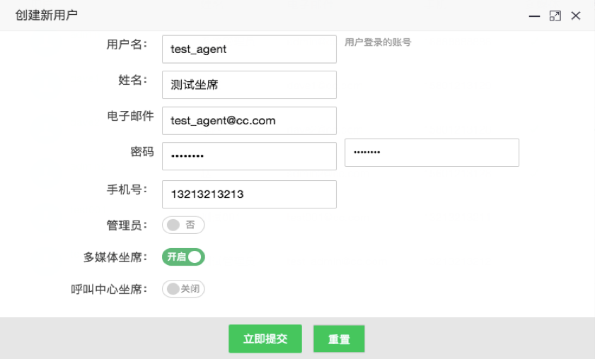
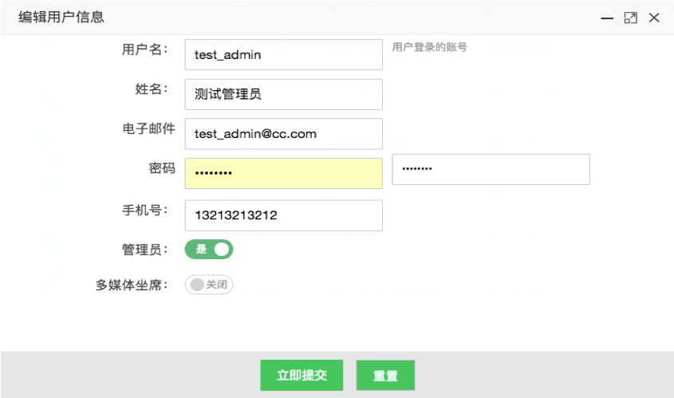
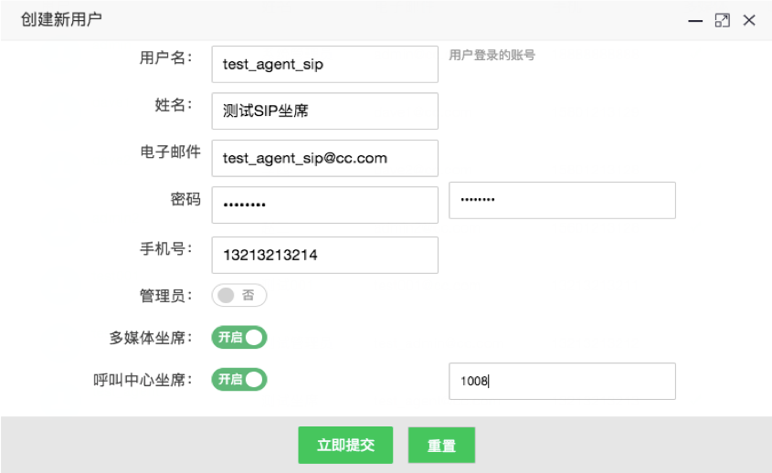
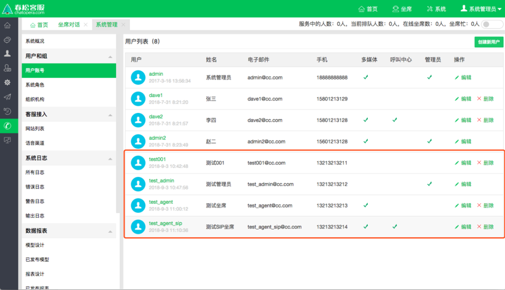
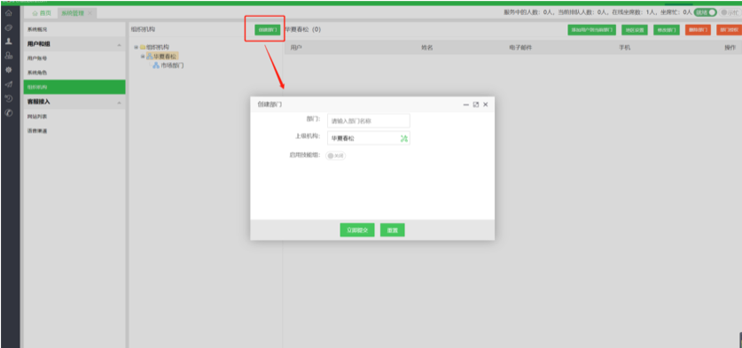
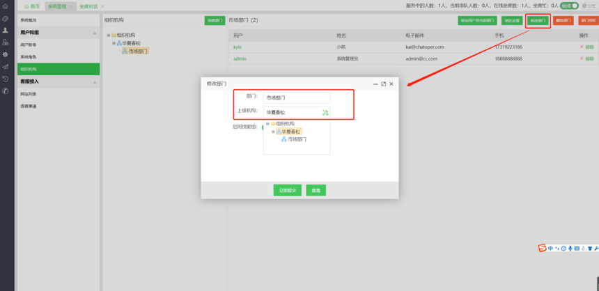
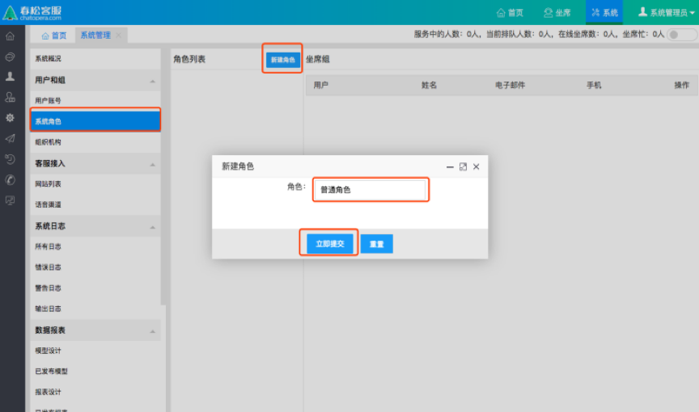

# 账号体系

进入春松客服后台界面，输入默认的账号密码(用户名: admin, 密码: admin1234)，点击立即登录。

<table class="image">
    <caption align="bottom"></caption>
    <tr>
        <td></td>
    </tr>
</table>

进入春松客服首页

<table class="image">
    <caption align="bottom"></caption>
    <tr>
        <td></td>
    </tr>
</table>

## 创建账号

### 创建用户账号：_系统_ -> _系统概况_ -> _用户和组_ -> _用户账号_ -> _创建新用户_

> 提示:

```
电子邮件: 需要有效的格式
密码: 字母数字最少8位，手动录入
手机号: 全系统唯一
```

- 用户分为管理员和普通用户
- 坐席分为一般坐席和 SIP 坐席，普通用户与管理用户都可以成为坐席，SIP 坐席是在多媒体坐席的基础上
- **每个账号必须分配到一个部门下，以及关联到一个角色上，才可以查看或管理资源，请详细阅读【组织机构】和【角色】管理**

* 创建普通用户

<table class="image">
    <caption align="bottom"></caption>
    <tr>
        <td></td>
    </tr>
</table>

- 创建多媒体坐席

<table class="image">
    <caption align="bottom"></caption>
    <tr>
        <td></td>
    </tr>
</table>

- 创建管理员

<table class="image">
    <caption align="bottom"></caption>
    <tr>
        <td></td>
    </tr>
</table>

- 创建呼叫中心坐席

<table class="image">
    <caption align="bottom"></caption>
    <tr>
        <td></td>
    </tr>
</table>

## 查看账号

### 查看用户账号列表：_系统_ -> _系统概况_ -> _用户和组_ -> _用户账号_

<table class="image">
    <caption align="bottom"></caption>
    <tr>
        <td></td>
    </tr>
</table>

点击操作一栏中的“编辑”“删除”，可以对当前用户列表中的所有用户的信息进行编辑或者删除

## 创建部门

### 创建部门

_系统_ -> _系统概况_ -> _用户和组_ -> _组织机构_ -> _创建部门_，并且可以启用或关闭技能组

<table class="image">
    <caption align="bottom"></caption>
    <tr>
        <td></td>
    </tr>
</table>

- 名词解释：

**部门** 需要创建的部门名称

**上级机构** 选择上级部门

**启用技能组** 这里启用与否，主要决定当前组织结构是否具有外呼的权限

## 更新、删除部门

### 部门列表

_系统_ -> _系统概况_ -> _用户和组_ -> _组织机构_

### 编辑(修改)部门

_系统_ -> _系统概况_ -> _用户和组_ -> _组织机构_ -> _修改部门_

<table class="image">
    <caption align="bottom"></caption>
    <tr>
        <td></td>
    </tr>
</table>

### 删除部门

_系统_ -> _系统概况_ -> _用户和组_ -> _组织机构_ -> _删除部门_

## 管理部门人员

### 部门添加用户

_系统_ -> _系统概况_ -> _用户和组_ -> _组织结构_ -> _选中一个部门_ -> _添加用户到当前部门_

- 可以把已经存在的 用户账号 添加到一个特定的部门中

- 一个用户账号只能隶属于一个部门

<table class="image">
    <caption align="bottom"></caption>
    <tr>
        <td></td>
    </tr>
</table>

## 设置部门地区

### 部门地区设置

_系统_ -> _系统概况_ -> _用户和组_ -> _组织结构_ -> _选中一个部门_ -> _地区设置_

<table class="image">
    <caption align="bottom"></caption>
    <tr>
        <td></td>
    </tr>
</table>

## 角色设置

### 创建角色

_系统_ -> _系统概况_ -> _用户和组_ -> _系统角色_ -> _新建角色_

<table class="image">
    <caption align="bottom"></caption>
    <tr>
        <td></td>
    </tr>
</table>

名词解释：

**角色** 系统中用户的操作权限是通过角色来控制，角色可以理解为具备一定操作权限的用户组；

可以把一个或者更多的用户添加到一个角色下；

可以给一个角色设置一定的系统权限，相当于这个角色下面的用户有了这些系统权限；

### 编辑(修改)角色

_系统_ -> _系统概况_ -> _用户和组_ -> _系统角色_ -> _修改角色_

<table class="image">
    <caption align="bottom"></caption>
    <tr>
        <td></td>
    </tr>
</table>

### 删除角色

系统->系统概况->用户和组->系统角色>删除角色

<table class="image">
    <caption align="bottom"></caption>
    <tr>
        <td></td>
    </tr>
</table>

### 角色添加用户

系统->系统概况->用户和组->系统角色>添加用户到角色

<table class="image">
    <caption align="bottom"></caption>
    <tr>
        <td></td>
    </tr>
</table>

## 评论

<script src="https://utteranc.es/client.js"
        repo="chatopera/docs"
        issue-term="pathname"
        label="Comment"
        theme="github-light"
        crossorigin="anonymous"
        async>
</script>
