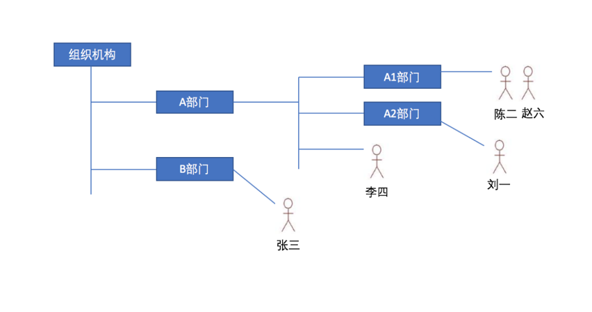

# 账号和权限

## 系统管理员

在春松客服里，系统管理员是具备管理所辖组织内坐席、权限、角色、联系人和坐席监控等资源的管理员，系统管理员分为两种类型：**超级管理员**和**普通管理员**，普通管理员也简称“管理员”。

超级管理员为春松客服系统设置的，初始化一个春松客服实例后，默认超级管理员用户名为 `admin`，密码为 `admin1234`，并且有且只有一个，IT 人员在初始化搭建的春松客服实例的第一件事就是更改超级管理员账号的密码，以确保系统安全。超级管理员具备更新系统所有属性的能力，读写数据，是春松客服内权限最大的用户。

安装启动系统，进入春松客服后台界面，输入初始化的超级管理员账号密码(用户名: `admin`, 密码: `admin1234`)，点击立即登录。

<table class="image">
    <caption align="bottom"></caption>
    <tr>
        <td></td>
    </tr>
</table>

**超级管理员同时维护者春松客服的组织机构的高层级，组织机构是树形结构，默认情况下没有组织机构信息，春松客服搭建完成后，由超级管理员设定根节点，比如总公司、总公司下属子公司，维护这样的一个层级结构，再创建其他管理员账号，普通管理员账号可以创建多个，不同管理员隶属于不同组织机构，该管理员只有管理其所在组织机构及该组织机构附属组织机构的权限。**

系统管理员切换不同的组织机构，可以查看不同组织机构的数据。

## 权限设计

春松客服权限体系包括：组织机构，角色，账号。

角色可以自定义，可包括对一系列资源的读写。然后将账号添加到角色中，账号也同时隶属于不同的组织机构，那么账号所具有的权限就是其所在组织机构以及附属组织机构的角色对应的资源的读写。

根据角色和坐席所在组织机构进行权限检查：

- 超级管理员可以管理系统所有资源
- 管理员可以创建部门/角色/人员，人员可设置为是否是“管理员”
- 组织机构支持层级的树状结构
- 角色包含对不同资源的读写权限
- 资源如联系人，客户等是根据组织机构进行隔离的
- 网站渠道必须启用技能组，不同网站渠道接入的访客根据网站渠道设置分配给不同的技能组
- 系统数据根据坐席当前所在的组织机构进行展示
- 坐席可以看到自己所在组织机构以及附属组织机构的数据

假设组织机构如下：

<table class="image">
    <caption align="bottom"></caption>
    <tr>
        <td></td>
    </tr>
</table>

- 李四所能看到的联系人全集是 A 部门及其附属部门所创建的全部联系人
- 李四看不到 B 部门的联系人，张三看不到 A 部门的联系人
- 李四能看到刘一创建的联系人，刘一看不到李四创建的联系人

## 创建账号

### 创建用户账号：_系统_ -> _系统概况_ -> _用户和组_ -> _用户账号_ -> _创建新用户_

> 提示:

```
电子邮件: 需要有效的格式
密码: 字母数字最少8位，手动录入
手机号: 全系统唯一
```

- 用户分为管理员和普通用户
- 坐席分为一般坐席和 SIP 坐席，普通用户与管理用户都可以成为坐席，SIP 坐席是在多媒体坐席的基础上
- **每个账号必须分配到一个部门下，以及关联到一个角色上，才可以查看或管理资源，请详细阅读【组织机构】和【角色】管理**

* 创建普通用户

<table class="image">
    <caption align="bottom"></caption>
    <tr>
        <td></td>
    </tr>
</table>

- 创建多媒体坐席

<table class="image">
    <caption align="bottom"></caption>
    <tr>
        <td></td>
    </tr>
</table>

- 创建管理员

<table class="image">
    <caption align="bottom"></caption>
    <tr>
        <td></td>
    </tr>
</table>

- 创建呼叫中心坐席

<table class="image">
    <caption align="bottom"></caption>
    <tr>
        <td></td>
    </tr>
</table>

## 查看账号

### 查看用户账号列表：_系统_ -> _系统概况_ -> _用户和组_ -> _用户账号_

<table class="image">
    <caption align="bottom"></caption>
    <tr>
        <td></td>
    </tr>
</table>

点击操作一栏中的“编辑”“删除”，可以对当前用户列表中的所有用户的信息进行编辑或者删除

## 创建部门

### 创建部门

_系统_ -> _系统概况_ -> _用户和组_ -> _组织机构_ -> _创建部门_，并且可以启用或关闭技能组

<table class="image">
    <caption align="bottom"></caption>
    <tr>
        <td></td>
    </tr>
</table>

- 名词解释：

**部门** 需要创建的部门名称

**上级机构** 选择上级部门

**启用技能组** 这里启用与否，主要决定当前组织结构是否具有外呼的权限

## 更新、删除部门

### 部门列表

_系统_ -> _系统概况_ -> _用户和组_ -> _组织机构_

### 编辑(修改)部门

_系统_ -> _系统概况_ -> _用户和组_ -> _组织机构_ -> _修改部门_

<table class="image">
    <caption align="bottom"></caption>
    <tr>
        <td></td>
    </tr>
</table>

### 删除部门

_系统_ -> _系统概况_ -> _用户和组_ -> _组织机构_ -> _删除部门_

## 管理部门人员

### 部门添加用户

_系统_ -> _系统概况_ -> _用户和组_ -> _组织结构_ -> _选中一个部门_ -> _添加用户到当前部门_

- 可以把已经存在的 用户账号 添加到一个特定的部门中

- 一个用户账号只能隶属于一个部门

<table class="image">
    <caption align="bottom"></caption>
    <tr>
        <td></td>
    </tr>
</table>

## 设置部门地区

### 部门地区设置

_系统_ -> _系统概况_ -> _用户和组_ -> _组织结构_ -> _选中一个部门_ -> _地区设置_

<table class="image">
    <caption align="bottom"></caption>
    <tr>
        <td></td>
    </tr>
</table>

## 角色管理

### 创建角色

_系统_ -> _系统概况_ -> _用户和组_ -> _系统角色_ -> _新建角色_

<table class="image">
    <caption align="bottom"></caption>
    <tr>
        <td></td>
    </tr>
</table>

名词解释：

**角色** 系统中用户的操作权限是通过角色来控制，角色可以理解为具备一定操作权限的用户组；

可以把一个或者更多的用户添加到一个角色下；

可以给一个角色设置一定的系统权限，相当于这个角色下面的用户有了这些系统权限；

### 编辑(修改)角色

_系统_ -> _系统概况_ -> _用户和组_ -> _系统角色_ -> _修改角色_

<table class="image">
    <caption align="bottom"></caption>
    <tr>
        <td></td>
    </tr>
</table>

### 删除角色

系统->系统概况->用户和组->系统角色>删除角色

<table class="image">
    <caption align="bottom"></caption>
    <tr>
        <td></td>
    </tr>
</table>

### 角色添加用户

系统->系统概况->用户和组->系统角色>添加用户到角色

<table class="image">
    <caption align="bottom"></caption>
    <tr>
        <td></td>
    </tr>
</table>

## 评论

<script src="https://utteranc.es/client.js"
        repo="chatopera/docs"
        issue-term="pathname"
        label="Comment"
        theme="github-light"
        crossorigin="anonymous"
        async>
</script>
