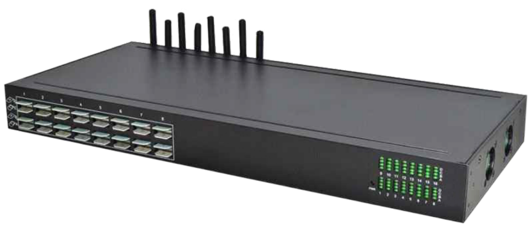
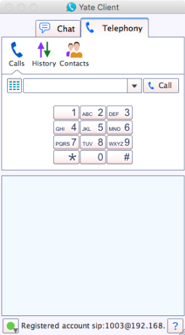
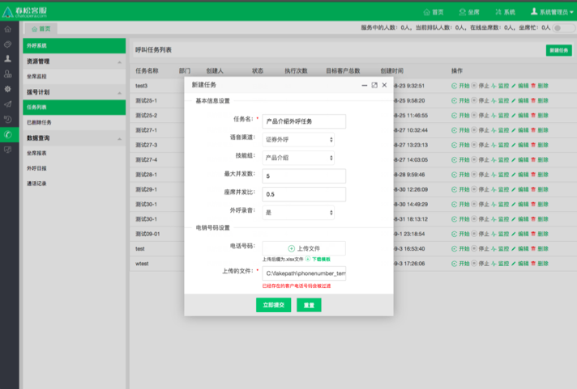
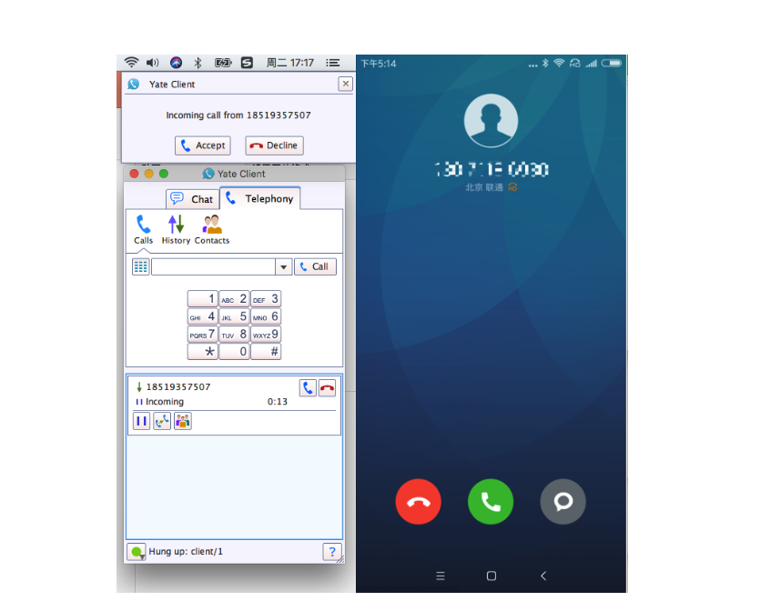

# 呼叫中心

简单定义：在一个相对集中的场所，由一批服务人员组成的服务机构．通常利用计算机通信技术，处理来自企业、顾客的电话垂询，尤其具备同时处理大量来话的能力，还具备主叫号码显示，可将来电自动分配给具备相应技能的人员处理，并能记录和储存所有来话信息。

春松客服支持呼叫中心业务，但是需要企业额外采购语音网关和客服电话，其中，客服电话可以使用软电话，软电话有免费版本(比如
YateClient，linephone，eyebeam)。

- 语音网关

<table class="image">
    <caption align="bottom"></caption>
    <tr>
        <td></td>
    </tr>
</table>

- 软电话

<table class="image">
    <caption align="bottom"></caption>
    <tr>
        <td></td>
    </tr>
</table>

关于具体搭建带有呼叫中心功能的春松客服系统，请联系我们(info@chatopera.com)。

呼叫中心服务需要保证系统至少有一个 SIP 坐席客服，即在春松客服系统中设置好的“呼叫中心坐席”。

## 呼叫中心插件

从[春松客服 v5.0](https://github.com/chatopera/cosin/releases/tag/5.0.0) 版本开始，春松客服内的呼叫中心功能以插件形式提供给企业客户，并不发布开源版代码中。

春松客服呼叫中心作为整体解决方案包括**春松客服插件**、**春松客服 FreeSWITCH 扩展**、**分布式数据存储扩展**和**语音网关**（硬件设施）。

## 自动批量外呼

<table class="image">
    <caption align="bottom"></caption>
    <tr>
        <td></td>
    </tr>
</table>

(1) 语音交换网关正常：确保电话交换设备已经正常工作；

(2) 呼叫中心坐席设置：确保需要作为坐席的用户具有“呼叫中心坐席”，已经拥有 SIP 地址；

(3) 电话机/软电话设置：把 2 中的 sip 地址绑定在电话机/设置软电话中；这里设为 1003

(4) 技能组部门就位：需要一个部门，且已经启用了“技能组”功能，把 2 中的用户账号加在里面；

(5) 拥有权限：把 “坐席对话”与“坐席工作台”授权给此部门；

(6) 呼叫中心坐席上线：保证该坐席用户已经登录系统；

(7) 创建任务：用管理员或者具有“外呼系统”->”任务列表”->”新建任务”的权限的账号创建一个拨号计划；

(8) 初始化成功：确保创建的任务已经“初始化”完毕，可以执行“开始”任务；

(9) 开始：开始执行任务；

不同操作的说明：

- “开始” 启动一个任务，对于已经开始了任务，此按钮将不能再被触发；

- “停止” 停止一个正在进行呼叫的任务，任务停止之后，此按钮将不能再被触发；

- “监控” 对于一个任务，我们都可以通过监控看到它的具体状态；

- “编辑” 对于一个任务可以再次编辑，目前编辑内容只能编辑“最大并发数”，“坐席并发比”，只有“已停止”的任务才可以编辑；

- “删除” 只能删除“已停止”的任务，删除之后会进入到“已删除任务”中，方便后期对数据进行分析；

不同状态的说明：

- “初始化”的呼叫计划不能“删除“，不能“开始“，也不能“暂停“；

- “初始化”后自动转移到“已停止”；

- “执行中”在系统打完所有电话后，自动转移到“已停止”；

- 除了“初始化”状态，无法删除外，其他状态都可以点击“删除”（执行中的计划会先停止，再删除）；

- “执行中”的呼叫计划，不能编辑，其他状态可以编辑，但是不能修改“电话号码”和“技能组”；

<table class="image">
    <caption align="bottom"></caption>
    <tr>
        <td></td>
    </tr>
</table>

对于已经开始了的任务，具有以下的特点

- “开始” 启动一个任务，对于已经开始了任务，此按钮将不能再被触发；

- 任务状态变为“执行中”；

- 客户会接到电话；

- 呼叫中心坐席 也会接到 电话响铃提醒；

- 同时当呼叫中坐席接通电话后会有自动弹屏 --“坐席工作台”；

- 呼叫中心坐席的对话列表会显示“在线”，并且头像旁边会显示一个正在接通的电话图标；

- 默认会把当前客户的相关信息记录在“坐席工作台”的表单中 ，不需要客服手动关联；

- 在通话过程中就可以记录此客户的是否意向等数据，最后直接一键保存到 CRM 数据库中；

开始执行任务，接通自动弹屏

<table class="image">
    <caption align="bottom"></caption>
    <tr>
        <td></td>
    </tr>
</table>

(10) 被叫呼叫成功，客户会接到电话

<table class="image">
    <caption align="bottom"></caption>
    <tr>
        <td></td>
    </tr>
</table>

(11) 挂断，一键保存数据；

- “呼叫中心坐席“的 ”对话列表”状态显示为“离开”，并且头像的电话显示为“灰色”；
- 可以对刚才的客户信息继续编辑或者直接保存到 CRM 数据库中；
- 如果保存了用户，并且成功，则下次再次呼出到此用户时，都可以关联到此信息，并且再次自动弹出，可以再次编辑。

(12) 监听拨号计划，暂停拨号计划。

(13) 删除拨号计划

## 手动外呼

<table class="image">
    <caption align="bottom"></caption>
    <tr>
        <td></td>
    </tr>
</table>

(1) 在拥有 SIP 地址的电话机/软电话 拨打目标号码；

(2) 开始：开始执行任务；

(3) 被叫呼叫成功；

(4) 呼叫中心坐席电话弹屏自动弹出，并且当前的客户信息已经自动填写在里面；

(5) 挂断，更新数据，一键保存数据；

## 评论

