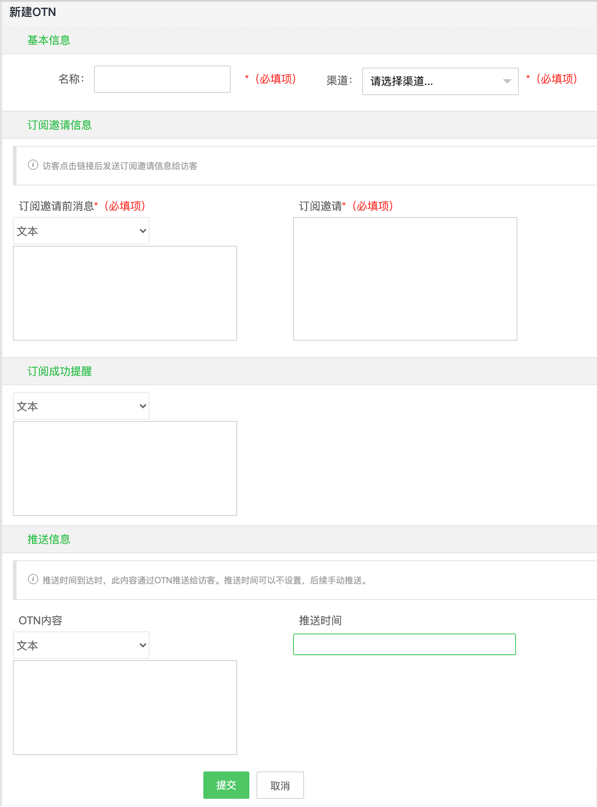

# Facebook OTN 主动推送指南

## 什么是 OTN 消息

OTN 消息是 Facebook 渠道一次性通知（OTN，One-time Notification）消息，当用户点击“通知我/Notify Me”后，您将获得用户明确的许可，在获得用户的许可后，您将可以在一年的许可有效期内任意时间向用户发送一条任意形式的消息（营销/非营销消息），将不受24小时规则的限制。

下图为 Facebook 官方给出的一个 OTN 使用案例：

<table class="image">
    <caption align="bottom"></caption>
    <tr>
        <td></td>
    </tr>
</table>

整个 OTN 使用流程可分为三步：

* 1）我们通过 Messenger 向用户发送 OTN 消息，OTN 消息可在春松客服“营销中心”进行配置；
* 2）当用户点击 OTN 消息中的“通知我/Notify Me”后，即给予您明确的许可，允许您在未来某个时间向他发送一次通知，也等同于“订阅了 OTN 推送”。
* 3）当您收到用户给予的许可后，您可以在一年的许可有效期内任意时间向用户发送一次性通知（OTN，One-time Notification）。

## 开通 Facebook Page 的 OTN 权限
根据 Facebook 的规定，您首先需要为您的 Page 开通 OTN 权限。如下图所示，在 Page 中按照：设定→ 進階訊息→ 要求的功能→ 一次性通知 的路径为您的 Page 申请 OTN 权限。

<table class="image">
    <caption align="bottom"></caption>
    <tr>
        <td></td>
    </tr>
</table>

## OTN 管理
营销人员可以在营销中心对 OTN 进行管理。在营销中心可以看到 OTN 的详细信息以及订阅人数和状态等。

### 创建 OTN
步骤：营销中心 → 创建 OTN

<table class="image">
    <caption align="bottom"></caption>
    <tr>
        <td></td>
    </tr>
</table>

OTN 表单内容。

<table class="image">
    <caption align="bottom"></caption>
    <tr>
        <td></td>
    </tr>
</table>

* OTN支持文本和图片两种消息类型
* 请选择渠道是指messenger渠道
* 订阅前邀请消息支持文本和图片，可以根据需要自定义
* 订阅邀请文本
* 成功订阅提醒是用户订阅消息后，收到的消息
* OTN 内容指用户收到的营销人员发送的OTN消息详情
* 推送时间可以预设，到达预设的时间，系统自动发送 OTN 消息

### 获得分享链接

创建 OTN 后，可以在 OTN 管理列表中，找到对应项的【活动链接】，点击【复制】。

**那么，接下来，您就可以发布推文（Post），并且在推文中增加该链接，Facebook 用户在浏览推文，如果感兴趣就点击该链接，完成订阅！**

### 编辑 OTN
步骤：Messenger OTN 列表页→ 操作栏→ 编辑
在推送内容前，管理员可以继续编辑 OTN 表单内容。

### 删除 OTN
步骤：Messenger OTN列表页→ 操作栏→ 删除

<table class="image">
    <caption align="bottom"></caption>
    <tr>
        <td></td>
    </tr>
</table>

### 发送 OTN 推送

活动的时间到了，是推送优惠券或者重要更新的时候了，之前点击了订阅的链接的用户，给 TA 们推送消息吧！

有两种发送 OTN 推送方式：**定时发送**和**手动发送**。

定时发送：在 OTN 的表单中，指定时间，在当前设定未到达前，您可以随时调整该时间。

<table class="image">
    <caption align="bottom"></caption>
    <tr>
        <td></td>
    </tr>
</table>

手动发送步骤：Messenger OTN列表页→ 操作栏→ 发送

<table class="image">
    <caption align="bottom"></caption>
    <tr>
        <td></td>
    </tr>
</table>

## 营销人员发布活动链接到 Facebook 主页
第一步：营销人员复制 Messenger OTN 列表中的活动链接

<table class="image">
    <caption align="bottom"></caption>
    <tr>
        <td></td>
    </tr>
</table>

第二步：进入 Facebook 主页页面，建立贴文；帖文中加上活动链接，然后发布

<table class="image">
    <caption align="bottom"></caption>
    <tr>
        <td></td>
    </tr>
</table>

## Facebook 渠道用户订阅 OTN 消息
用户在 Facebook page 页面，点击活动链接，进入对话窗口后点击：通知我/Notify Me

<table class="image">
    <caption align="bottom"></caption>
    <tr>
        <td></td>
    </tr>
</table>

## Facebook 渠道用户接收 OTN 消息
用户订阅 OTN 消息后，营销人员在营销中心发送 OTN，用户就可以收到消息了

<table class="image">
    <caption align="bottom"></caption>
    <tr>
        <td></td>
    </tr>
</table>

## 查看 OTN 发送效果

OTN 列表页“订阅”一列显示此 OTN 订阅人数，订阅的用户都能接收到 OTN 推送，接收人数和订阅人数相同。

<table class="image">
    <caption align="bottom"></caption>
    <tr>
        <td></td>
    </tr>
</table>

在 Facebook 主页上，作为管理员，从右侧管理面板进入公共主页成效分析，包含最近丰富的粉丝增长数据，页面访问情况数据，指导企业计算 RoI 等指标。

<table class="image">
    <caption align="bottom"></caption>
    <tr>
        <td></td>
    </tr>
</table>

## OTN 注意事项
根据 Facebook 官方对于 OTN 的限制说明，需要注意：不能在短时间内多次向用户发送获得 OTN 许可的请求，即不能短时间内重复多次发送 OTN、请求用户点击“通知我/Notify Me”。这样的行为会被 Facebook 监控，如果 Facebook 算法检测到短时间内发送的 OTN 请求数量异常，您将面临失去访问 OTN 功能的风险。

## 评论

