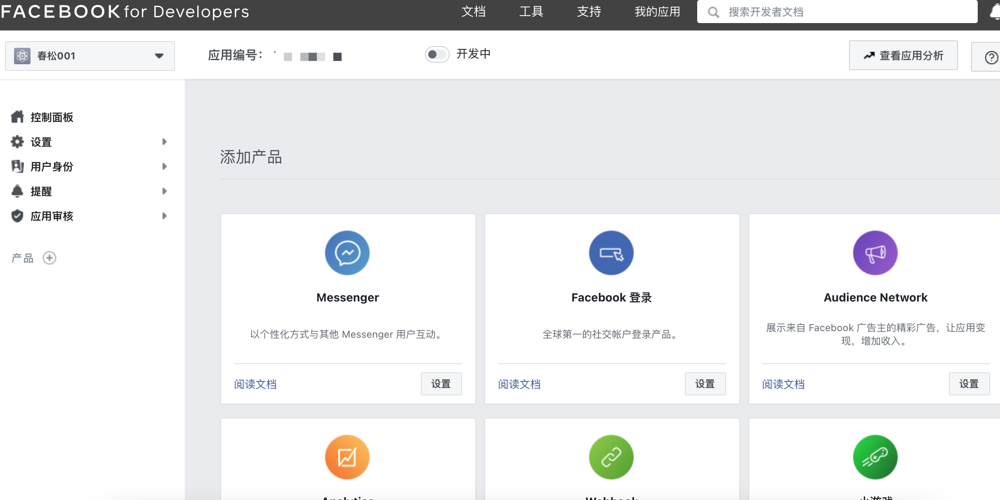
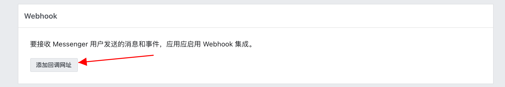

# Messenger 渠道

## 概述
Messenger 是 Facebook 旗下的最主要的即时通信软件，支持多种平台，因其创新的理念、优秀的用户体验和全球最大的社交网络，而广泛应用。通过 Facebook Messenger 的官方链接，可以了解更多。

https://www.messenger.com/

春松客服 Messenger 插件帮助企业在 Facebook 平台上实现营销和客户服务。

<table class="image">
    <caption align="bottom"></caption>
    <tr>
        <td></td>
    </tr>
</table>

* 集成 Facebook 粉丝页，使用 OTN 推送营销活动信息，吸引新粉丝和激活老客户
* 集成 Chatopera 机器人客服，自动回答常见问题，提升客户体验
* 支持机器人客服转人工坐席，解决客户的复杂问题
* 产品迭代一年，提供多个最佳实践，帮助企业高效率运营
* 春松客服运营分析和 Chatopera 机器人客服运营分析生成报表，洞察业务指标

## 安装插件
Messenger 插件为付费插件，交付形式有两种，源码安装和使用 Docker 镜像。

### 源码安装
安装到客户现有春松客服实例。使用源码形式安装插件，付费后随源码一并提供详细说明文档，由客户的工程师打包到春松客服的源码中。

### Docker 镜像
使用 Docker 镜像，由春松客服官方提供安装好 Messenger 插件的春松客服镜像。

### 购买指南
春松客服企业服务业务洽谈：https://www.chatopera.com/price.html

## 了解 Messenger 的强大功能
首先，出海企业要获客，或者通过互联网方式提供服务，那么 Facebook 上的广告和 Messenger 服务，是您无论如何都要使用的，因为你可以从这里找到您的目标客户、潜在客户。但是，如果 Facebook 平台的商业化程度过高，将影响社交网络内用户的体验，比如用户收到和自己不相关、不感兴趣的、大量的广告。为此 Facebook 在广告和 Messenger 上，有很多设计、一些限制，达到了商业化和人们社交需求的平衡，这是 Facebook 能成为今天世界上最大的社交网络的关键原因之一。

其次，您需要了解 Messenger 的一些应用场景，比如 Chatopera 为九九互动提供的智能客服和 OTN 营销的案例。

[https://www.chatopera.com/solutions/gaming-overseas.html](https://www.chatopera.com/solutions/gaming-overseas.html)


在正式介绍 春松客服 Messenger 插件的使用之前，需要说明Chatopera 提供该插件是通过 Facebook Messenger 平台的开发者 APIs 实现，因此，该插件的功能安全可靠、稳定强大并且会不断更新。

[https://developers.facebook.com/docs/messenger-platform](https://developers.facebook.com/docs/messenger-platform)

## 前提准备
在使用春松客服集成 Messenger 前，您需要做如下准备工作。

| 准备工作 | 描述 | 网址 | 
| --- | --- | --- |
| 注册 Facebook 账号 | 创建 Messenger 应用，Facebook Page 页，测试 BOT 等需要准备 Facebook 账号 | 	https://facebook.com/ |
| 注册 Chatopera 云服务账号 | 创建机器人客服需要使用 Chatopera 云服务 | https://bot.chatopera.com/ |
| 部署春松客服实例 | 春松客服实例需要安装有 Messenger 插件 | https://docs.chatopera.com/products/cskefu/deploy.html |
| 初始化春松客服 | 使用超级管理员创建组织机构，技能组，坐席角色和一个坐席账号，将账号绑定到坐席角色和技能组 | https://docs.chatopera.com/products/cskefu/initialization.html | 
		
		
在配置的过程中，还需要开通额外的账号或资源，是以以上为基础的。

## 集成 Messenger 渠道
安装好春松客服 Messenger 插件后，系统管理员登录，只有系统管理员或超级系统管理员【admin】可以维护 Facebook Messenger 渠道。

### Messenger 渠道管理
在右上角组织机构，选择一个技能组，然后进入【系统管理】，打开 【Messenger】页面。

<table class="image">
    <caption align="bottom"></caption>
    <tr>
        <td></td>
    </tr>
</table>


注意：此处要先切换到技能组，因为创建 Messenger 渠道必须绑定一个技能组。

点击【创建渠道】。

<table class="image">
    <caption align="bottom"></caption>
    <tr>
        <td></td>
    </tr>
</table>

如图，创建 Messenger 表单有几个信息，接下来，我们将介绍如何获得这些信息。

### 创建 Facebook Page
Facebook Page，也称为 Facebook 粉丝页、Facebook 页面、Facebook 主页，是 Facebook 为机构、企业、非营利性组织等各种类型的组织提供的站点，在该站点组织发布消息，和 Facebook 平台的用户互动。在粉丝页，Facebook 提供了广告、推文、点评、小组、数据分析等工具，帮助企业充分的利用社交网络实现营销、品牌建设。

<table class="image">
    <caption align="bottom">Island King 的粉丝页</caption>
    <tr>
        <td></td>
    </tr>
</table>

在上图，我们注意到，访客可以看到“发消息”按钮，那么点击发消息按钮就可以唤起  Messenger 聊天控件和企业互动，完成反馈、咨询等。服务访客的，可能是人工坐席，也可以能是机器人客服，此外，企业可以主动联系访客，并进而通过 Messenger 进行实时对话。稍后，我们将介绍如何集成配置春松客服连接一个 Facebook 页面，然后进行更多最佳实践的介绍，敬请继续阅读。

在熟悉了 Facebook Page 的定位以后，当您有了 Facebook 账号，您可以通过下面链接快速的创建一个 Facebook Page。

https://www.facebook.com/pages/creation/?ref_type=comet_home

<table class="image">
    <caption align="bottom"></caption>
    <tr>
        <td></td>
    </tr>
</table>

在此，我们创建一个示例页面，在演示如何在春松客服集成 Messenger 时使用，注意：企业创建 Messenger 应用以后，可以将 Messenger 应用集成到 Facebook Page 上，Facebook Page 是企业的一个对外的主页，而并不是唯一的，Messenger 应用同时支持多种渠道，比如网页聊天、Whatsapp等。Messenger 应用的介绍是在下一环节。

假设我们创建的 Facebook Page 名称：春松客服 DEMO。创建完成后，进入 春松客服 DEMO 地址，这时，我们是管理员视图，点击“访客视图”，就是普通访客看到的页面。


<table class="image">
    <caption align="bottom"></caption>
    <tr>
        <td></td>
    </tr>
</table>

注意：此时，Facebook Page 刚刚创建，对于 Facebook 普通用户而言，这个页面还是不可见的，作为管理员，在 Facebook Page 设置页面，进行可见度设置，调整为 Public 才是公开的。设置界面，后面我们还会使用到。

<table class="image">
    <caption align="bottom"></caption>
    <tr>
        <td></td>
    </tr>
</table>

### 添加联系我按钮
此时，我们有了一个 Facebook Page，默认情况下，没有联系我按钮，我们需要手动的添加。

在 Facebook Page 页面，以管理员视图查看，找到“添加按钮”，点击这个按钮。

<table class="image">
    <caption align="bottom"></caption>
    <tr>
        <td></td>
    </tr>
</table>

这时，我们在很多弹出的选项中，选择“发消息”。

<table class="image">
    <caption align="bottom"></caption>
    <tr>
        <td></td>
    </tr>
</table>

提交后，在您的页面上，便有了“发消息”按钮。作为管理员，您可以设置或测试它。

<table class="image">
    <caption align="bottom"></caption>
    <tr>
        <td></td>
    </tr>
</table>

当我们再以访客视图查看，就会发现唤起 Messenger 聊天控件的发消息按钮。

<table class="image">
    <caption align="bottom"></caption>
    <tr>
        <td></td>
    </tr>
</table>

作为 Facebook Page 的管理员，我如何回复消息呢？

有两个方案：

#### 普通模式
在默认情况下，用户浏览会以通知的形式发送给您登录的浏览器，您可以进行回复。并进入设置→消息，进行一些个性化的设置。

<table class="image">
    <caption align="bottom"></caption>
    <tr>
        <td></td>
    </tr>
</table>

此种方式下，访客的信息并没有和您的 CRM 系统联通，信息分散了；此外，您的访客可能来自不同渠道，Facebook Messenger 只是其中之一，渠道不能统一到一个系统，您的组织的客户服务工作效率降低，客户体验差。还有很多问题，这就是为什么 Facebook 提供了第二种模式 - 高级模式。


#### 高级模式
在高级模式下，Facebook 将访客在您的 Facebook Page 上唤起的 Messenger 对话控件的消息，转发给了兼容 Facebook Messenger 平台的软件服务，比如一个春松客服实例，春松客服和 Facebook Messenger 平台之间进行通信，并且以约定的形式，企业可以主动发起会话、发布营销通知、回复访客会话等，Facebook 平台同时有丰富的接口，春松客服可以获得访客的 ID、语言、所在地区、邮箱、电话号码等信息，从而满足客户关系管理、营销和客服等诉求。下文，我们就详细介绍如何使用春松客服 Messenger 插件，通过高级模式，支持 Messenger 的对话。

创建 Messenger 应用
在高级模式下，企业可以选择：

* 1）企业自行开通 Facebook 开发者平台账号，创建 Messenger 应用，并绑定 Facebook Page; 
* 2）和支持 Facebook Messenger 平台的服务商合作，获得技术支持，比如[春松客服官方团队](https://www.chatopera.com/price.html)，该技术支持是付费服务项。

我们推荐企业使用第一种方式，即自行开通，该过程会多花一点时间，但是相对也简单，这种方式，完全由企业在 Facebook 平台上操作，不涉及任何春松客服官方的接口、云服务。

在以上两种方式中，您的春松客服实例都需要配置 HTTPs 协议，这部分后续会详细介绍。接下来，我们就以自行开通 Facebook 开发者平台进行讲解。


打开 Facebook Developer Portal, 使用 Facebook 账号开通

https://developers.facebook.com/apps 


开通后登入，点击创建应用，一个应用可以关联多种 Facebook 产品，Messenger 是产品之一，因为本文我们将用该应用关联 Messenger 产品，因此，我们简称此种应用为 Messenger 应用。

<table class="image">
    <caption align="bottom"></caption>
    <tr>
        <td></td>
    </tr>
</table>

在弹出的表单中，选择“更多选项”。

<table class="image">
    <caption align="bottom"></caption>
    <tr>
        <td></td>
    </tr>
</table>

接着填写应用的名称，联系邮箱。

<table class="image">
    <caption align="bottom"></caption>
    <tr>
        <td></td>
    </tr>
</table>

这里，我们假设名字填写了【春松001】，作为示例程序名字。如果您有开通 Facebook 商务账号，也可以在这里关联，该项为非必填。

Facebook 商户账号（ https://business.facebook.com/ ）是管理企业的组织人员、广告等资产的平台。


当应用创建成功，自动跳转到应用详情页面，如下。

<table class="image">
    <caption align="bottom"></caption>
    <tr>
        <td></td>
    </tr>
</table>

在添加产品卡片上，点击 Messenger 的【设置】按钮，进入 Messenger 产品设置页面，该页面有较多内容，我们将着重介绍有关和春松客服集成到 Facebook Page 相关的内容。

页面滑动至【访问口令】，点击【添加或移除主页】。

<table class="image">
    <caption align="bottom"></caption>
    <tr>
        <td></td>
    </tr>
</table>

此时，将弹出对话框，提示授权登录 Facebook，登录成功后，将展示您的 Facebook Page 列表，此时，我们可以看到【春松客服 DEMO】，勾选并选择提交。

<table class="image">
    <caption align="bottom"></caption>
    <tr>
        <td></td>
    </tr>
</table>


如果该绑定失败，可能会提示原因，并且提示您进行变更，如下所示，点击【完成】。

<table class="image">
    <caption align="bottom"></caption>
    <tr>
        <td></td>
    </tr>
</table>

此时，代表着【春松客服001】Messenger 应用正式接管了 Facebook Page 【春松客服 DEMO】的消息管理。回到应用详情页面，此时 Messenger 设置中，就出现了【春松客服 DEMO】。


<table class="image">
    <caption align="bottom"></caption>
    <tr>
        <td></td>
    </tr>
</table>

### 获得 Messenger 配置信息
还记得之前在春松客服内，创建 Messenger 渠道的表单吗？现在，对于表单里的内容，就可以获得了。


| 配置项 | 描述 | 示例 | 
| --- | --- | --- |
| 名称 | 渠道名称，可使用 Facebook Page 名字 | 春松客服 DEMO  |
| Page ID | Facebook Page 的唯一标识。在 Messenger 应用的设置的访问口令列表中，Page ID 就是主页名称下的数字字符串	 | 159955055741 |
| Access Token | 访问 Facebook Page 的口令，每个 Facebook Page 使用不同口令。在 Messenger 应用的设置的访问口令列表中，点击【生成口令】	| xxxx |
| Verify Token |	该值为随机字符串，由企业用户自定义 |	foobar20 |
		
<table class="image">
    <caption align="bottom"></caption>
    <tr>
        <td></td>
    </tr>
</table>

### 创建 Messenger 渠道
回到春松客服 Messenger 渠道创建表单，填写对应值，点击【提交】。

<table class="image">
    <caption align="bottom"></caption>
    <tr>
        <td></td>
    </tr>
</table>

此时，渠道创建成功。但是，还需要一些配置，使得春松客服实例与 Facebook Messenger 平台服务连接起来。

### 配置 HTTPS
处于安全的考虑，Facebook 要求 Messenger 应用对接的软件服务使用 HTTPS 加密协议，春松客服企业用户有多种方案完成这一目的，针对生产环境，推荐您使用文档[《春松客服配置 CDN和HTTPS》](https://chatopera.blog.csdn.net/article/details/105820829)进行配置。出于本文是演示使用的目的，我们使用更为简单的方案，但是企业客户不要在生产环境用这种方式，避免因连接不稳定给您带来的损失。

在下文，我们使用 ngrok 为春松客服实例实现 HTTPS 协议的访问地址，ngrok 是可以免费使用的，但是需要您先注册，注册好了使用 ngrok 的命令行客户端绑定 localhost 的春松客服端口，ngrok 就提供一个 https 地址作为代理。

执行命令：

```
ngrok http 8035
```

此处，8035 即春松客服实例运行端口。

<table class="image">
    <caption align="bottom"></caption>
    <tr>
        <td></td>
    </tr>
</table>

在以上 ngrok 运营的结果，就是 `https://efdbe3894f65.ngrok.io` -> `http://localhost:8035`

此时，我们就得到了春松客服的HTTPS服务的地址 `https://efdbe3894f65.ngrok.io`

### 激活渠道连接
进入 Messenger 应用设置页面，滑动至【Webhook】区域，点击【添加回调网址】。

<table class="image">
    <caption align="bottom"></caption>
    <tr>
        <td></td>
    </tr>
</table>

在弹出的对话框内，填写回调地址和验证口令。

<table class="image">
    <caption align="bottom"></caption>
    <tr>
        <td></td>
    </tr>
</table>

回调地址：`https://your_domain/facebook/webhook/{{PAGE_ID}}` ，将 {{PAGE_ID}} 替换为Page ID。

验证口令：即之前设定的 Verify Token。

点击【验证并保存】，此时，Facebook 会请求春松客服实例，保证服务连接状态正常，回到设置页面；若连接不成功，将会进行提示。

注意：第一次配置回调地址成功后，回调地址栏内将有值。一个 Messenger 应用可以集成多个 Facebook Page，这些 Facebook Page 是共享一个回调地址和验证口令的，那么您在这个 Messenger 应用上添加第二个 Facebook Page 并且都是连接到同一个春松客服实例时，是不需要再次设置 Webhook 信息的，所有的 Facebook Page 对话将一起被发送给这个回调地址处理。

<table class="image">
    <caption align="bottom"></caption>
    <tr>
        <td></td>
    </tr>
</table>

至此，配置 Webhook 成功。


### Webhook 添加订阅
完成添加 Webhook 信息，还需要在 Webhook 栏内选择【添加订阅】。

<table class="image">
    <caption align="bottom"></caption>
    <tr>
        <td></td>
    </tr>
</table>

Facebook 将该主页发生的【发消息】相关的事件分为很多种类型，现在我们勾选 messages 和 messaging_postbacks。如果需要了解其他的事件类型可以参考 [Facebook Messenger 平台文档](https://developers.facebook.com/docs/messenger-platform)。

<table class="image">
    <caption align="bottom"></caption>
    <tr>
        <td></td>
    </tr>
</table>

保存，回到 messenger 设置页面后，可见 Webhooks 多了两个字段。

<table class="image">
    <caption align="bottom"></caption>
    <tr>
        <td></td>
    </tr>
</table>

此时，渠道就连接上了，春松客服经由 Facebook 开发者平台对接上了 Facebook Page 上的 Messenger 对话控件。

### 做一个测试
在集成 messenger 渠道的准备工作里，提到前提条件包括创建技能组、创建坐席人员的角色和创建至少一个账号关联角色和技能组。假设这个坐席人员名字是张三，现在，我们作为技能组的张三登录系统。同时，进入春松客服 DEMO 的 Facebook 主页，点击【发消息】，开始对话。

<table class="image">
    <caption align="bottom"></caption>
    <tr>
        <td></td>
    </tr>
</table>

访客发送的消息会自动在张三的网页上弹屏，二者进入对话。

### 进一步学习最佳实践

接下来，您可以阅读下面的[最佳实践](#最佳实践)系列文章，了解如何一步一步的打造良好的用户体验。

最佳实践主要是针对 Facebook 主页与春松客服之间的使用经验，如何获得高效的运营体验和客服服务体验，完成营销和客服工作。

此外，春松客服的基本功能如报表和坐席监控等，请参考春松客服文档中心的其它部分。

### 正式上线
之前，在 Facebook 主页内的操作，我们都是使用管理员账号，此时，Facebook 普通用户作为访客登录，发起 Messenger 对话，是不会被 Facebook 转发到春松客服的，为了达成这个目标，我们需要提交上线，此过程需要在 Facebook 开发者平台，应用详情页面，编辑申请权限。

<table class="image">
    <caption align="bottom"></caption>
    <tr>
        <td></td>
    </tr>
</table>

找到 pages_messaging，点击申请。

<table class="image">
    <caption align="bottom"></caption>
    <tr>
        <td></td>
    </tr>
</table>

提示申请需要大约 5 天，根据经验，三天内就可以完成。

<table class="image">
    <caption align="bottom"></caption>
    <tr>
        <td></td>
    </tr>
</table>

提交申请后，同时我们丰富一下 Facebook  应用的介绍信息，这是可能被数十亿人浏览和使用的！

比如应用的 Icon, 服务条款网址等。

<table class="image">
    <caption align="bottom"></caption>
    <tr>
        <td></td>
    </tr>
</table>

 当权限申请完成，应用信息填写完成，正式提交审核，在侧边栏，点击【应用审核->申请】。

<table class="image">
    <caption align="bottom"></caption>
    <tr>
        <td></td>
    </tr>
</table>

注意：以上图片因为没有完成权限申请，没有提交上线的审核按钮。

上线审核通过后，在应用设置页面的上方，将【开发中】开关拨动到另一侧，此时，Facebook Page 和春松客服的集成大功告成。

<table class="image">
    <caption align="bottom"></caption>
    <tr>
        <td></td>
    </tr>
</table>

这时，您的主页就可以通过购买 Facebook 广告、发布文章等方法运营、转化客户了。

## 最佳实践

* [Facebook OTN 主动推送指南](/products/cskefu/channels/messenger/facebook-otn.html)
* [Messenger 渠道配置机器人客服](/products/cskefu/channels/messenger/messenger-chatbot.html)
* [Messenger 管理机器人客服对话](/products/cskefu/channels/messenger/message-types.html)

## 评论

<script src="https://utteranc.es/client.js"
        repo="chatopera/docs"
        issue-term="pathname"
        label="Comment"
        theme="github-light"
        crossorigin="anonymous"
        async>
</script>
