# Messenger 管理机器人客服对话

## 概述
本文演示ME渠道机器人可以实现的一些基本功能。

阅读本文前需了解：

* Chatopera 机器人平台的[多轮对话设计器](/products/chatbot-platform/conversation/cde.html) 

* [Messenger 渠道插件使用文档](/products/cskefu/channels/messenger/index.html)

* [配置机器人客服接待访客 Messenger 渠道](/products/cskefu/channels/messenger/messenger-chatbot.html)

<table class="image">
    <caption align="bottom">关系图</caption>
    <tr>
        <td>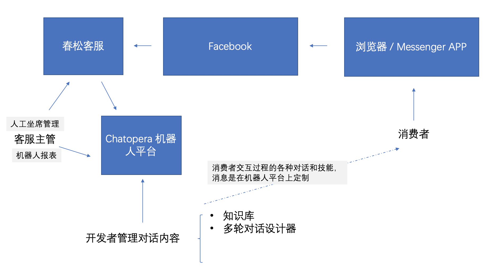</td>
    </tr>
</table>

## 开始按钮

用户首次打开该 Facebook 主页的 Messenger 对话窗口时，主页显示【Get Started】，引导用户开始和机器人对话。

点击按钮后，机器人发送自定义欢迎信息。

<table class="image">
    <caption align="bottom"></caption>
    <tr>
        <td>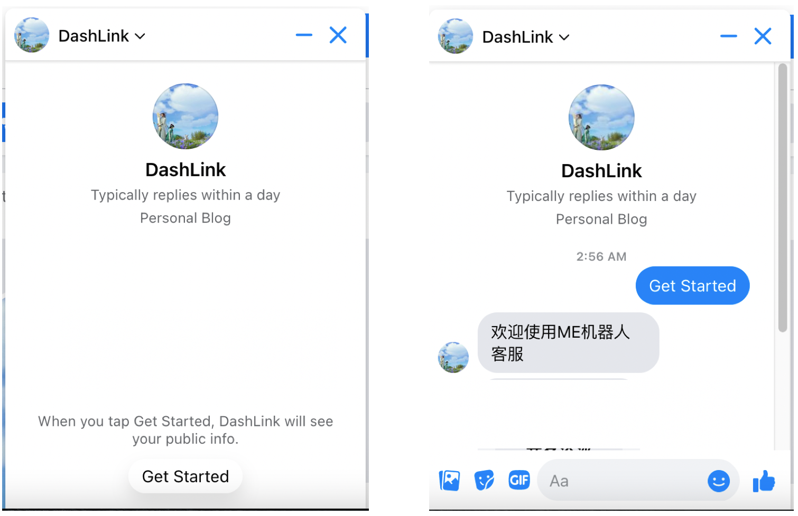</td>
    </tr>
</table>

实现原理：

通过 Messenger Profile API 设置 Page 欢迎屏幕会显示“开始”按钮，payload 设置为 `__get_start`。

户轻触此按钮后，Messenger 平台会向您的 Webhook 发送一个 messaging_postbacks 事件, 发送 `__get_start` 到机器人，开启机器人对话。

延申阅读Facebook Messenger 消息格式[Get Started 文档](https://developers.facebook.com/docs/messenger-platform/reference/messenger-profile-api/get-started-button)。

在多轮对话设计器中，处理`__get_start`事件，定制机器人回复：

<table class="image">
    <caption align="bottom"></caption>
    <tr>
        <td>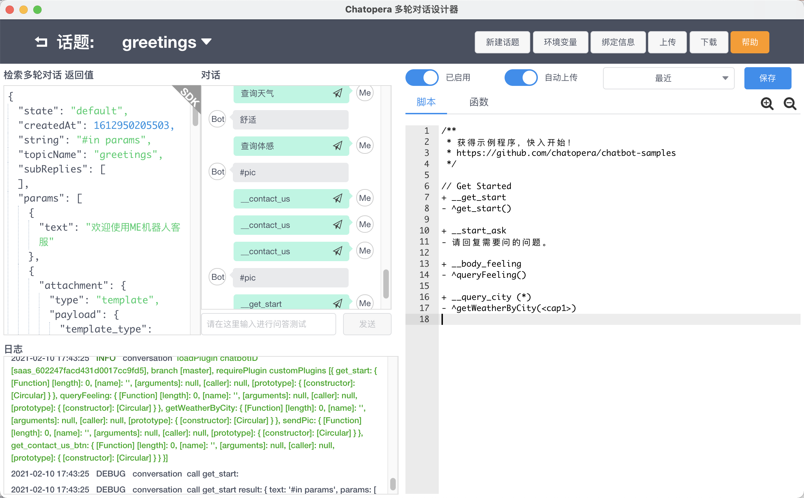</td>
    </tr>
</table>

比如下面技能代码，实现响应 `__get_start` 事件，推送欢迎语和导航菜单。

技能函数:
```
// Get Started
+ __get_start
- ^get_start()

```

技能函数:

```
exports.get_start = async () => {
    return {
        text: '#in params',
        params: [{ // 文本消息
            text: '欢迎使用ME机器人客服'
        }, {
            attachment: { // 导航菜单
                type: 'template',
                payload: {
                    template_type: 'button',
                    text: 'Hi,你想查看什么？',
                    buttons: [{
                            type: "phone_number",
                            title: "商务洽谈",
                            payload: "+8613691490568",
                        },
                        {
                            type: "postback",
                            payload: "__body_feeling",
                            title: "查看城市体感",
                        },
                        {
                            type: "postback",
                            payload: "__start_ask",
                            title: "咨询问题",
                        }
                    ],
                },
            },
        }, ]
    }
}
```

## 导航菜单
我们给用户推送一个导航菜单，引导用户使用我们的服务。

菜单按钮直接触发云平台对应机器人技能。

<table class="image">
    <caption align="bottom"></caption>
    <tr>
        <td>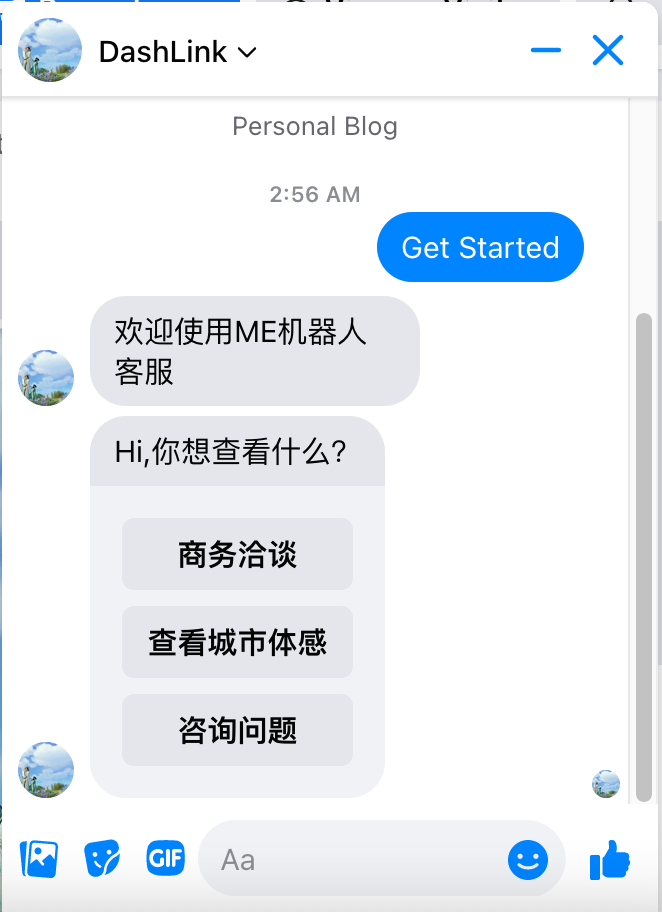</td>
    </tr>
</table>

导航菜单使用 Buttons 实现，按钮类型同 [Messenger Buttons](https://developers.facebook.com/docs/messenger-platform/reference/buttons)。

菜单 payload 在用户点击后推送给机器人。

## 快捷回复

现在用户想查看城市体感信息，我们通过快捷回复，给用户几个热门城市选择，点击直接回复机器人。

<table class="image">
    <caption align="bottom"></caption>
    <tr>
        <td>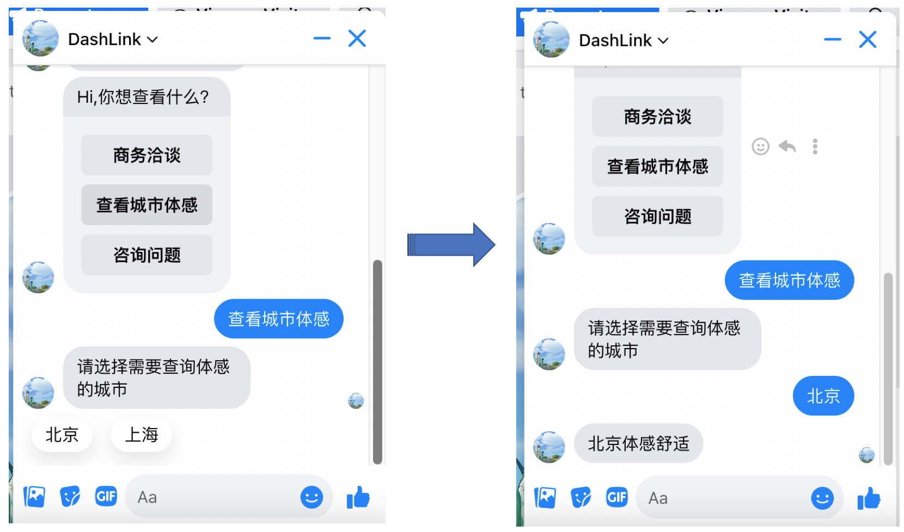</td>
    </tr>
</table>

用户选择 “查看城市体感” ， `__body_feeling` 技能被处理，返回推荐选项给用户选择。

技能脚本:

```
// 显示推荐城市
+ __body_feeling
- ^queryFeeling()

// 查询城市数据
+ __query_city (*)
- ^getWeatherByCity(<cap1>)
```

技能函数

```
exports.queryFeeling = async () => {
    return {
        text: '#in params',
        params: {
            text: '请选择需要查询体感的城市',
			// 快捷回复选项
            quick_replies: [{
                    content_type: 'text',
                    title: '北京',
                    payload: '__query_city 北京',
                },
                {
                    content_type: 'text',
                    title: '上海',
                    payload: '__query_city 上海'
                },
            ],
        },
    };
}

// 此处简化处理，技能函数有访问REST API的能力
exports.getWeatherByCity = function(city, cb) {
    debug("getWeatherByCity: %s", city);
    let data = {
        '北京': '舒适',
        '上海': '闷热'
    }

    cb(null, city + '体感' + data[city]);
}

```

## 知识库查询
在输入框直接回复完整问题查询知识库，回答已有的知识点。

<table class="image">
    <caption align="bottom"></caption>
    <tr>
        <td>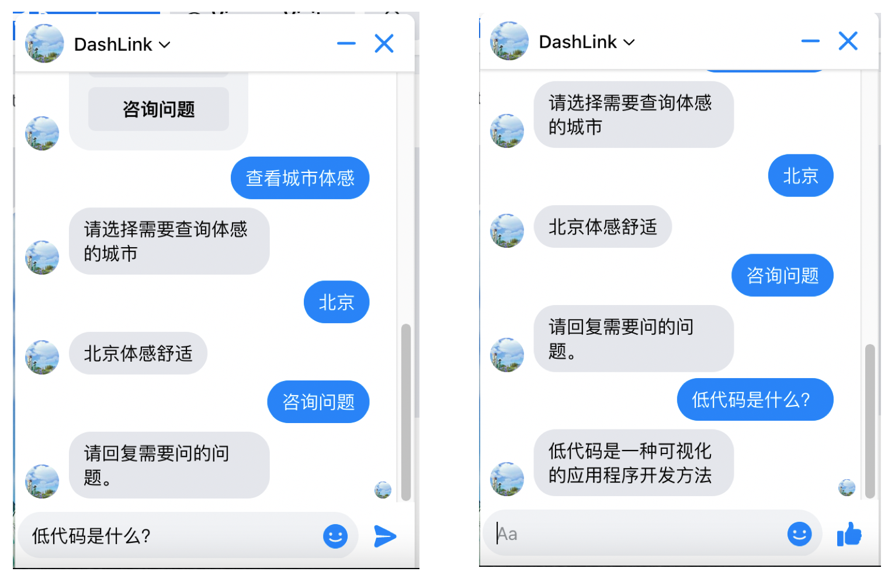</td>
    </tr>
</table>


在 Chatopera 云平台，设置常见问答对。用户问答和知识库数据匹配度超过指定阈值时，直接回复该条目答案。

<table class="image">
    <caption align="bottom"></caption>
    <tr>
        <td>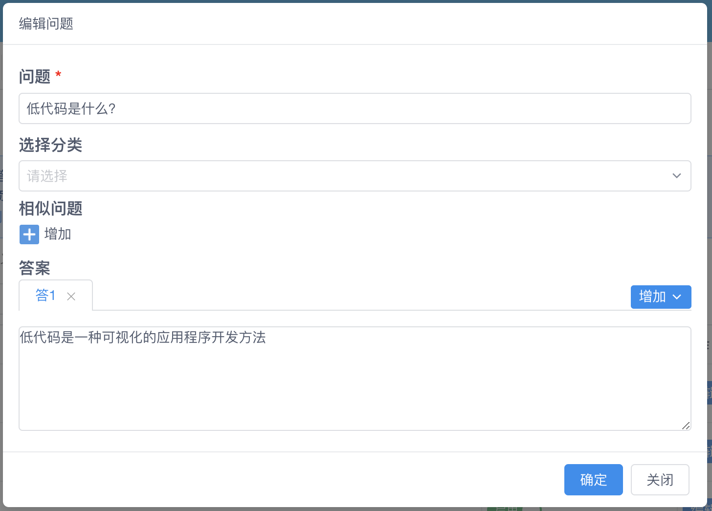</td>
    </tr>
</table>

## 知识库反馈
针对知识库的问答对，可以请用户进行反馈，提高知识库准确定。

<table class="image">
    <caption align="bottom"></caption>
    <tr>
        <td>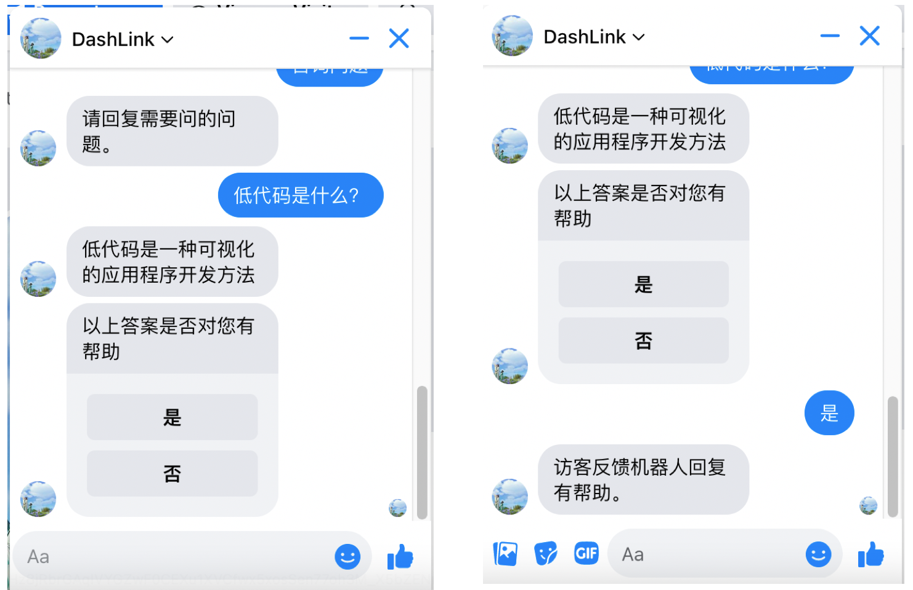</td>
    </tr>
</table>

数据统计展示在云平台ROI数据中。使用 Chatopera 云服务 聚类分析 ，选择性优化知识库，提升机器人服务效果。

<table class="image">
    <caption align="bottom"></caption>
    <tr>
        <td>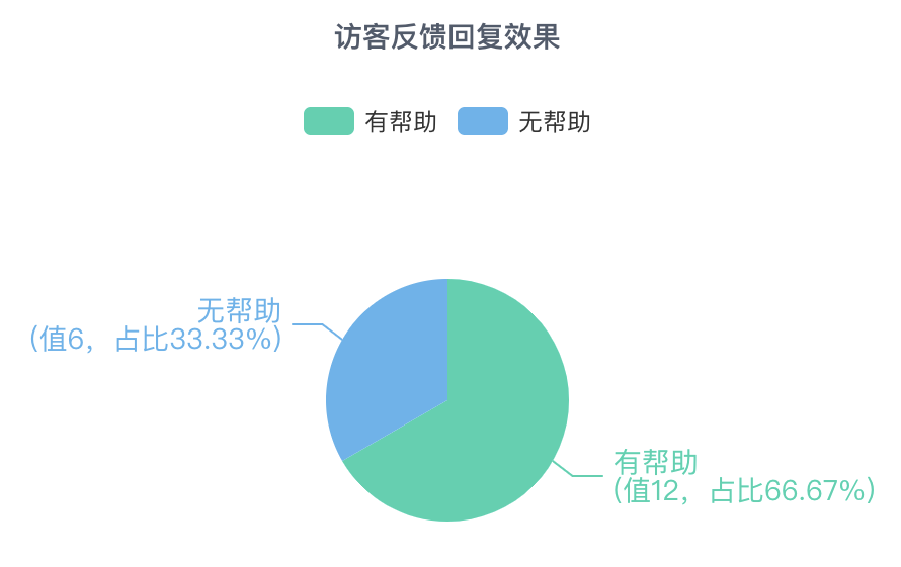</td>
    </tr>
</table>


## 知识库推荐
当问题没有匹配，有相关问题时，系统会推荐给用户，供用户快速选择。

<table class="image">
    <caption align="bottom"></caption>
    <tr>
        <td>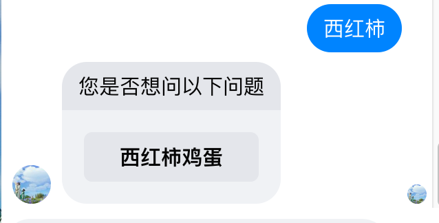</td>
    </tr>
</table>


## 人工服务
用户问题机器人无法解决时，可在适当时机转人工处理。

<table class="image">
    <caption align="bottom"></caption>
    <tr>
        <td>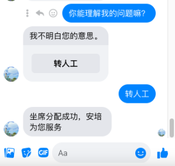</td>
    </tr>
</table>


系统会根据ACD策略接入合适的客服，进行处理。客服可以看到用户的历史对话，并使用 知识库快捷，知识库联想、转接其他专业客服等功能更好的服务访客。

## 总结

基于以上介绍，企业用户在春松客服和 Chatopera 机器人平台基础上，可以无代码的方式提供基于知识库的 FAQ Bot 和 低代码的方式实现多轮对话 Bot。

强大的定制化开发能力，满足企业客户的各种需求，提升企业的智能化和自动化，在规模化的同时，消费者获得个性化服务，自助式服务。


## 评论

<script src="https://utteranc.es/client.js"
        repo="chatopera/docs"
        issue-term="pathname"
        label="Comment"
        theme="github-light"
        crossorigin="anonymous"
        async>
</script>
