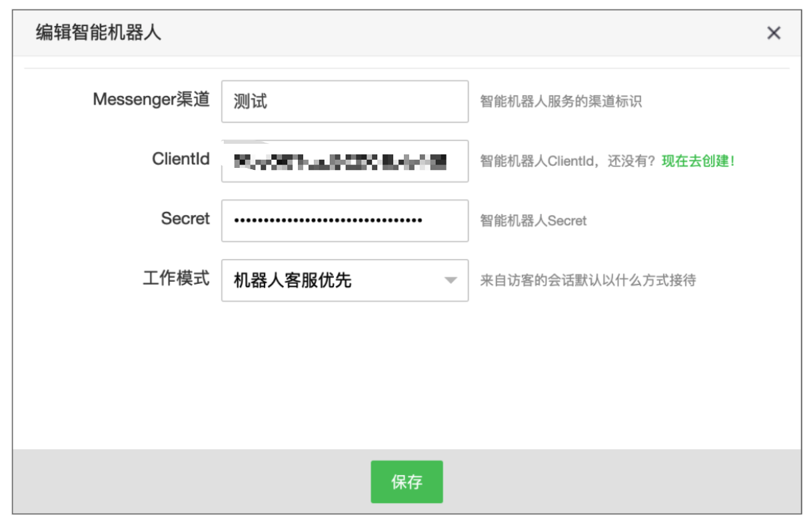
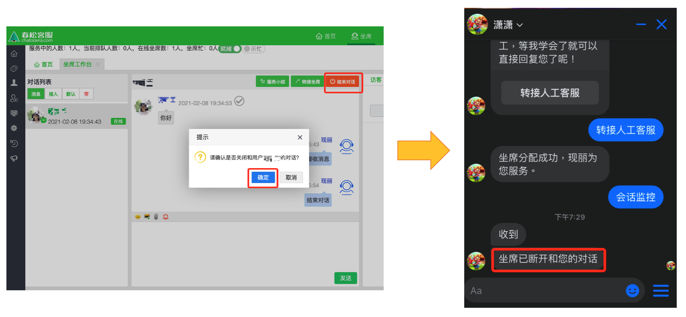

# Messenger 渠道配置机器人客服

## 概述
在春松客服中集成了 Messgnger 渠道后，您可以通过配置机器人客服实现更加高效，方便，快捷的服务方式。机器人客服可以帮助您回答简单问题，提供轻松的娱乐，预先过滤访客数据，收集信息等，大大减少了人工客服的工作量。

## 配置机器人客服
春松客服实例需要安装有 Messenger 插件和智能机器人插件。只有超级管理员「admin」可以维护智能机器人插件。

### 创建机器人
步骤：系统→系统设置→智能机器人→新建

<table class="image">
    <caption align="bottom"></caption>
    <tr>
        <td></td>
    </tr>
</table>

点击新建之后，弹出集成智能机器人对话框。渠道类型默认的是网站渠道，需要选择 Messenger 渠道。

<table class="image">
    <caption align="bottom"></caption>
    <tr>
        <td></td>
    </tr>
</table>

根据提示填写对应信息，其中 ClientId 和 Secret 需要在 [Chatopera 云服务](https://bot.chatopera.com/)中机器人的设置页面获取。

<table class="image">
    <caption align="bottom"></caption>
    <tr>
        <td></td>
    </tr>
</table>

点击保存之后，创建智能机器人成功。

### 编辑机器人
步骤：智能机器人页面→操作栏→绑定

<table class="image">
    <caption align="bottom"></caption>
    <tr>
        <td></td>
    </tr>
</table>

### 设置机器人
步骤：智能机器人列表选择需要设置的机器人→根据需求进行设置

<table class="image">
    <caption align="bottom"></caption>
    <tr>
        <td></td>
    </tr>
</table>

### 删除机器人
步骤：智能机器人页面→操作栏→删除

<table class="image">
    <caption align="bottom"></caption>
    <tr>
        <td></td>
    </tr>
</table>

## 机器人不同工作模式

| 模式| 	描述| 	是否可以转接不同工作模式| 
| --- | --- | --- |
| 机器人客服优先| 	当有新的访客接入会话时，机器人客服优先服务。访客可以选择转人工服务。| 	是| 
| 人工客服优先 |	当有新的访客接入会话时，人工客服优先服务。|	否|
| 仅机器人客服	| 当有新的访客接入会话时，机器人客服优先服务。访客不可以选择转人工服务。|	否|

## 访客和机器人对话
用户在 Facebook page 页面点击「发消息」进入对话窗口，用户在对话窗口中发消息可以收到机器人回复，并且可以评价机器人的回复是否有帮助。

<table class="image">
    <caption align="bottom"></caption>
    <tr>
        <td></td>
    </tr>
</table>

用户反馈问题是否有帮助后，数据会记录到 Chatopera 云服务中，登录 [https://bot.chatopera.com/](https://bot.chatopera.com/ ) 进入机器人「统计」页面查看数据。

<table class="image">
    <caption align="bottom"></caption>
    <tr>
        <td></td>
    </tr>
</table>

## 访客如何选择转人工服务
访客和机器人对话触发到兜底回复时，兜底回复下带有「转人工」的按钮，访客点击「转人工」收到提示消息后就可以发送消息和人工客服对话。

<table class="image">
    <caption align="bottom"></caption>
    <tr>
        <td></td>
    </tr>
</table>

## 人工客服如何结束对话
Facebook 渠道的用户不能主动结束对话，需要人工坐席在坐席工作台主动结束对话。

步骤：坐席工作台→ 对话列表→ 结束对话

<table class="image">
    <caption align="bottom"></caption>
    <tr>
        <td></td>
    </tr>
</table>

## 评论

