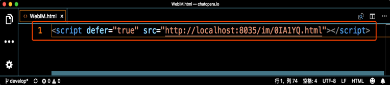
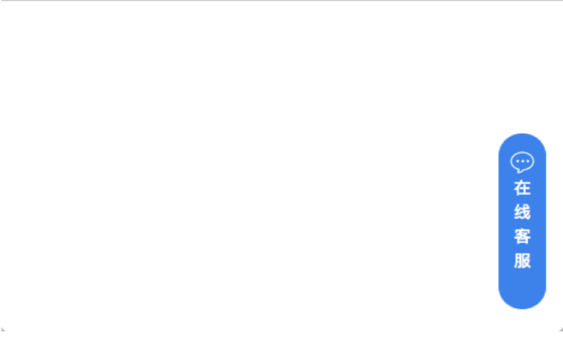
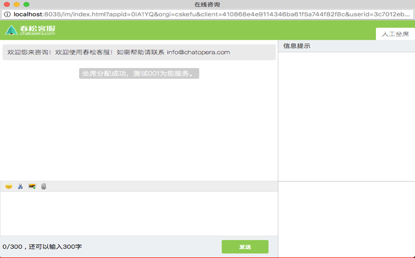

# 网页渠道

## 概述

网页聊天支持可以适配移动设备浏览器，桌面浏览器。可以在电脑，手机，微信等渠道接入网页聊天控件。

## 安装

获取网页脚本，_系统_ -> _系统管理_ -> _客服接入_ -> _网站列表_ -> _点击“Chatopera 官网”_ -> _基本设置_ -> _接入；_

<table class="image">
    <caption align="bottom"></caption>
    <tr>
        <td></td>
    </tr>
</table>

将图中的代码复制到一个 Web 项目的页面中，例如下图的。

<table class="image">
    <caption align="bottom"></caption>
    <tr>
        <td></td>
    </tr>
</table>

## 使用

使用浏览器打开该 Web 页面。

<table class="image">
    <caption align="bottom"></caption>
    <tr>
        <td></td>
    </tr>
</table>

【提示】该网页需要使用 http(s)打开，不支持使用浏览器打开本地 HTML 页面。

点击该网页中出现的“在线客服”按钮，出现聊天窗口，可以作为访客，与客服聊天了。

<table class="image">
    <caption align="bottom"></caption>
    <tr>
        <td></td>
    </tr>
</table>

【提示】春松客服提供一个测试网页客户端的例子，可以使用 _<http://{{春松春松客服IP:[PORT>]}}/testclient.html_ 进行访问。
