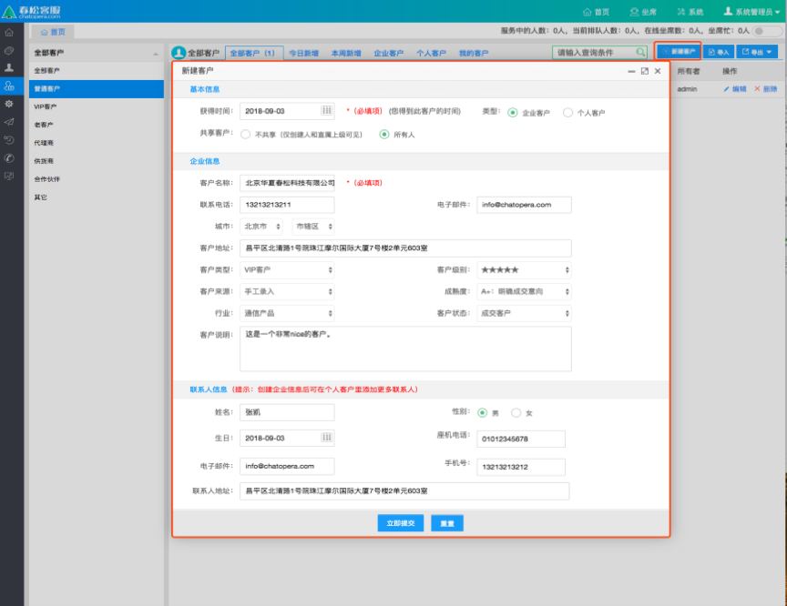
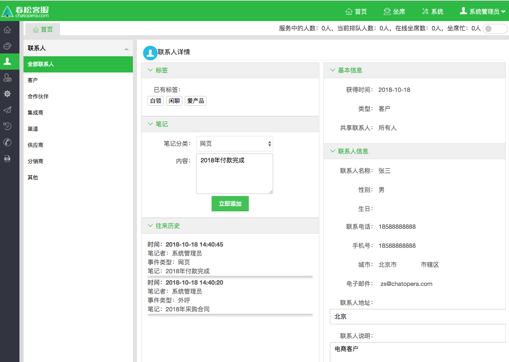

# 客户关系管理

## 新建客户

_左侧菜单_ -> _全部客户_ -> _新建客户_

这里客户信息包括“基本信息”，“企业信息”，“联系人信息”；
其中“联系人信息”，会同步到 左侧菜单->全部联系人；

<table class="image">
    <caption align="bottom"></caption>
    <tr>
        <td></td>
    </tr>
</table>

## 编辑客户

_左侧菜单_ -> _全部客户_ -> _客户列表_ -> _选中一个客户_ -> _点击“编辑”按钮_

只能更新“基本信息”，“企业信息”；
需要更新 “联系人信息”，请移步到 左侧菜单->全部联系人；

## 联系人笔记

进入联系人列表，选择一个联系人，点击*联系人*姓名，进入详情页面。
在详情页面，编辑联系人笔记，记录来往历史。

<table class="image">
    <caption align="bottom"></caption>
    <tr>
        <td></td>
    </tr>
</table>

## 删除客

_左侧菜单_ -> _全部客户_ -> _客户列表_ -> _选中一个客户_ -> _点击“删除”按钮_
