# 开发环境搭建

本文介绍如何完成春松客服开发环境的搭建，面向企业/开发者提供关于春松客服二次开发的相关知识，从入门到掌握全部开发技能请学习[《春松客服大讲堂》](/products/cskefu/training.html)。

## 依赖

- [Git](https://git-scm.com/)

- [Java 8+](http://www.oracle.com/technetwork/java/javase/downloads/jdk8-downloads-2133151.html)

- [Maven 3+](https://maven.apache.org/)

- [IntelliJ IDEA](https://www.jetbrains.com/idea/)或[Eclipse](https://www.eclipse.org/)

- [Docker 18+](https://www.docker.com/)

- [Docker compose 1.22+ ](https://docs.docker.com/compose/install/)

- [MySQL 管理客户端 Navicat for MySQL](https://www.navicat.com/en/products/navicat-for-mysql)

## 配置 Maven

确保在 pom.xml 中存在如下的 maven 库，[Chatopera Nexus](https://nexus.chatopera.com/)是代理 Maven Central，Alibaba Maven Repo 等节点的混合 Maven Repository，使用 Chatopera Nexus 不会影响项目使用其它公共包（Artifacts）。

在`<repositories><repository>`内存在：

```
    <repositories>
        <repository>
            <id>chatopera</id>
            <name>Chatopera Inc.</name>
            <url>https://nexus.chatopera.com/repository/maven-public</url>
            <releases>
                <enabled>true</enabled>
            </releases>
            <snapshots>
                <enabled>true</enabled>
            </snapshots>
        </repository>
    </repositories>
```

配置文件的示例见 [pom.xml](https://github.com/chatopera/cskefu/blob/osc/contact-center/app/pom.xml)。

如配置后不能下载，请参考[配置文件](https://github.com/chatopera/cskefu/issues/137)。

## 下载代码

```
git clone https://github.com/chatopera/cskefu.git cskefu
# 默认为 osc 分支
```

## 数据库

在源码中，默认使用 docker-compose 启动服务的描述文件 [docker-compose.yml](https://github.com/chatopera/cskefu/blob/osc/docker-compose.yml)，用于快速准备开发环境。

为了减少开发环境搭建可能遇到的问题，请使用 [docker-compose.yml](https://github.com/chatopera/cskefu/blob/osc/docker-compose.yml) 中的 docker 镜像启动以下服务，尤其是春松客服对于一些软件的版本有要求，我们强烈建议开发者在入门春松客服开发的阶段，安装 docker 和 docker-compose，并按照下面的步骤配置开发环境。

### Elasticsearch

春松客服依赖 Elasticsearch 服务，如果没有 Elasticsearch 服务，可以用下面的方式创建。

```
cd cskefu
docker-compose up -d elasticsearch
```

Elasticsearch 的配置项在 application.properties 是

```
spring.data.elasticsearch.cluster-name=elasticsearch
spring.data.elasticsearch.cluster-nodes=127.0.0.1:9300
```

将 cluster-nodes 配置为开发服务地址，默认为"YOUR_IP:9300"

### ActiveMQ

春松客服依赖 ActiveMQ 服务，如果没有 ActiveMQ 服务，可以用下面的方式创建。

```
cd cskefu
docker-compose up -d activemq
```

ActiveMQ 的配置项在 application.properties 是

```
spring.activemq.broker-url=tcp://localhost:61616
spring.activemq.user=admin
spring.activemq.password=admin
spring.activemq.pool.enabled=true
spring.activemq.pool.max-connections=50
```

将以上值修改为 ActiveMQ 的实际地址和密码。

### MySQL

春松客服依赖 MySQL 服务，如果没有 MySQL 服务，可以用下面的方式创建。

```
cd cskefu
docker-compose up -d mysql
```

**MySQL 容器启动后，还需要创建春松客服数据库，该过程是在数据库上执行 SQL 文件(`contact-center/config/sql/cskefu-MySQL-slim.sql`)完成的。**

连接 MySQL 服务

<p align="center">

</p>

使用`docker-compose`启动的服务

| IP        | 用户名 | 密码   | 端口 |
| --------- | ------ | ------ | ---- |
| localhost | root   | 123456 | 8037 |

#### MySQL 数据字典

在线浏览[数据字典](https://chatopera.github.io/cskefu/)

<p align="center">
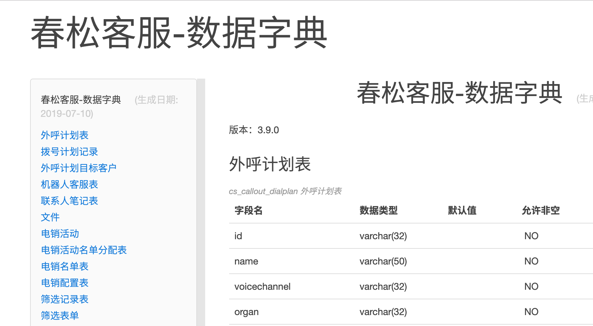
</p>

### Redis

春松客服依赖 Redis 服务，如果没有 Redis 服务，可以用下面的方式创建。

```
docker-compose up -d redis
```

Redis 启动后就可以，不需要其他操作。

## 安装插件

春松客服的一些定制化需求是通过插件的形式发布的，插件让非通用需求和定制化开发的功能的源码与基础代码分离。一些插件是付费的，一些插件是免费的，比如机器人客服插件就是免费开源的。

插件的安装和源码参考：[https://github.com/chatopera/cskefu/tree/osc/public/plugins
](https://github.com/chatopera/cskefu/tree/osc/public/plugins)

## 生成项目描述

文件目录介绍

<p align="center">
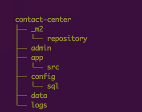
</p>

| 目录     | 说明                         |
| -------- | ---------------------------- |
| `_m2`    | 用于 Dockerfile 中，构建镜像 |
| `admin`  | 各种脚本                     |
| `app`    | 源代码                       |
| `config` | 数据库文件                   |
| `data`   | 数据库数据                   |
| `logs`   | 日志                         |

春松客服是基于 Java 开发到，使用 Maven 维护项目声明周期。使用 Maven 命令，生成项目，方便导入到 IDE 中。

春松客服团队使用[IntelliJ IDEA](https://www.jetbrains.com/idea/)作为集成开发环境，它因为更加智能而大幅提升了开发者的工作效率，我们也强烈推荐 Java 开发者使用这个工具。本文使用`IntelliJ IDEA`介绍搭建过程。

```
cd cskefu
./admin/gen-idea.sh
```

## 配置文件

春松客服是基于 [Spring Boot Release 1.5.9](https://spring.io/blog/2017/11/28/spring-boot-1-5-9-available-now) 开发，配置文件是

```
cskefu/contact-center/app/src/main/resources/application.properties
```

数据库连接等其他信息，参考该文件，如果需要覆盖这些值，在开发过程中，很常见，可以有以下两个方式：1）使用 application-dev.properties；2）使用环境变量。

### 使用 Profile 文件覆盖默认配置

使用 application-dev.properties 覆盖默认配置，有两种方式修改默认的配置：一种是用环境变量+properties 文件；另外一种是直接使用环境变量。

- 设置环境变量

```
SPRING_PROFILES_ACTIVE=dev
```

- 创建 application-dev.properties

```
touch contact-center/app/src/main/resources/application-dev.properties
```

内容如下：

```
# MySQL
spring.datasource.url=jdbc:mysql://192.168.2.217:7111/cosinee?useUnicode=true&characterEncoding=UTF-8
spring.datasource.username=root
spring.datasource.password=123456

# Redis服务器连接端口
spring.redis.host=localhost
spring.redis.port=6379
# Redis服务器连接密码（默认为空）
spring.redis.password=

# ActiveMQ
spring.activemq.broker-url=tcp://192.168.2.217:9007
spring.activemq.user=admin
spring.activemq.password=123456

# Elasticsearch
spring.data.elasticsearch.cluster-nodes=192.168.2.217:7201
```

**此处可以覆盖 application.properties 中的任何值。**

### 环境变量

`application.properties`中的每一项都可以用环境变量配置，通过环境变量方式映射配置信息，实现覆盖 application.properties 中等配置，其映射方式为`propery`的键转为大写同时`.`和`-`转为`_`。部分环境变量：

```
SPRING_DATASOURCE_URL=jdbc:mysql://mysql:3306/contactcenter?useUnicode=true&characterEncoding=UTF-8
SPRING_DATASOURCE_USERNAME=root
SPRING_DATASOURCE_PASSWORD=123456
```

并且，环境变量的值优先级高于 `properties` 文件。

## 配置开发环境

按照`IDEA`提示，导入`contact-center/app`目录。对于`Eclipse`或其它 IDE 工具，春松客服团队不提供搭建文档。

### 配置执行及调试

配置运行方式为 Spring，应用为 `com.chatopera.cc.app.Application`

<p align="center">
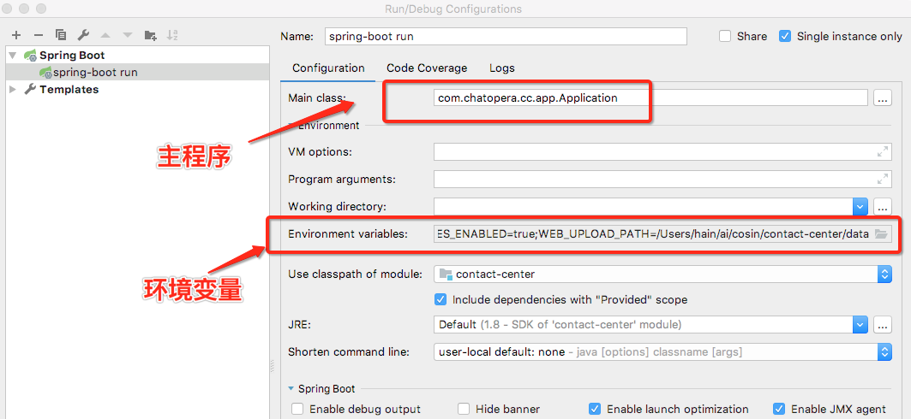
</p>

### 配置环境变量

<p align="center">
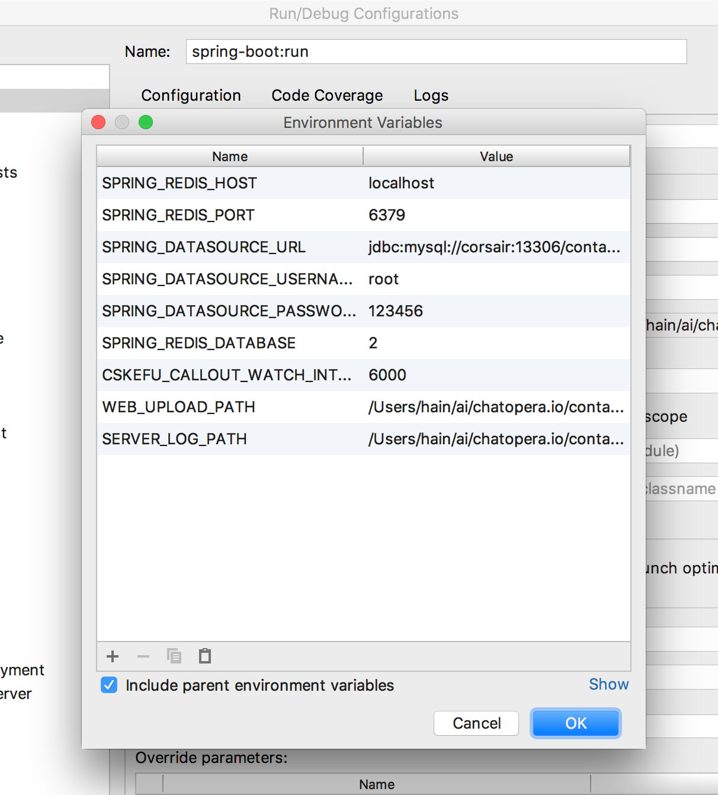
</p>

### 运行及调试

<p align="center">
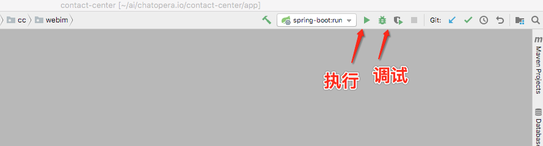
</p>

点击"执行"或"调试"，服务启动，然后访问 http://localhost:8035 确定服务正常运行了。

<p align="center">

</p>

**用户名**：admin **密码**：admin1234

### 热更新

在开发过程中，修改了代码，更新正在以 **“调试”** 模式运行服务，点击"执行旁边的锤子"。

<p align="center">
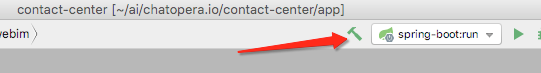
</p>

更新成功后，提示

<p align="center">
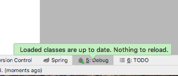
</p>

另外， **“调试”** 模式下，也支持断点调试。

## 初始化系统

启动调试服务，如果要定制化客服接待访客的代码，需要按照[系统初始化](/products/cskefu/initialization.html)文档做更多配置。

## 模拟访客端测试

介绍如何测试网页端访客程序，假设服务是自动在本地 `http://localhost:8035` 端口。

### 创建网站渠道

```
http://localhost:8035/
用户名：admin
密码：admin1234
```

保证有下面的一条网站渠道：

<p align="center">
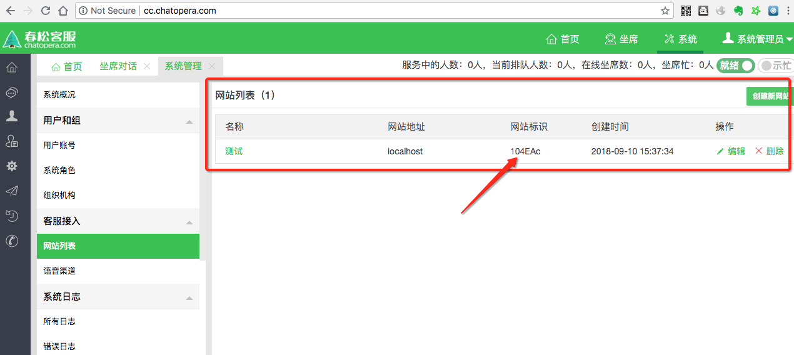
</p>

**注意**：网站地址为 _localhost_

### 设计网页端样式

在网站列表中，从右侧操作中点击“设计”。

<p align="center">
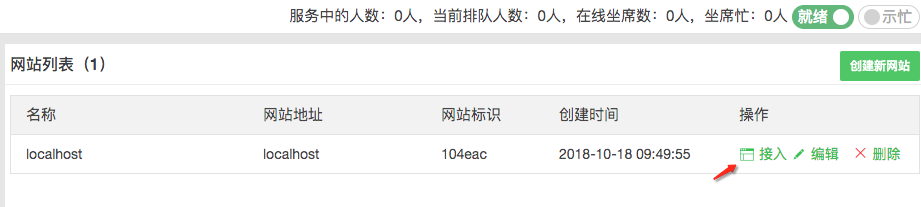
</p>

按照需求配置各种属性。

<p align="center">
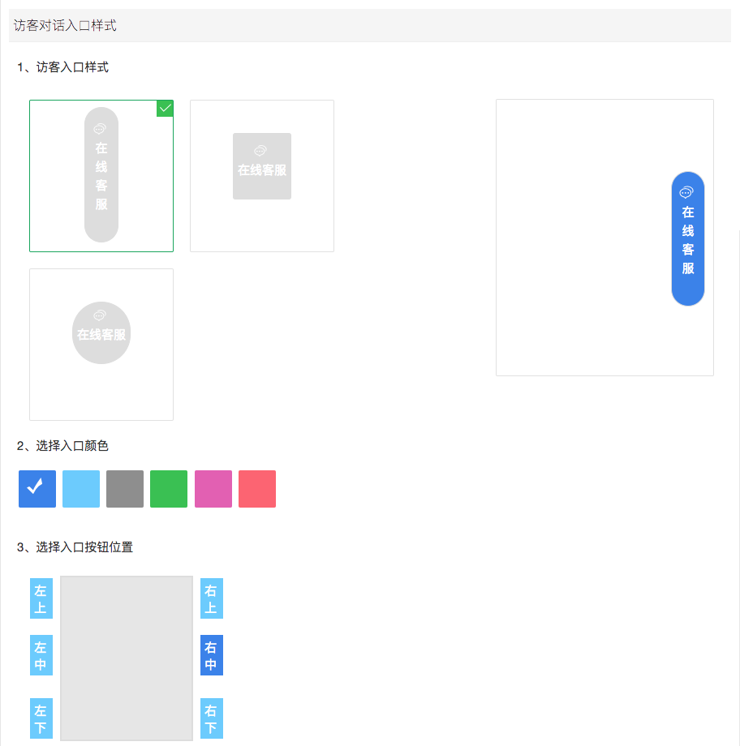
</p>

### 访问测试程序

浏览器打开

```
http://localhost:8035/testclient.html
```

<p align="center">
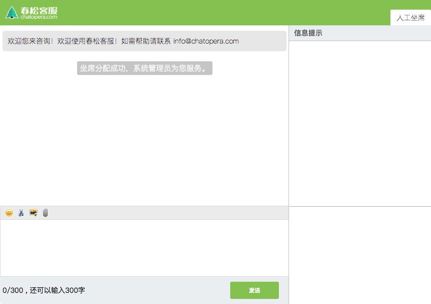
</p>

### 网站留言

如果当前系统中没有"在线"并且"就绪"的客服人员，则进入留言。

### 嵌入代码到网站中

在目标接入访客聊天控件的网站中，网页 HTML 的 header 中加入一行代码，就可以访问了，代码：

```
<script defer="true" src="http://春松客服地址[:端口]/im/网站渠道标识.html"></script>
```

**注意**：如果使用 80 或 443 端口，可省略端口；请将网页放在 HTTP 服务器上，如果从浏览器中以本地文件打开因为安全限制会无法加载聊天控件。

HTML 示例：

```
<!DOCTYPE html>
<html lang="zh">

<head>
    <!-- META -->
    <meta name="viewport" content="width=device-width; initial-scale=1.0; maximum-scale=1.0; user-scalable=0;">
    <meta http-equiv="Content-Type" content="text/html; charset=utf-8" />
    <script defer="true" src="http://cc.chatopera.com/im/104eac.html"></script>
</head>
<body>
春松客服演示客户端

</body>
</html>
```

## 寻找开发者

寻找开发者合作智能客服项目，社区共建，携手共赢！

- 组织或个人，在春松客服主页展示为认证开发者
- 春松客服官方推荐项目机会
- 专访并通过官方渠道曝光

填写申请：[https://www.wjx.top/jq/93397428.aspx](https://www.wjx.top/jq/93397428.aspx)

## 接下来

[《春松客服博客专栏》](https://blog.csdn.net/watson243671/category_9915986.html)提供更多开发技能介绍，敬请关注，🔥 火热更新中 ...

- [春松客服里的机器人客服 | 春松客服](https://blog.csdn.net/samurais/article/details/103681908)

- [春松客服数据库表及管理 | 春松客服](https://blog.csdn.net/samurais/article/details/105807088)

- [春松客服的压力测试| 春松客服](https://blog.csdn.net/samurais/article/details/105725876)

## 评论

<script src="https://utteranc.es/client.js"
        repo="chatopera/docs"
        issue-term="pathname"
        label="Comment"
        theme="github-light"
        crossorigin="anonymous"
        async>
</script>
