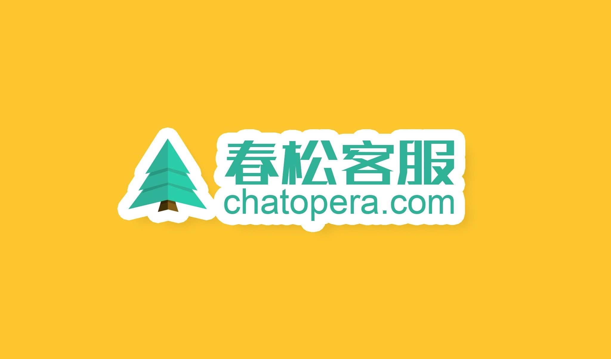
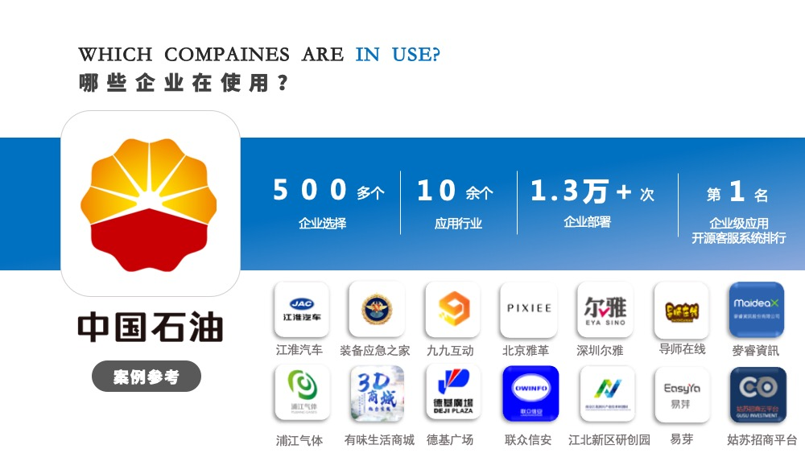
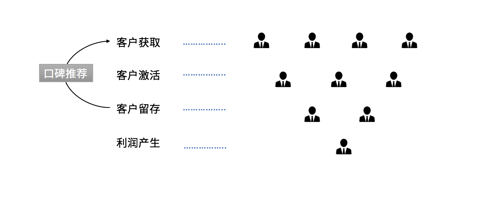
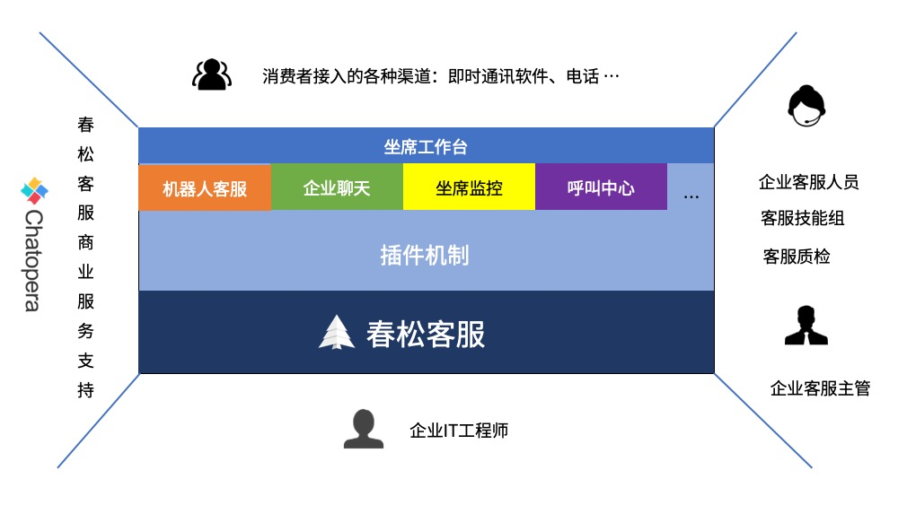

# 春松客服

[https://www.cskefu.com](https://www.cskefu.com)

<b></b> 

春松客服是拥有坐席管理、渠道管理、机器人客服、数据分析、CRM 等功能于一身的新一代客服系统。将智能机器人与人工客服完美融合，同时整合了多种渠道，结合 CRM 系统，为客户打标签，建立客户的人群画像等，帮助企业向客户提供更加专业客服服务。

<b></b> 

**春松客服的基础功能开源，也可以看作是企业客服系统的开发框架**。

## 产品定义

客服系统是企业的重要工具，尤其是移动互联网时代，微信公众号、移动电话或是 Facebook Messenger 等渠道分散了企业的服务渠道，企业需要响应来自任何地点任何时间的客户。同时，企业的口碑至关重要，企业服务需要在客户获得、客户激活、客户留存等阶段无懈可击。

<b>用户生命周期</b> 

**春松客服**有下面的亮点：

### 模块化设计

免费模块和付费模块适合企业长期使用，尤其是中小型企业，灵活购买高级插件。

### 开放源码

免费模块使用 Apache2.0 授权证书发布，商业友好。

### 部署方便

以容器化基础，安装使用 Docker 编排，卸载等非常简单。

### 机器人客服

强大的机器人客服解决方案，与 Chatopera 机器人平台等产品集成。

## 产品演示

演示环境是为了帮助大家了解春松客服，以下是地址和超级管理员账号。

| 网站                      | 用户名 | 密码      |
| ------------------------- | ------ | --------- |
| <https://cc.chatopera.com/> | admin  | admin1234 |

提示：【演示环境】定时刷新且任何人都可以登录，不要更改密码和创建敏感数据，因该网站会**频繁重置数据和升级**，**该网站不能作为生产系统评估**，仅作为应用可行性参考；评估系统，比如压力测试和性能测试，请按照[部署文档操作](https://docs.chatopera.com/products/cskefu/deploy.html)获得新的服务实例。

## 免费模块

春松客服提供多个**开箱即用**的供企业**免费使用**的模块：

- 账号及组织机构管理：按组织、角色分配账号权限

- 坐席监控：设置坐席监控角色的人员可以看到并干预访客会话

- 联系人和客户管理：CRM 模块，管理联系人和客户，细粒度维护客户信息，自定义标签和打标签，记录来往历史等

- 网页聊天组件：一分钟接入对话窗口，支持技能组、邀请和关联联系人等

- 坐席工作台：汇聚多渠道访客请求，坐席根据策略自动分配，自动弹屏，转接等

- 机器人客服：与[Chatopera 云服务](/products/chatbot-platform/index.html)集成，通过插件形式安装，插件也以开源形式提供，查看插件源码。

- 企业聊天：支持企业员工在春松客服系统中群聊和私聊

- 质检：历史会话、服务小结、服务反馈及相关报表

在本文档中，也称以上模块为*基础模块*。

## 付费模块

春松客服从 v5.0.0 版本开始提供如下付费模块：

- Messenger 渠道：集成 [Facebook Messenger Platform](https://docs.chatopera.com/products/cskefu/channels/messenger/index.html)为出海企业服务，满足营销和客服需求，在 Facebook 全家桶中连接亿万消费者、买家、玩家、客户

付费模块代码并不开源，并且使用**插件**的形式安装在源码中，请联系[“商务洽谈”](/products/cskefu/index.html#商业支持)获得插件和商业支持。

## 定制化开发培训课程

开发者通过学习[《春松客服大讲堂》](/products/cskefu/osc/training.html)来掌握基于春松客服定制开发客服系统，在春松客服基础上添加企业特别需求的功能。

## 角色设定

### 客户

需要智能客服系统的企业。

### 客服人员

指代客户的客服团队的工作人员。

### 访客/消费者

指代甲方的客户，是需要通过联系客服人员咨询问题的人。

### 开发人员

指代智能客服系统的开发者，开发人员应该是有权限修改智能客服系统代码的人，包括 Chatopera 工程师和春松客服开源社区开发者。

### 业务专家

指代熟悉客户业务的人员，业务专家可以提供产品设计的意见，可以参与智能问答的质量评定，也可以作为管理员登录智能客服系统，配置系统，管理智能对话和训练。

## 质量管理

解读 Chatopera 质量管理体系，上线定制化的客服系统。如何合理的规划测试工作？怎样搭建质量管理的支撑系统？Chatopera 反思、精进产品开发和服务支持体系，认真负责的帮助客户落地客服系统。本视频系 Chatopera 质量保证人员根据实际工作内容总结整理。

在线观看[《解读 Chatopera 质量管理体系》](https://mp.weixin.qq.com/s/AUWbqCYIcvzTZBJVgJzKsg)，同时，该视频相关的[文章](https://mp.weixin.qq.com/s/sah0e0q3HH2Ex4wZyfJXIg)中也有详细介绍。

<table class="image">
    <tr>
        <td></td>
    </tr>
</table>

## 更新日志

查看[Chatopera 产品更新日志](https://status.chatopera.com/tags?tag=%E6%98%A5%E6%9D%BE%E5%AE%A2%E6%9C%8D)相关内容。

加入春松客服开源社区群：

请不要发送敏感信息；讨论与春松客服和 Chatopera 产品和服务相关的事宜。

## 评论

