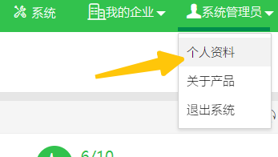
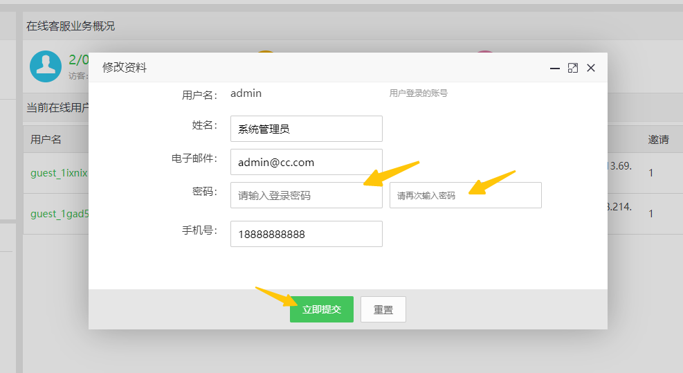
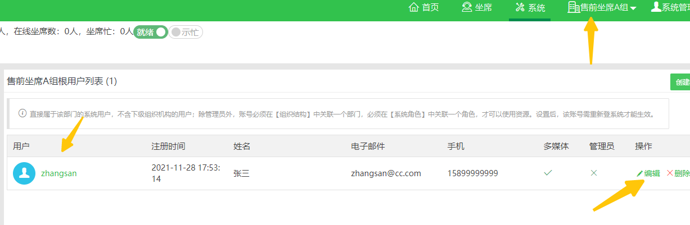
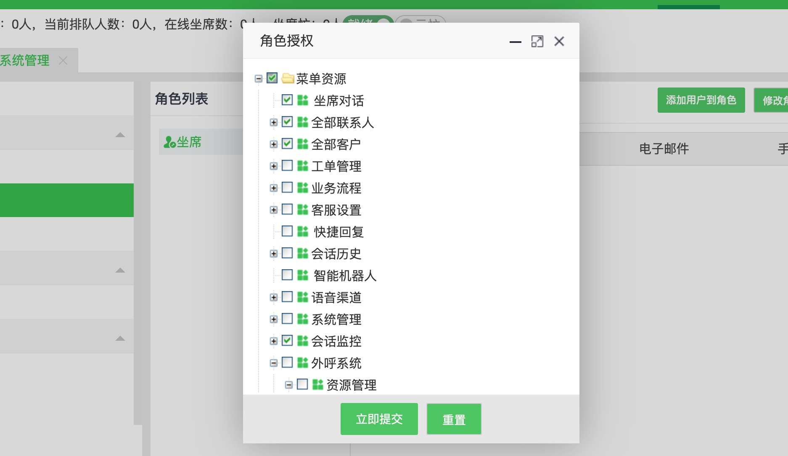

# 系统初始化

完成[部署春松客服实例](/products/cskefu/deploy.html)后，还需要针对企业的组织架构和客服坐席进行配置才能使用。**请认真阅读本页内的内容，尤其是【常见问题】一节。** 这样可以节约您的宝贵时间！

默认的账号 `admin` 是超级管理员，该账号做了特殊处理：可以使用坐席工作台，但是不具备接待访客会话的能力。

只有对系统进行初始化，才能开始处理客户咨询，所以初始化主要是针对坐席管理的，也请先详细阅读 [权限设计](/products/cskefu/accounting.html#%E6%9D%83%E9%99%90%E8%AE%BE%E8%AE%A1)。

在您了解了`组织机构`、`角色`、`账号`和[网页渠道](/products/cskefu/channels/webim.html)的概念后，继续阅读一下内容。

**春松客服刚搭建好后，合理的初始化顺序是：1）创建组织机构；2）创建角色；3）创建账号；4）账号添加到组织机构；5）账号添加到角色。** 在使用过程中，也可以灵活调整。

## 默认的账号信息

在系统部署后，得到默认的：

| **登录账号** | **密码**  | **角色** |
| ------------ | --------- | --------- |
| admin        | admin1234 | 系统超级管理员 |
| zhangsan        | agent1234 | 客服坐席人员 |

* 系统超级管理员【admin】, 密码：`admin1234`

* 角色【管理员】【高级坐席】【初级坐席】
  * 初级坐席：仅具备坐席服务的基本资源读写权限
  * 高级坐席：在初级坐席基础上，支持【坐席监控】等高级功能
  * 管理员：可以查看【系统管理】并对管理员所在的组织机构和附属组织机构进行人员、设置等

* 组织机构【售前坐席A组】, 及其从属
  * 角色【普通坐席】
  * 坐席账号【zhangsan】，属于角色【普通坐席】, 密码：`agent1234`
  * 网站渠道【localhost】, 该聊天控件可以在 *http(s)://CSKEFU_IP:CSKEFU_PORT/testclient.html* 体验

需要强调的是，为了系统安全起见，您可以按照一下顺序删除`网站渠道【localhost】`、`【zhangsan】`、`【普通坐席】` 和 `【售前坐席A组】`。

## 修改默认账号密码

**为了安全起见，在系统部署后，完成密码修改并妥善保管密码。**

### 修改【admin】账号

使用系统超级管理员 admin，点击右上角【个人资料】。

设置新密码并保存。

### 修改【zhangsan】账号

使用系统超级管理员 admin 进入【售前坐席 A 组】，再进入系统管理，账号管理，找到zhangsan，点击`编辑`进行修改。

## 创建组织机构

参考[组织机构管理](/products/cskefu/accounting.html#组织机构管理)，为企业建设一个树形的组织架构。针对坐席小组，设定为 **技能组**。

## 创建角色

参考[角色管理](/products/cskefu/accounting.html#%E8%A7%92%E8%89%B2%E7%AE%A1%E7%90%86)，创建角色并授予相应的权限，客服人员主要需要的资源就是**坐席对话**，**全部客户** 和 **全部联系人**，此处**全部客户**和**全部联系人**是限定在该坐席所在的组织机构和下属组织机构而言的。

若果该角色需要能干预其他坐席人员的会话，则可授予**会话监控**，此处也是监控该坐席所在的组织机构和下属组织机构的。

一个春松客服登陆用户，具体有什么资源的访问，看到哪些数据，是通过其所在的组织机构及其下属组织机构，和该登陆用户的角色授予情况来判断的，因为一个资源，即有资源名称，又属于一个组织机构。

## 创建账号

参考[账号管理](/products/cskefu/accounting.html#%E8%B4%A6%E5%8F%B7%E7%AE%A1%E7%90%86)，**创建账号后，将账号添加到组织机构和角色**。

## 下一步

[坐席工作台的使用注意事项](/products/cskefu/work.html)

[创建网页聊天控件](https://docs.chatopera.com/products/cskefu/channels/webim.html)

[配置机器人客服](/products/cskefu/work-chatbot/index.html)

[春松客服系统维护：升级、备份、回退等](/products/cskefu/osc/maintainence.html)

## 常见问题

### #463

<https://github.com/chatopera/cskefu/issues/463>

问题：客户端点开客服每次都进入的排队 ，发现只有刷新后台的页面才会正常接入客服
 
解决：进入【系统设置-网页渠道-接入】，在【客服信息】中绑定单一技能组。
 

### #378

<https://github.com/chatopera/cskefu/issues/378>

问题：访客打开网页聊天控件，提示等待
 
解决：没有坐席在线，需要按照上述建立有效的坐席人员，并有坐席人员登陆。春松客服部署好以后，默认只有`超级管理员`，这时直接建立网页渠道访问，超级管理员在线，就会出现提示等待。
 

## 评论

