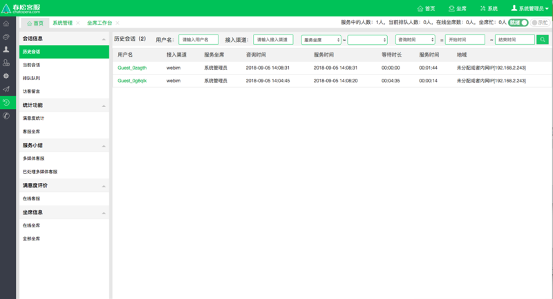
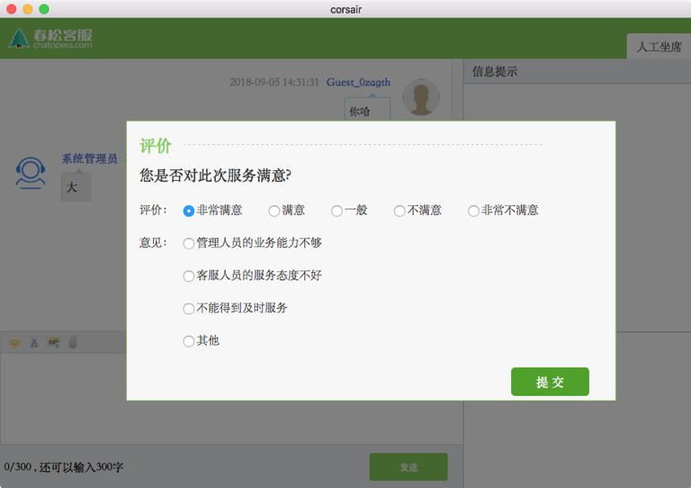
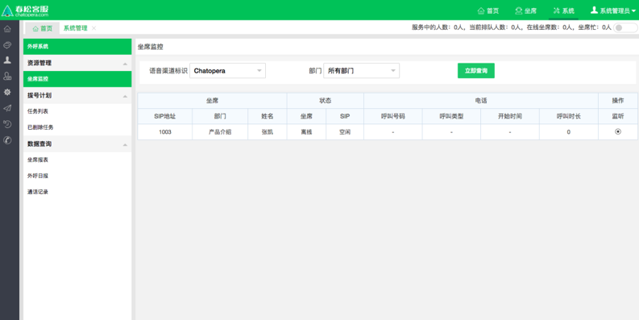

# 坐席监控

## 查看历史会话

_左侧菜单_ -> _会话历史_ -> _历史会话_

<table class="image">
    <caption align="bottom"></caption>
    <tr>
        <td></td>
    </tr>
</table>

## 查看当前会话

_左侧菜单_ -> _会话历史_ -> _当前会话_

## 查看排队队列

_左侧菜单_ -> _会话历史_ -> _排队队列_

## 查看访客留言

_左侧菜单_ -> _会话历史_ -> _访客留言_

## 查看满意度统计

_左侧菜单_ -> _统计功能_ -> _满意度统计_

<table class="image">
    <caption align="bottom"></caption>
    <tr>
        <td></td>
    </tr>
</table>

## 查看全部坐席

_左侧菜单_ -> _会话历史_ -> _坐席信息_ -> _全部坐席_

## 坐席监控

_左侧菜单_ -> _坐席监控_

<table class="image">
    <caption align="bottom"></caption>
    <tr>
        <td></td>
    </tr>
</table>

## 评论

