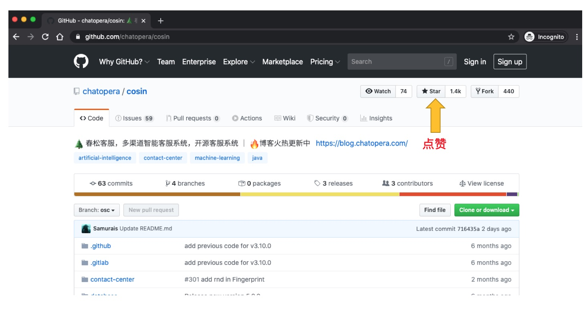

# 开源码社区

    

## 项目地址

**开源项目地址：**

[Github](https://github.com/chatopera/cskefu) [Gitee](https://gitee.com/chatopera/cosin) [CodeChina](https://codechina.csdn.net/chatopera/cskefu)

以上不同地址的代码同步，在上面的地址，您可以：

- 下载项目开源码
- 通过 README.md 了解更多项目信息
- 通过 Wiki 获得开发文档
- 通过 Issue 提问
- 通过 Pullrequest 贡献代码
- 通过 Issue 了解开发状态

在项目地址中，有详细的入门说明，如果使用遇到问题，第一时间[阅读文档](/products/cskefu/index.html)，第二时间搜索[历史 Issues](https://github.com/chatopera/cskefu/issues)，如果无法解决，加入社区提问。

## 博客专栏

Chatopera 博客频道[**《春松客服专栏》**](https://blog.csdn.net/watson243671/category_9915986.html)火热 🔥 更新中，订阅关注，及时获得最新的信息。

    <b>Chatopera拥抱开源</b>
    

## 为我点赞

您的关注、鼓励是我们工作动力之一，请大家给春松客服点赞 👍！

    <b>点赞春松客服</b>
    

## 寻找开发者

寻找开发者合作智能客服项目，社区共建，携手共赢！

- 组织或个人，在春松客服主页展示为认证开发者
- 春松客服官方推荐项目机会
- 专访并通过官方渠道曝光

填写申请：[https://www.wjx.top/jq/93397428.aspx](https://www.wjx.top/jq/93397428.aspx)

## 评论

