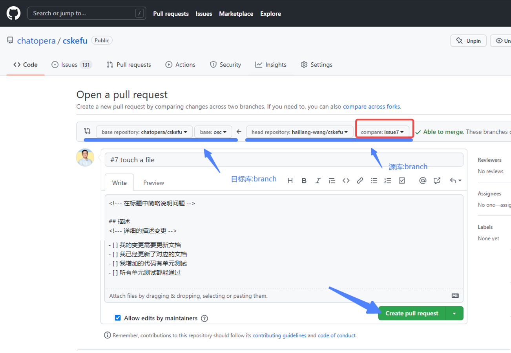

# 提交代码

春松客服一直会坚持 Apache 2.0 许可证，在保持开放的情况下，团结起来，一起做好开源客服系统，既然大家都在用春松客服，合作才会成为大赢家。

提交代码，就是变更[春松客服项目库](https://github.com/chatopera/cskefu)中的内容，比如增加文档、变更代码、配置等。给春松客服提交代码是成为一个春松客服开发者的标志。相对于其它类型的贡献，提交代码需要更多的努力，因此，给春松客服提交代码，也是开源合作共赢精神的证明。

## 成为春松客服开发者

春松客服有很多用户，企业或独立开发者在使用春松客服，作为要不断优化的企业软件，春松客服得到很多的反馈建议，包括 BUG、需求、文档等。作为开源软件，可作为贡献者工作的也主要是三项：发现问题、分析问题和解决问题。现在，春松客服开源社区运作不平衡，很多人发现问题，少部分的人分析问题，解决问题的主要还是发布者。但是从另外一方面，也有一些春松客服用户在做变更，比如 [dph5199278/wit@621c949](https://github.com/dph5199278/wit/commit/621c949e471e8338045d0fef51dd77800dda950e)。

如果大家做的变更公开了，但是却没有提交到春松客服 OSC 分支（春松客服源码的主分支），可能是缺少一份说明文档。这是本文档的作用：详细的说明如何提交代码到春松客服。

我们诚挚的邀请春松客服用户提交 PR，成为春松客服的开发者：春松客服属于贡献者。

以下内容为具体介绍，建议先全文读一遍再进行实践。

提交代码的过程，可以简述为：1）确定工作内容；2）搭建开发环境；3）完成开发和测试；4）推送代码；5）提交 PR 到春松客服。在合并到春松客服 OSC 分支前，可能还会根据 Code Review 进行沟通和优化。

## 确定工作的内容

工作的内容记录在春松客服的[工单(Issue)](https://github.com/chatopera/cskefu/issues)中，可以创建根据您自己的需要创建工单，或者选择一个已有的工单。

在工单中，对工作进行准确和清晰的定义，讨论，设计是非常有必要的，这个过程可以体现工作成熟度。

高手解决问题，在大脑中完成，动手实现只是完成确定无疑的事情。聪明的人，不断的完善头脑中创造的能力。“少用脑，多用手”会一直停留在菜鸟的阶段。

## 搭建开发环境

开发环境搭建，包括下载源码、安装 IDE、启动数据库和配置项目等。

详细内容，参考文档[开发环境搭建](https://docs.chatopera.com/products/cskefu/osc/engineering.html)。

## 完成开发和测试

在对工单进行思考后，开始着手实现，下面探讨两项相关内容。

### Git 使用概述

Git 用于版本管理，使用 Git 时，一个文件有三个可能存在的地方：indexed（索引区），staged（暂存区） 和 workarea（工作区）。indexed 文件就是被索引了（提交了）；staged 就是被临时的保存了（暂未提交，保护一下）；workarea，在编辑器中打开的这份。

<p align="center">
    
</p>

上图中 master 所在区就是 indexed。

Git 的版本管理，就是指这三个层面同一个文件的差异。

Git add: 从 workarea 添加到 staged

Git commit: 从 staged 到 indexed

当然还有不同的方向，这构成了 git checkout, git stash, git restore, git reset, git clean 等命令。

当本地的 Git 库和它的远程的 Git 库同步时，就涉及使用 git push 和 git pull。

以上是对 Git 的简要介绍，快速入门 Git，首先熟悉它的远离，比如以上；其次，做一些练习，比如使用 [practice-git](https://github.com/grayghostvisuals/practice-git)。

即便还没有理解，也可以按照下面的命令完成代码提交。

### 管理工作区

首先，创建本次工作的分支，创建分支是非常有必要的。保持工作区的清爽，方便多人协作。

```bash
cd cskefu.osc  # 在第2步，搭建开发环境中，有描述，克隆代码后，得到该路径
git checkout -b ${名称}
# 比如，git checkout -b issue7
```

然后，开始修改代码，进行测试。

### 成为一个优秀的开发者

要从工作中获得更多快乐，同时也为了不断涨薪，就需要不断的前进，依赖于：1）心态；2）技能。

#### 关于心态

这是一个比提升技能更需要时间和重视的部分，一个好的开发者的心态，可以和一个觉悟者相提并论了，那些个看不到、摸不着的字节，完成你的复杂的逻辑，需要你保持稳定和理性的状态。

这方面有很多好的读物，比如[《程序员修炼之道：从小工到专家》](https://item.jd.com/10393278.html)、[《冥想》](https://item.jd.com/12058554.html)和[《程序员的自我修养——链接、装载与库》](https://item.jd.com/10024708744202.html)。这几本书，值得常看，常看可以常新。尤其是《冥想》，每天早晚各十分钟冥想，坚持 90 天，保证你成为程序员中的大师！

#### 关于技能

春松客服社区发布了[《春松客服大讲堂》](https://docs.chatopera.com/products/cskefu/osc/training.html)，快速的入门以及熟悉开发技能。

在《春松客服大讲堂》中，有很多知识内容，而单元测试、AOP 变成、自动化测试等也涉及，内容丰富。

## 推送代码

通过测试后，进行代码推送。推送代码，一方面是为了备份，一方面是为了协作。

```bash
cd cskefu.osc
git add --all # 添加全部的变更
# 也可以使用 git add ${文件路径} 来指定
 
 
git commit -m "#7 foo bar, some description" # 在 Commit Message 中添加 #ISSUE_NUMBER 是一个好习惯，可以 Git log 日志整洁，易于维护
git push origin ${YOUR_BRANCH_NAME} # ${YOUR_BRANCH_NAME} 就是分支名称
# 比如 git push origin issue7
```

执行过程中，交互类似：

<p align="center">
    
</p>

在 git push 命令，执行后，也可以看到，git 提示您，可以提交一个 PR（Pull Request）:

```bash
remote: Resolving deltas: 100% (1/1), completed with 1 local object.
remote:
remote: Create a pull request for 'issue7' on GitHub by visiting:
remote:      https://github.com/hailiang-wang/cskefu/pull/new/issue7
remote:
To github.com:hailiang-wang/cskefu.git
 * [new branch]      issue7 -> issue7
```

这里的日志说的 remote, 就是指您远程的 GitHub 仓库，这里我的仓库地址是：

[https://github.com/hailiang-wang/cskefu](https://github.com/hailiang-wang/cskefu)

## 提交 PR 到春松客服

上一步，已经提示，推送代码到 remote，可以打开提示 URL 地址，比如

<https://github.com/hailiang-wang/cskefu/pull/new/issue7>

进行 PR 提交，PR 提交是指将您的变更通知春松客服开源仓库，仓库的维护人员，可以查看、评价和合并您的变更。

在浏览器中，打开 <https://github.com/hailiang-wang/cskefu/pull/new/issue7> ，得到如下页面：

<p align="center">
    
</p>

在该页面，确认希望提交的代码分支是正确的，合并的方向是从【源库:branch】到【目标库:branch】。然后，对变更添加标题和描述正文。

在春松客服中，使用了模板，根据模板进行填写。在模板中，添加工单的 Issue Number, 比如使用 `#7`。

进行这些步骤，点击【Create pull request】。

本步骤完成，提交 PR 的工作就完成了，春松客服开源社区的其它贡献者会尽快的处理，完成交流和合并工作。

## 恭喜您

发布代码到春松客服是值得骄傲的事情，您的变更在合并的路上！

## PR 被 Merge 后

PR 被合并后，是指代码进入到了春松客服的[OSC 分支](https://github.com/chatopera/cskefu/tree/osc)，一个被 Merge 的 PR 状态显示为【Merged】，比如 [PR 666](https://github.com/chatopera/cskefu/pull/666)。

<p align="center">
    
</p>

现在，Upstream 已经有了最新的代码，但是您的远程仓库还没有最新的代码，也就是您的 OSC 分支还没有更新，此时需要做下面的操作。

### 在本地 Git 库同步 Upstream

```bash
cd cskefu.osc
git checkout osc   # 如果此时在 local 有变更，不是 clean 的状态，使用 git stash 缓存，或使用 git clean -f . 放弃
git pull upstream osc
git push origin osc # 推送到您的远程 Git 仓库
```

### 在本地删除临时的 Branch

假如现在工单的工作已经完成，那么可以删除本地的临时的分支。

```bash
git branch -d issue7
```

## 自豪的

春松客服是最流行的开源客服系统，现在已经在企业部署超过 17,000 次，为数百政府机构、事业单位和企业上线智能客服系统，现在您是春松客服的开发者一员了！

春松客服会尽快的将您添加到[贡献者列表](https://github.com/chatopera/cskefu#%E8%B4%A1%E7%8C%AE%E8%80%85%E5%88%97%E8%A1%A8-)!
