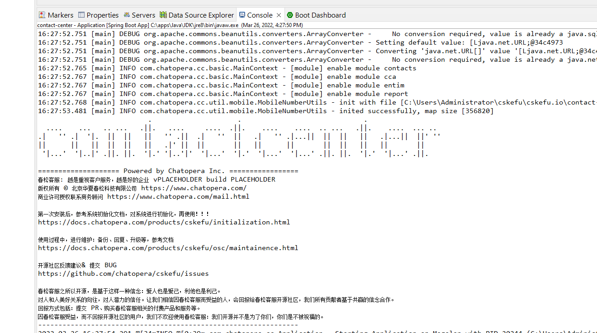

# IDE 使用之 Eclipse IDE

<< 回到[上一步](./engineering.md#初始化系统)

## 安装和下载 Eclipse

### 下载安装包

安装 Eclipse：https://www.eclipse.org/downloads/
本文下载时，版本为：Eclipse IDE 2021‑09

<p align="center">
        
</p>

下载过程大约需要 10 mins。

### 安装 Eclipse

双击安装包，按照提示进行安装。

<p align="center">
        
</p>

### 安装 STS

STS 最简单的安装方式，就是启动 Eclipse 后，在 Eclipse Marketplace 中安装。

打开 Marketplace。

<p align="center">
        
</p>

搜索，Spring Tool Suite。

<p align="center">
        
</p>

点击【Install】。

<p align="center">
        
</p>

至少选择以上几项，在授权声明页面，选择 【I accept】，点击【Finish】。
安装过程可能会持续半个小时，视网络情况。

STS 安装完成，下一步导入项目。

## 导入项目
### 初始化 Contact Center 项目描述文件
春松客服提供初始化脚本，在命令行执行：

```bash
cd cskefu.osc/contact-center
./admin/gen-eclipse.sh
```

完成后有如下提示：

<p align="center">
        
</p>

该命令生成了被 Eclipse 识别的项目导入文件。

### 导入到 Eclipse

打开 Eclipse，选择 File - Import, 导航到 cskefu.osc/contact-center/app，点击 【Select Folder】。

<p align="center">
        
</p>

在提示界面，选择 Projects: contact-center.

<p align="center">
        
</p>

导入完成。

<p align="center">
        
</p>

## 启动和调试

### 设置 JDK 为 Corretto 8 或 11

在上一篇[《开发环境搭建》](./engineering.md)文档中，介绍安装 Corretto 8 或 11，此时，需要将该 JDK 设置为 Eclipse 中 contact-center 项目依赖的 JDK，方法如下：

首先，在左侧 contact-center 右键，选择 Build path, configure Build Path ...

<p align="center">
        
</p>

然后，选择 Add Library, JRE System Library。

<p align="center">
        
</p>

然后，添加 JDK 8 路径。

<p align="center">
        
</p>

点击 【Finish】。确认依赖 JDK。

添加完成，回到 Java Build Path 配置页面，确认 Libraries 中，依赖了 Corretto JDK。

<p align="center">
        
</p>

### 修改配置文件

在目录中添加 application-dev.properties 文件

具体操作，复制 contact-center/src/main/resources/application.properties 为 /contact-center/src/main/resources/application-dev.properties。

根据数据库信息，或其它信息进行必要的更改。

参考上一篇[《开发环境搭建》](./engineering.md)里的内容。

### 创建项目 debug 调试

点击 Debug 启动按钮下拉中的 Debug Configurations, 在左侧找到 Spring Boot App，右键，选择新建配置。

<p align="center">
        
</p>

在配置页面，填写应用名称：contact-center - Application，project 选择 contact-center, Main Type 选择 com.chatopera.cc.Application。

然后点击 Environment，点击 Add 添加：Name - SPRING_PROFILES_ACTIVE， Value - dev，字符串无空格。

<p align="center">
        
</p>


点击【Apply】。然后点击【Debug】。

此时，滚动出大量的日志。

<p align="center">
        
</p>


### 调试项目

在项目提示： c.c.socketio.SocketIOServer - SocketIO server started at port，代表项目启动成功。

#### 断点调试的基本知识

第一步： 设置断点：在该行最前面边框双击  或快捷键：Ctrl+Shift+B  

第二步： Debug 运行启动  

第三部： 运行到断点后： 使用快捷键F5,F6，F7单步执行。 F5：Step into/跳入方法/进入该行的函数内部 F6：Step over/向下逐行调试/一行一行执行 F7：Step return/跳出方法/退出当前的函数

F8：直接跳转到下一个断点

#### 更多相关内容参考网络文章

* [Eclipse 断点调试（debug）实用技巧——基础篇](https://jingyan.baidu.com/article/647f0115d666b27f2148a8b1.html)
* [Eclipse 的 Debug 调试技巧大全](https://blog.csdn.net/u011781521/article/details/55000066)

## Trouble Shooting
### 报错：com.sun.net.ssl.internal.ssl.Provider

<p align="center">
        
</p>

解决办法：

* 修改 Compiler 验证提示

https://blog.csdn.net/tower888/article/details/106220494

<p align="center">
        
</p>

* 修改 Project JRE 为前面安装的 Java8 JRE

### 修正中文显示

解决办法：https://blog.csdn.net/timo1160139211/article/details/74908266

<p align="center">
        
</p>

## 下一步

回到[开发环境搭建](./engineering.md#初始化系统)完成后续步骤。

## 评论

<script src="https://utteranc.es/client.js"
        repo="chatopera/docs"
        issue-term="pathname"
        label="Comment"
        theme="github-light"
        crossorigin="anonymous"
        async>
</script>
