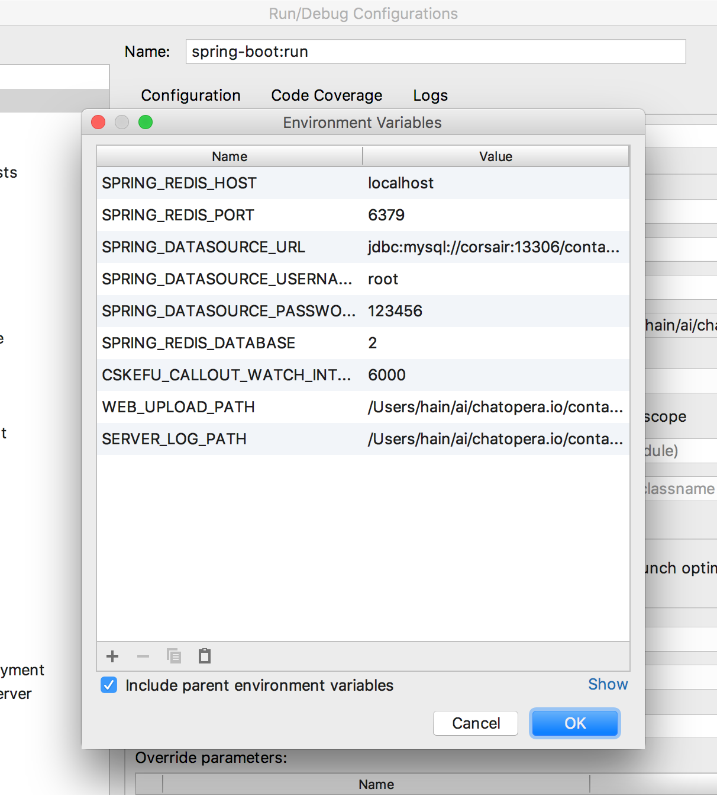

# IDE 使用之 IntelliJ IDEA


## 生成项目描述文件

在命令行终端，执行：

```bash
cd cskefu.osc
cd contact-center
./admin/gen-idea.sh
```

按照 `IDEA` 提示，导入 `contact-center/app` 目录。

## 配置执行及调试

配置运行方式为 Spring，应用为 `com.chatopera.cc.app.Application`

<p align="center">

</p>

## 配置环境变量

<p align="center">

</p>

## 运行及调试

<p align="center">

</p>

点击"执行"或"调试"，服务启动，然后访问 http://localhost:8035 确定服务正常运行了。

<p align="center">

</p>

**用户名**：admin **密码**：admin1234

## 热更新

在开发过程中，修改了代码，更新正在以 **“调试”** 模式运行服务，点击"执行旁边的锤子"。

<p align="center">

</p>

更新成功后，提示

<p align="center">

</p>

另外， **“调试”** 模式下，也支持断点调试。

## 下一步

回到[开发环境搭建](./engineering.md)完成后续步骤。


## 评论

<script src="https://utteranc.es/client.js"
        repo="chatopera/docs"
        issue-term="pathname"
        label="Comment"
        theme="github-light"
        crossorigin="anonymous"
        async>
</script>
